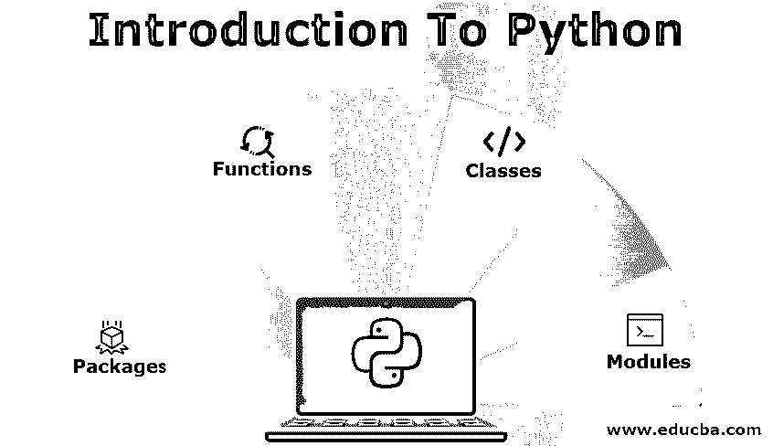

# Python 简介

> 原文：<https://www.educba.com/introduction-to-python/>

## Python 简介

下面的文章提供了 Python 入门的概要。 [Python 被称为](https://www.educba.com/what-is-python/)解释型脚本语言。古多·范·罗森设计的。它于 1991 年发行。针对 Python 发布了不同的版本，如 python 1、python 2 和 python 3。它是最常用的脚本语言之一，用于自动化模块和工具、web 应用程序开发、处理大数据、复杂计算、工作流创建、快速原型制作和其他软件开发目的。

### Python 的主要组件/亮点

下面给出了 Python 的主要组件/亮点:

<small>网页开发、编程语言、软件测试&其他</small>

*   **函数:**在 Python 中，有一些内置函数可以帮助检索或返回实际值。比如数学函数。它是程序块的集合，可以在程序员想要或需要功能的任何时候运行。
*   **类:**在 Python 中，定义了需要执行的变量和语句的结构，在类中也定义了要执行的函数。
*   **模块:**在 Python 中，它对函数和类进行分组。它用于字符串操作、字符操作、web 编程和图形编程。
*   **包:**在 Python 中，包用于运行指令集，导入库等。

### Python 的特点

以下是提到的特征:

*   **平台无关:** Python 是平台无关的。python 代码可用于任何操作系统，如 Windows、Unix、Linux 和 Mac。不需要为不同的 OS 编写不同的代码。
*   **解释:**python 代码不需要按照其他语言的要求编译。Python 代码在内部自动将源代码转换成字节码，代码是逐行执行的，而不是一次执行，所以执行应用程序的代码需要更多的时间。
*   简单:Python 语言简单，易于编码和阅读。 [python 的语法真的很简单](https://www.educba.com/python-operators/)，很容易学会。
*   **健壮:** Python 是健壮的。
*   **高级语言:**是一种用于脚本编写的高级语言。这意味着不需要记住系统架构，也不需要管理内存。
*   **丰富的库支持:** Python 可以与其他库集成，帮助您实现这些功能。您不需要为此编写额外的代码。
*   **可嵌入:** Python 源代码可以放到不同的语言中使用。这有助于将 python 程序的功能与其他语言相集成。
*   **开源:** [Python 是开源的](https://www.educba.com/python-3-cheat-sheet/)，随时随地都可以通过互联网获得。人们不需要获得它的许可。它可以很容易地下载和使用。
*   **免成本:**免成本。程序员或组织不需要投入额外的成本来使用这一点并降低用户的成本。
*   **简洁紧凑:** Python 代码主要是简洁紧凑，有助于程序员清晰理解。
*   **动态类型化:**是动态类型化的，也就是说值的类型会在运行时决定。这就是程序员不早点声明变量类型的原因。

### 基于 Python 的应用程序

下面给出了提到的应用:

*   网络应用
*   Web 框架
*   软件开发
*   图形用户界面应用
*   样机研究
*   操作系统
*   应用程序(商业和企业)

有一些组织正在更高层次上使用 python:

*   微软
*   谷歌
*   美国 Yahoo 公司(提供互联网的信息检索服务)
*   油管（国外视频网站）
*   浏览器名
*   DropBox
*   加拿大白鲑
*   Spotify
*   脸谱网
*   OpenStack

### Python 的优点和缺点

下面给出了提到的优点和缺点:

#### 优势:

*   它是开源的，并且易于使用。
*   很容易学习和探索。
*   第三方模块可以轻松集成。
*   它是高级面向对象编程语言。
*   它具有交互性和可移植性。
*   应用程序可以在任何平台上运行。
*   它是一种动态类型语言。
*   它有很好的在线支持和社区论坛。
*   它有一个用户友好的数据结构。
*   它有广泛的支持库。
*   它是解释语言。
*   Python 提供了数据库连接。
*   它提高了程序员的生产率。

#### 缺点:

*   不能用于[移动应用开发。](https://www.educba.com/testing-of-mobile-application/)
*   它对数据库访问有限制。
*   它抛出运行时问题，给程序员带来问题。
*   因为动态类型的语言，它消耗更多的内存。
*   它的速度很慢。
*   需要更多的应用程序和代码的维护。

### 结论

Python 是一种广泛用于自动化脚本的语言，作为脚本语言。每种语言都有自己的优点和缺点。Python 现在是整个组织和程序员使用的最流行的语言。它支持跨平台，基于 python 语言的应用程序可以在任何平台上运行，没有任何问题。对于 Python，Python 2 和 Python 3 版本在市场上更受欢迎使用。Python 3 在 Python 的编程语言领域表现出了巨大的变化。在这个版本中，功能变得更加简单，并且添加了新的附加功能，使其与 python 的较低版本和应用程序兼容。

### 推荐文章

这是 Python 入门指南。这里我们讨论了 Python 的主要组件、应用、特征以及优缺点。您也可以阅读以下文章，了解更多信息——

1.  [Python 开源了吗](https://www.educba.com/is-python-open-source/)
2.  [Python vs Ruby 性能](https://www.educba.com/python-vs-ruby-performance/)
3.  [Python 的用途](https://www.educba.com/uses-of-python/)
4.  [Python 框架](https://www.educba.com/python-frameworks/)

