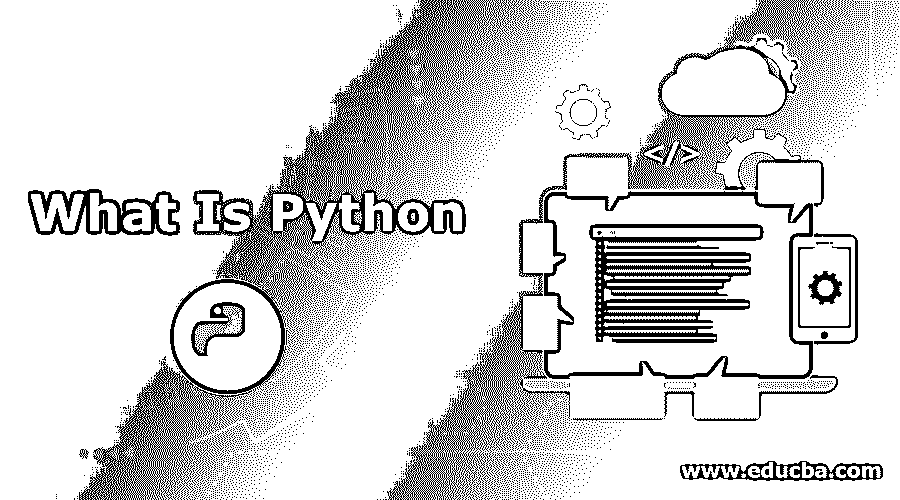
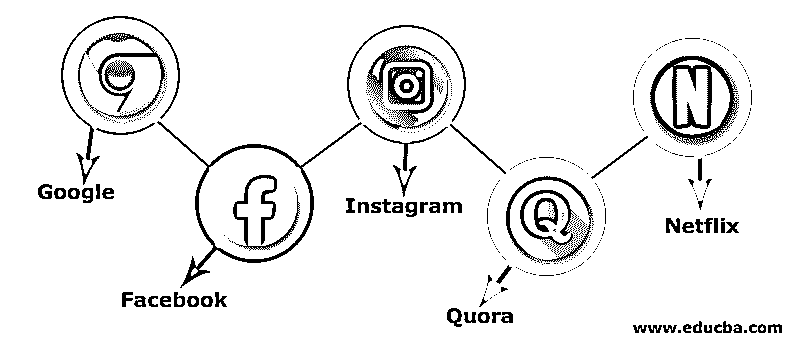
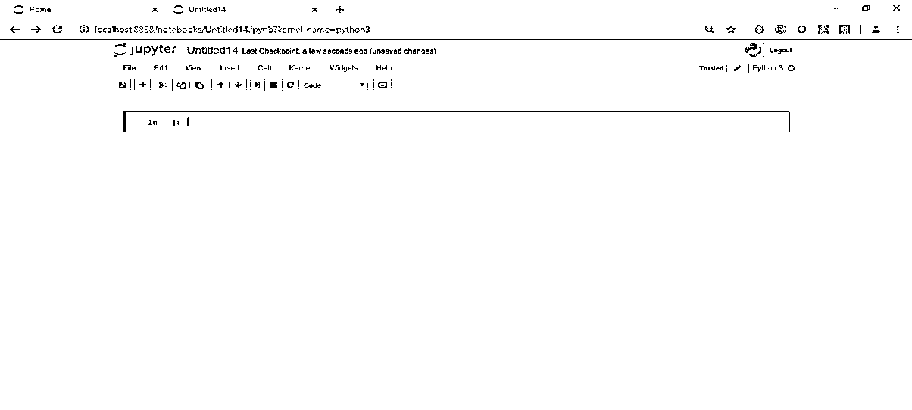
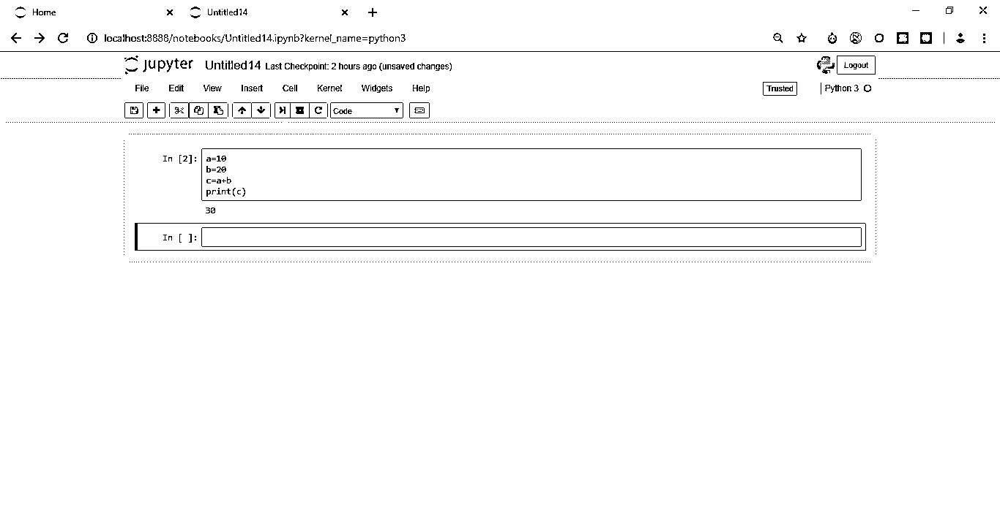
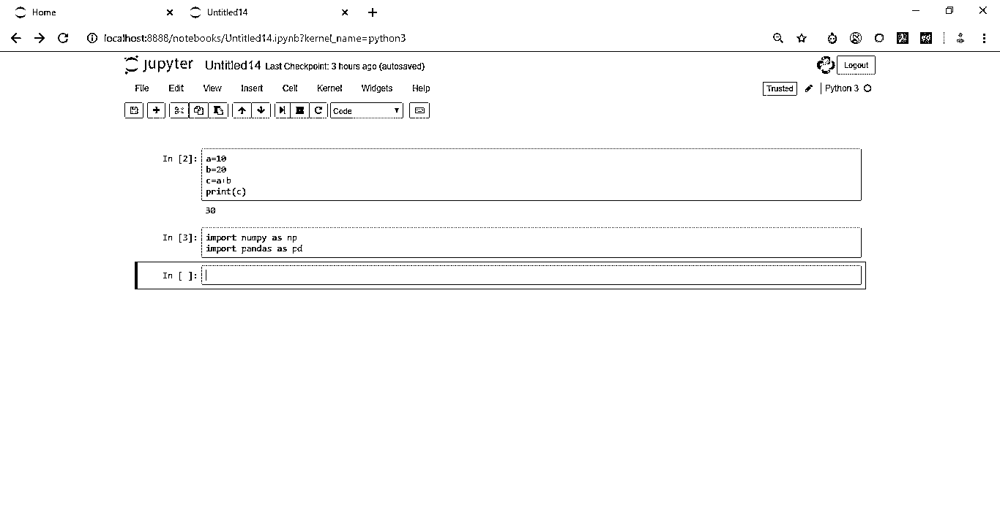
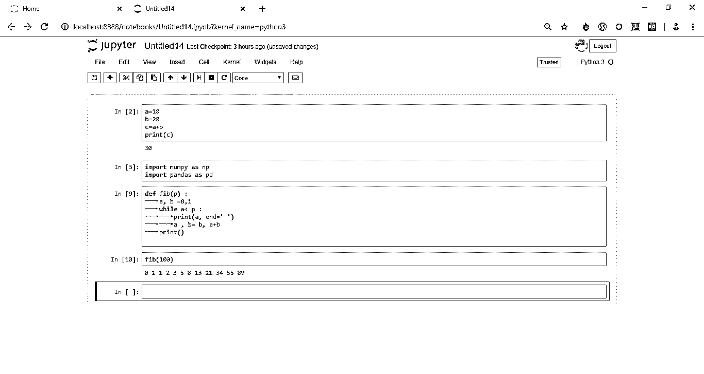

# Python 是什么？

> 原文：<https://www.educba.com/what-is-python/>




## Python 的定义

下面这篇文章提供了 Python 是什么的概要吗？这是一种由吉多·范·罗苏姆开发的编程语言，它是解释性的，提供高级功能，并结合了通用编程语言的特点。它的结构基于垃圾收集和动态类型，支持多种编程范例，如面向对象、函数式和过程式编程。这些技术方面使它成为一个动态的角色，并允许程序员将其用于小型和大型的实际项目。 **T2】**

### 谅解

根据上面的回答，我们可以看到我们在定义它时使用了两个关键字。

<small>网页开发、编程语言、软件测试&其他</small>

#### 1.高级语言

这被称为高级语言，因为它离机器语言(由 0 和 1 组成)更远，而且不容易编码。因此，编码变得困难，而这很容易阅读，所以它离机器语言更远。所以变成了高级语言。与低级语言相比，高级语言语法更具可读性。我们希望的另一件事是，当我们编写这个程序时，它不是编译语言，而是解释语言，这意味着它必须由另一个程序运行，在这种情况下，是一个解释程序，而不是由处理器运行，不像 C 语言那样由处理器直接运行。

#### 2.面向对象的编程语言

它是一种面向对象的编程语言，这意味着它在对象上工作。那么什么是事物呢？比如老虎是一个物体，颜色和年龄是它的属性，狩猎和繁衍是它的行为。所以，如上面的例子所示，一个对象有两个特征:特性和行为。

因此，OOPs 的一些基本原则如下:

*   **继承:**在这种情况下，子类可以使用父类的行为和属性。
*   **封装:**对其他对象隐藏一个类的内部细节。
*   **多态性:**对不同的输入使用不同形式的联合行为/操作。

如你所见，我们已经使用了上面的关键字 class，那么 class 是什么意思呢？

类是对象的蓝图。它包含了一个对象的所有细节，这个对象是一个类的实例。定义课程后，对象的描述是有限的，这意味着不会分配内存或存储空间。

### Python 是如何让工作变得如此简单的？/我们为什么需要它？

它使工作变得如此容易的原因是因为它简单的语法和代码的可读性。与 C 等其他[编程语言不同，它有很多可读性和简洁的语法，让初学者很容易掌握概念并达到高级水平。例如，即使你想打印你的名字，你也必须用 C#](https://www.educba.com/web-programming-languages/) 写大约 7 行[代码，但是用 Python，这可以只用一行就完成，这与其他语言相比有很大的不同和优势。](https://www.educba.com/c-sharp-commands/)

### 顶级 Python 公司

以下是排名靠前的 python 公司:




让我们来看看一些使用这种方法的公司:

*   **谷歌:**谷歌长期以来一直是 Python 的[支持者](https://www.educba.com/python-operators/)。即使脚本是用 Perl 或 bash 为 Google 编写的，它们也是用 Python 重新编写的，因为它易于编写、部署和维护。它现在是谷歌的官方服务器端语言，另一种是 [C++和 Java](https://www.educba.com/c-plus-plus-vs-java/) 。
*   脸书:脸书也在很大程度上使用 Python，使其成为社交媒体巨头第三大最受欢迎的语言，仅次于 C++和 PHP。脸书发表了许多为 Python 3 编写的开源项目。
*   **Instagram:**2016 年，insta gram 工程团队宣布，他们正在运行世界上最大的 [Django 框架，](https://www.educba.com/django-framework/)，它是用 Python 编写的。Instagram 的团队投入了时间和资源来保持其 python 开发的可行性(约 8 亿月活跃用户)。
*   **Quora:** 庞大的众包问答平台使用 Python 是因为它的易写性和可读性。
*   **网飞:**它利用数据分析向用户推荐和建议节目和电影。使用它的主要原因是高度活跃的开发社区。

以上公司都是一些使用 Python 的大公司。

### 你能用 Python 做什么？/应该用在哪里？

所以，现在更大的问题是我们能用它做什么，或者说我们能在哪里使用它？

这个问题的答案是，它几乎可以在任何地方使用。

以下是您可以使用它的几个领域:

#### 1.用于 Web 开发的 Python

因为它是一种面向对象的编程语言，所以像其他面向对象的语言一样，它可以用于 Web 开发。此外，它易于语法理解，可读性更好。Django 和 Flask 是两个最流行的 Python Web 框架。

#### 2.用于科学发展的 Python

我们可以将它用于科学开发，因为它有一个 SciPy 库、一个数值计算库 NumPy 和一个可视化的 2D 绘图库 Matplotlib。它可以[安装 MATLAB](https://www.educba.com/install-matlab/) 引擎 API，作为计算引擎与 MATLAB 交互。它也是一种高度可扩展的语言。它可以使用 web 前端，这意味着它是一个类似 [Django 的 web 框架，Flask](https://www.educba.com/django-vs-flask/) 可以使用 Python 作为 web 前端的 API。

#### 3.数据科学和分析

这是最重要的特性之一，也是最有利于 Python 的领域之一。它可以用于使用 sci-kit 库创建机器学习算法。我们可以建立所有类型的模型，如线性回归、随机森林，甚至更多像张量流这样的库，从而轻松创建深度学习模型。由于在机器学习和人工智能中的使用，这种受欢迎程度已经翻了几番。

### 工作

我们将[使用 Jupyter 笔记本](https://www.educba.com/install-jupyter-notebook/)。首先，我们将安装 Jupyter 本身。为此，首先，我们应该安装 Anaconda。我的建议是用 Python 3 下载 Anaconda 的最新版本。一旦你安装了 Anaconda，你可以很容易地从那里打开 Jupyter 笔记本。

下面的截图展示了 Jupyter 笔记本的外观。




所以你看到的高亮框叫做细胞。在这里，我们编写希望内核执行的代码或指令。

编写完代码后，可以按工具栏上的 play 按钮来运行特定的单元格。这很简单。

**1。**例如，如果我们要将两个数 a 和 b 相加，其语法如下:

```
a=10
b=20
c= a+b
print(c)
```

下面的截图显示了 Jupyter 中的相同内容:




**2。对于数学和数值计算，我们可以导入像 numpy 和 [pandas](https://www.educba.com/what-is-pandas/) 这样的库来处理数据集。**

其语法是:

```
import numpy as np
import pandas as pd
```

以下是相同的截图:




**3。**接下来，我们可以看看如何构建函数。像其他语言一样，我们也可以开发方法，然后在程序中调用它们。下面的例子展示了如何[为前 100 个数字创建一个斐波那契数列](https://www.educba.com/fibonacci-series-in-python/)函数

```
def fib(p) :
a, b =0,1
while a<p :
print(a,end=’ ’)
a,b= b, a+b
print() 
```

我们可以使用 fib(100)来调用这个函数

下面是上面代码的截图:




**4。**接下来，我们将看到如何创建像 if 和 if-else 这样的条件流，因为这对任何编程语言都非常重要。

下面是创建条件流的示例代码，我们将使用 input 语句从用户处获取输入:

```
age = int(input(“Enter your name: ”))
if age <12:
print(“You are a kid”)
elif age in range(13, 20):
print(“ You are a teenager”)
else:
print(“You are a adult) 
```

**5。**接下来，我们将通过一个例子来看看如何在这里创建一个 for 循环。当我们知道迭代次数时，使用 For 循环。下面的代码使用 for 循环执行前十个数字的加法。这里迭代的次数是 10。

```
sum =0
for i in range(10):
print(i)
sum=sum +i
print(sum)
```

在上面的代码中，使用一个 sum 来存储每次迭代后所有数字的和，范围(10)表示它将从 0 到 9 开始，不包括 10。答案应该是 45。

**6。**我们[也有一个 while loop](https://www.educba.com/while-loop-in-python/) 。在下面的例子中，只要 I 小于 10，我们就打印它，所以在这里，如果我们看到它，我们不知道精确的迭代次数。因此，我们也称 while 循环为入口控制循环。

```
i =1
while i<10:
print(i)
i= i+1
```

### 所需技能

*   一个好的开发人员所需要的技能和其他开发人员是一样的。这个人应该对 OOPs(面向对象编程)概念有很好的了解，这样他就可以用 Python 来玩对象，然后只有他才能发挥 Python 的全部潜力。根据您的技术栈，他应该对 Django 和 Flask 等框架有很好的了解。
*   这个人还应该对前端技术有一个基本的了解，比如 HTML、CSS 和 JavaScript。应该熟悉 Python 中的事件驱动编程。需要对数据库有基本的了解，因为数据库知识有助于编写正确的查询。
*   使它领先于其他语言的独特特征是它在分析、数据科学和人工智能中的使用。要想在使用 Python 的那些领域做得好，一个人必须有很好的数学知识，尤其是在统计学方面；良好的领域知识也有助于选择合适的模型，使其适合正确的数据。

### 优势

有许多优点。

*   **广泛的支持库:**它提供了从数值计算到深度学习、机器学习和可视化的大型库。大多数编程任务已经在库中完成；用户必须导入库并根据需求传递参数。它减少了时间，语法的长度也减少了。
*   **集成特性:**具有强大的前端和服务器端技术集成能力。它可以通过 Jython 直接调用 C 和 C++或者 Java。
*   生产力:由于其健壮的集成特性和单元测试框架，它提高了应用程序的生产力。对于构建可伸缩的多协议应用程序来说，这是一个很好的选择。

### 范围

*   它现在和未来的范围是巨大的。几乎每个公司都在业务中以这样或那样的方式使用它。
*   它的范围包括 Web 开发、数据科学、数据分析、人工智能和机器学习。
*   Python 在数据科学/分析方面的范围远远超过其他编程语言。

### 谁是学习 Python 技术的合适受众？

*   这本书的合适读者是任何有学习欲望和 OOPS 基本知识的人。
*   大一新生，尤其是来自计算机科学之外的流[的学生，会发现它更容易理解，例如 C++。](https://www.educba.com/career-in-computer-science/)

### 这项技术将如何帮助你的职业发展？

*   学习这门语言会给你的载体带来额外的优势。
*   它是一种通用语言；在科学和数字计算以及数据分析中，它是首选，机器学习使它比其他人更有优势。

### 结论

总之，虽然它是在 1990 年创建的，但它在今天被广泛使用，并且它的使用将会增加，特别是在数据分析/数据科学和机器学习领域。

### 推荐文章

这是一个什么是 Python 的指南？在这里，我们讨论了基本概念、工作、所需技能、顶级 python 公司以及优势和范围。您也可以浏览我们推荐的其他文章，了解更多信息——

1.  [Python 中的哈希表](https://www.educba.com/hash-table-in-python/)
2.  [Python 测试空字符串](https://www.educba.com/python-test-empty-string/)
3.  [Weka Python](https://www.educba.com/weka-python/)
4.  [Python 中的单元测试](https://www.educba.com/unit-testing-in-python/)


