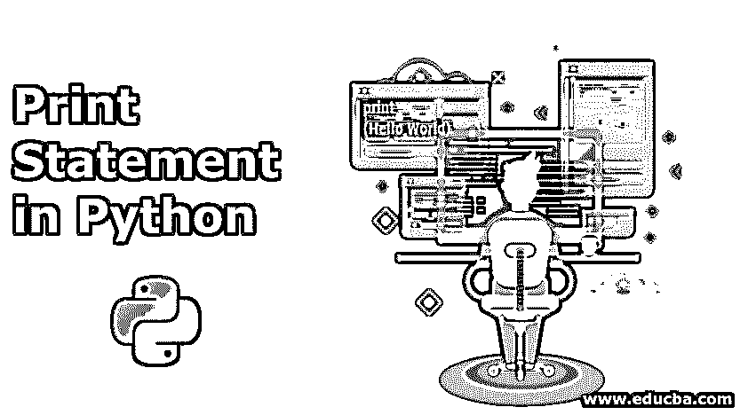
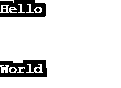
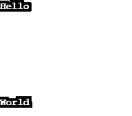
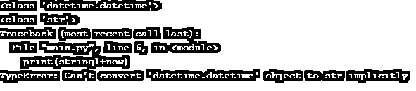
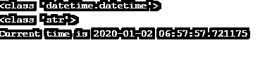
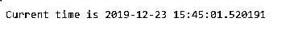
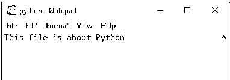

# 用 Python 打印语句

> 原文：<https://www.educba.com/print-statement-in-python/>




## Python 中的 Print 语句简介

print()函数将给定的对象打印到标准输出设备(屏幕)或文本流文件中。还记得你写第一个程序的时候吗？是啊！我说的是“Hello World”程序，这可能是任何人一生中学习的第一个程序。程序中的一行有一个打印语句，我们每天都在编程中使用，甚至不知道它的复杂性。print()语句的目的是将给定的对象打印到标准输出设备或文本流文件。

**语法:**

<small>网页开发、编程语言、软件测试&其他</small>

```
print(*objects, sep=' ', end='\n', file=sys.stdout, flush=False)
```

我们已经看到了打印函数的基本语法，

### Python 中 Print 语句的参数

让我们详细讨论它的参数:

*   **对象:**表示要打印的对象，*表示可以有多个对象。
*   sep :这表示不同物体之间的分离。默认情况下，该值为“”。
*   **end:** 最后打印该参数的值。
*   **file:** 应该是有 write(str)方法的对象。如果没有提到这个值，它将在标准输出设备(即屏幕)上打印对象。
*   **flush:** 如果该值为 True，则流被强制刷新。默认情况下，该值为 False。

### Python 中 Print 语句的示例

让我们看一些例子来充分理解打印功能。

#### 1.调用打印功能

要调用 print 函数，我们只需要写 print 后跟括号()。它告诉 Python 我们实际上是在调用函数，而不是通过它的名字来引用它。仅仅调用 print()就会产生一个不可见的换行符。但是使用 Python 字符串文字' \n '是打印新行的更好选择。

#### 2\. Newlines

**代码:**

```
print("Hello")
print("\n")
print("World")
```

**输出:**




*   **对于多个换行符:**

**代码:**

```
print("Hello")
print(5*"\n")
print("World")
```

**输出:**




#### 3.发送带有 Sep 和 End 参数的多个对象

**代码:**

```
print('Hello','World',sep=' ',end='!!!')
```

**输出:**


这里，在打印函数中传递多个对象。“sep”参数具有值“即空间，因此不同对象之间存在空间，而 end 参数具有值”！！!"所以字符串以“！！!"。

#### 4.使用字符串串联

**代码:**

```
string1 = "Hi "
string2 = "Hello "
string3 = "World"
string4 = "!!!"
print(string1+string2+string3+string4)
```

**输出:**


#### 5.不同数据类型的字符串串联

**代码:**

```
import datetime
now = datetime.datetime.now()
string1 = "Current time is "
print(type(now))
print(type(string1))
print(string1+now)
```

**输出:**




这里，当我们连接不同数据类型的对象时，有必要执行类型转换。这里的对象现在属于 datetime 类型。Datetime，对象字符串是 str 类型，因此出现错误。要解决这个问题，我们需要像下面这样执行类型转换。

**代码:**

```
import datetime
now = datetime.datetime.now()
string1 = "Current time is "
print(type(now))
print(type(string1))
print(string1+str(now))
```

**输出:**




#### 6.使用 f 字符串进行字符串连接

**代码:**

```
import datetime
now = datetime.datetime.now()
print(f'Current time is {now}')
```

**输出:**




f-strings 帮助我们避免一个常见的错误，即忘记对连接的操作数进行类型转换。它是在 Python 版本 3.6 中引入的

#### 7.使用位置参数

**代码:**

```
import datetime
now = datetime.datetime.now()
print('Current time is',now)
```

**输出:**


因此，我们看到，通过使用位置参数和“，”我们可以连接对象，而不必执行显式类型转换或使用 f 字符串。

#### 8.使用文件参数

**代码:**

```
srcFile = open('python.txt', 'w')
print('This file is about Python', file = sourceFile)
sourceFile.close()
```

**输出:**




这里，file 参数包含要写入文本的文件。

#### 9.打印非常数

**代码:**

```
print(None)
```

**输出:**


尽管 None 常量用于指示值的缺失，但如上所示，它的输出将显示为 None，而不是空字符串。

#### 10.打印用户自定义对象

**代码:**

```
class Person:
    def __init__(self, name, age, gender):
        self.name, self.age, self.gender = name, age, gender
jdoe = Person('Steve Smith', 35,'male')
print(jdoe)
```

**输出:**


在这里，我们创建了一个名为 Person 的类，它具有姓名、年龄和性别等属性。我们创建了一个该类的对象，我们可以像上面提到的那样打印该对象。

### 推荐文章

这是一个用 Python 打印语句的指南。这里我们讨论 Python 中 Print 语句的介绍和几个例子，以及基本语法和参数。您也可以阅读以下文章，了解更多信息——

1.  [Python 中的作用域](https://www.educba.com/scope-in-python/)
2.  [Python 列表](https://www.educba.com/python-list/)
3.  [Python 逆向列表](https://www.educba.com/python-reverse-list/)
4.  [Python 常量](https://www.educba.com/python-constants/)


