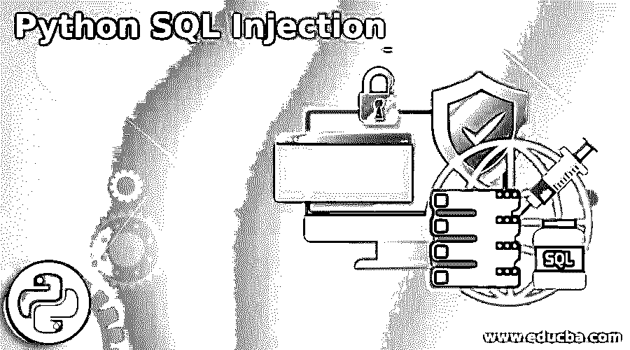
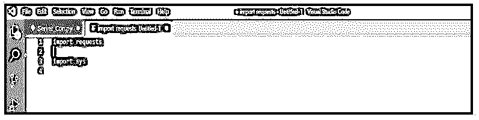
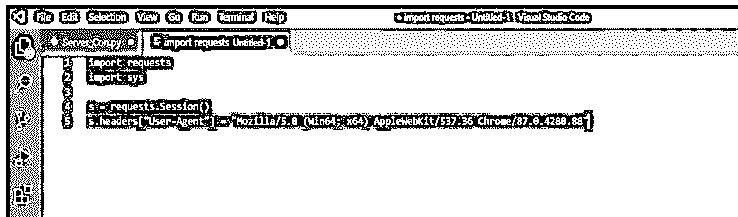
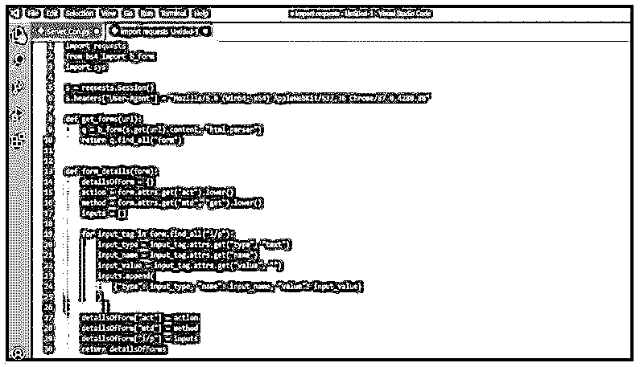
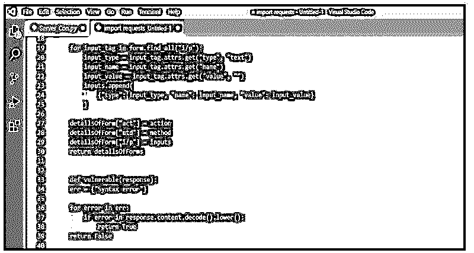
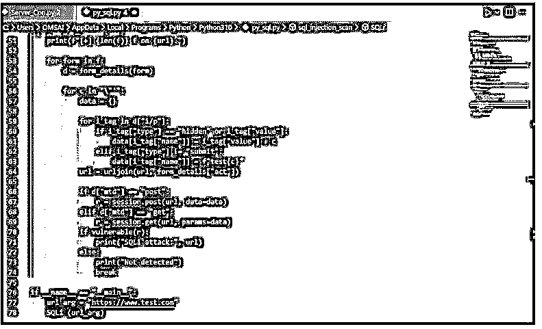
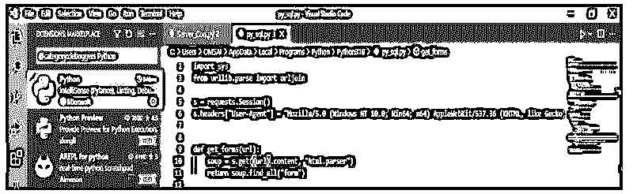
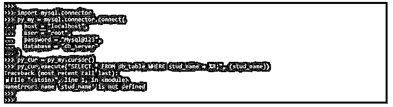
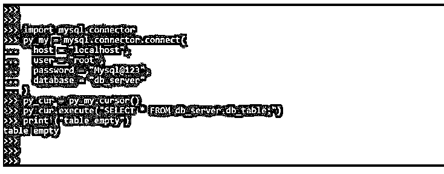

# Python SQL 注入

> 原文：<https://www.educba.com/python-sql-injection/>




## Python SQL 注入简介

Python SQL 注入是一个漏洞和安全，这是一个网络漫画传奇。创建和执行 SQL 查询是一项典型的任务。然而，当涉及到构造 SQL 语句时，世界各地的企业经常犯可怕的错误。尽管 ORM 层通常会生成 SQL 查询，但我们可能偶尔需要自己编写查询。当我们直接在数据库中运行查询时，会有危险。

### 什么是 Python SQL 注入？

*   SQL 注入不过是嵌入在 URL 字符串或数据结构中的多个命令，用于从连接到 web 应用程序的数据库中提取所需的响应。这种攻击在 PHP 或 ASP 上最为常见。基于网络的网站。
*   SQL 注入攻击的一个常见例子是改变数据库的内容，从应用程序端运行多个查询。
*   当应用程序在将输入传递给 SQL 语句之前未能正确验证输入时，就会发生这种攻击。通常，进样位于搜索区域或数据字段中。

### 如何构建 Python SQL 注入？

*   在字符串中使用“'”字符并查看我们是否得到错误是查看 web 应用程序是否易受 SQL 注入攻击的最快方法。
*   一般来说，SQLi 是最常见也是最有害的代码插入技术。最典型的攻击目标是海量知识抽取。攻击者可以转储包含数万条客户端记录的数据库表。根据环境的不同，SQL 注入还可以交换或删除数据。
*   SQL 注入由用户输入携带；我们将使用下面描述的方法提取表单。然后，我们将查看网页是否有任何 SQL 问题，这在测试 SQL 注入攻击时会派上用场，我们将在 HTML 表单上对其进行测试。

以下步骤显示了如何构建 python SQL 注入，如下所示:

<small>网页开发、编程语言、软件测试&其他</small>

1.在第一步中，我们将模块名作为 requests 和 sys 导入。该模块用于构建 python SQL 注入。




2.导入模块后，在这一步中，我们初始化 http 会话并为浏览器设置最新的代理。

在下面的步骤中，我们用 Mozilla 和 Chrome 浏览器初始化 http 模块。

**代码:**

```
s = requests.Session ()
s.headers ["User-Agent"] = "Mozilla/5.0 (Win64; x64) AppleWebKit/537.36 Chrome/87.0.4280.88"
```

**输出:**




3.在初始化 http 会话并在这一步设置代理之后，我们提取 web 表单。为了首先提取 web 表单，我们编写了给出 URL 的函数，并向从标签中提取 html 的页面发出请求。此后，标签将作为列表返回。之后我们可以使用这个标签作为列表。

**代码:**

```
def get_forms(url):
    	q = b_form(s.get(url).content, "html.parser")
    	return q.find_all("form")
def form_details(form):
    detailsOfForm = {}
    action = form.attrs.get ("act").lower()
    method = form.attrs.get ("mtd", "get").lower()
    inputs = []
    for input_tag in form.find_all ("i/p"):
        input_type = input_tag.attrs.get ("type", "text")
        input_name = input_tag.attrs.get ("name")
        input_value = input_tag.attrs.get ("value", "")
        inputs.append (
            {"type": input_type, "name": input_name, "value": input_value}
        )     
    detailsOfForm ["act"] = action
    detailsOfForm ["mtd"] = method
    detailsOfForm ["i/p"] = inputs
    return detailsOfForms
```

**输出:**




4.在这个步骤中提取 web 表单之后，我们检查页面是否包含响应输出中的漏洞。如果我们收到一个语法错误，我们可以说这个页面是易受攻击的。虽然有几个数据库问题，但我们将把重点放在 MySQL 和 PostgreSQL 错误上，因为它们是最常遇到的。

**代码:**

```
def vulnerable(response):
    err = {"Syntax error"}
    for error in err:
        if error in response.content.decode ().lower():
            return True
    return False
```

**输出:**




5.在检查完这一步中的漏洞后，我们将对 html 网页上的所有表单应用搜索方法。

**代码:**

```
def SQLi (url):
    f = get_forms (url)
    print(f"[+] {len(f)} f on {url}.")      
    for form in f:
        d = form_details(form)          
        for c in "\"'":
            data = {}              
            for i_tag in d["i/p"]:
                if i_tag["type"] == "hidden" or i_tag["value"]:
                    data[i_tag["name"]] = i_tag["value"] + c
                elif i_tag["type"] != "submit":
                    data[i_tag["name"]] = f"test{c}"
            url = urljoin(url, form_details["act"])              
            if d["mtd"] == "post":
                r = session.post(url, data=data)
            elif d["mtd"] == "get":
                r = session.get(url, params=data)
            if vulnerable(r):
                print("SQLi attack:", url)
            else:
                print("Not detected")
                break  
if __name__ == "__main__":
    url_arg = "https://www.test.com"
    SQLi (url_arg)
```

**输出:**




6.运行代码并在运行时提供 URL。




### Python SQL 注入示例

当我们导入模块时，解释器将运行代码。这意味着我们在导入模块时应该小心谨慎；PyPi 是一个很棒的资源，但是贡献的代码没有经过验证，而且在 PyPi 中已经发现了危险的包和常见的拼写错误。如果我们不确定外包装的有效性或实质内容，进行一些调查，如果我们仍然不确定，就忽略它。

防止大多数代码错误的第一步是列出潜在的错误，并仔细检查它们是否存在。这可以作为测试过程的一部分或作为预测试阶段来完成。

下面是 python 中 SQL 注入的例子。以下示例显示了使用 SQL 注入进行选择，如下所示。

#### 示例#1

**代码:**

```
import mysql.connector
py_my = mysql.connector.connect(
  	host = "localhost",
  	user = "root",
  	password = "Mysql@123",
  	database = "db_server"
)
py_cur = py_my.cursor()
py_cur.execute("SELECT * FROM db_table WHERE stud_name = %B;", (stud_name,))
```

**输出:**




上面的代码会产生错误，因为我们在创建代码时会出错。然而，我们在下面的代码中从表中取出所有的数据，所以我们没有犯任何语法错误。

#### 实施例 2

**代码:**

```
import mysql.connector
py_my = mysql.connector.connect(
  	host = "localhost",
  	user = "root",
  	password = "Mysql@123",
  	database = "db_server"
)
py_cur = py_my.cursor()
py_cur.execute ("SELECT * FROM db_server.db_table;")
print ("table empty")
```

**输出:**




### 结论

SQL 注入不过是嵌入在 URL 字符串或数据结构中的多个命令，用于从数据库中提取所需的响应。Python SQL 注入是网络漫画界的传奇。创建和执行 SQL 查询是一项典型的任务。

### 推荐文章

这是 Python SQL 注入的指南。在这里，我们讨论了介绍以及如何建立 python SQL 注入的例子。您也可以看看以下文章，了解更多信息–

1.  [Python 用户定义的异常](https://www.educba.com/python-user-defined-exception/)
2.  [Python Reduce](https://www.educba.com/python-reduce/)
3.  [Timsort Python](https://www.educba.com/timsort-python/)
4.  [Python Z 测试](https://www.educba.com/python-z-test/)


