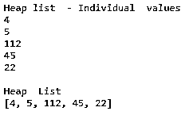
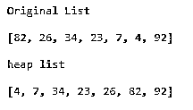
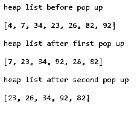
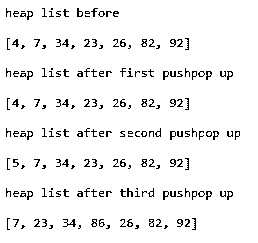
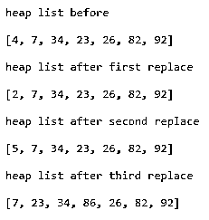
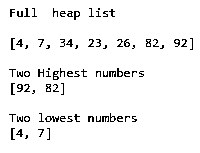

# 堆数据结构 Python

> 原文：<https://www.educba.com/heap-data-structure-python/>


## 堆数据结构 Python 简介

python 中的堆数据结构实现了优先级队列，这是一个有效的工具，为复杂的数据相关问题提供了解决方案。在它的实现中，Heap 使用一个二叉树结构，其中数据以节点的形式分层存储，每个节点最多可以有两个子节点。

优先级队列在许多应用中使用，例如确定最短的可能路线、日志文件合并、调度作业以及许多其他优化问题。堆数据结构可以为它处理的数据序列中的最高数字和最低数字提供最高优先级，但是作为 Python 标准库的一部分的 **heapq** 模块仅支持最低级别。

<small>网页开发、编程语言、软件测试&其他</small>

### 堆/优先级队列简介

堆提供了具体的数据模型，优先级队列本质上是抽象的。在二进制数据树中，无论何时插入或删除数据，都可能违反堆属性。整个数据结构经历适当的重组，因此异常得到修复。

虽然数据在逻辑上存储在二进制结构中，但为了便于操作，它被表示为一个列表。

### Python 中堆数据结构是如何工作的？

Heap 将数据存储在二叉树结构中，以优化搜索操作并更快地获得结果。它将最小值存储在其节点结构中，将其余数据存储在父节点和子节点中。每当添加和删除新数据时，都会调整结构。

#### heapq 模块

Python 中的 heapq 模块有几个函数来管理维护数据结构和保留其堆属性时可能需要的几个数据操作。

| **Sl** | **功能** | **描述** |
| --- | --- | --- |
| one | 使肥胖 | 对于空堆，用户可以将数据元素插入到堆中，这是一项繁琐而耗时的活动。Heapq 提供了一个工具，用户可以一次将数据元素全部上传到堆中。数据中的最小值将作为第一个数据元素存储在根节点中，从而保留堆的属性。否则，Heapify 不会对数据元素进行任何排序，但会保持原来的顺序。 |
| Two | Heappush | 这个函数向堆中添加一个新的数据元素，而不影响它的属性。添加数据，验证堆属性，如果堆不符合顺序，则重构堆。如果添加的数据是堆中最小的，它将作为根添加，其余的数据将进行适当的调整。 |
| three | Heappop | Heappop 从堆中移除最低值的数据元素，并自动将下一个最低值的元素移动到根节点中。在执行这个步骤之后，堆的特征被保留。 |
| four | Heappushpop | 这个函数首先执行 Heappush 的组合活动，然后再执行 Heappop。它添加新的数据元素，从堆中移除现有的最小元素，并将下一个最小的元素放在根中。该命令的执行时间比两个单独操作的总和还要短。 |
| five | hea prep place | 是先 Heappop 操作，后 Heappush 的结合。它首先从列表中删除最小的项，然后将新项添加到堆中。它的执行速度比删除和添加的组合操作更快。 |
| six | 最大的 | 这个函数从堆中挑选出最大的数字。用户可以指定最大数字的个数和键值作为选择标准。符合选择标准的数据元素将仅被考虑用于挑选最大的数字。 |
| seven | 最小的 | Nsmallest 函数返回堆中值最小的数据元素。用户可以选择 n 个最小的项目，也可以根据键值选择元素。 |

### 堆数据结构 Python 的例子

下面是堆数据结构 Python 的不同例子:

#### 1.希普什()

这段代码首先创建一个虚拟堆，然后将数字推入堆中。它还逐个打印列表中的元素，并作为一个列表。

```
# Code to explain Heappush
import heapq as q1 # import heapq module
heaptest = []# Define a dummy list
q1.heappush(heaptest,5) # Push values
q1.heappush(heaptest,4)
q1.heappush(heaptest,112)
q1.heappush(heaptest,45)
q1.heappush(heaptest,22)
print ("Heap list  - Individual  values ") # Print values one by one
for element in heaptest:
    print(element)
print (" ")
print ("Heap  List") # print as a list
print (heaptest)
```

**输出:**




当另一个数被压入一个堆时。

```
q1.heappush(heaptest,2)
print ("Heap  List  (After addition)")
print (heaptest)
```

**输出:**


#### 2.Heapify()

该函数将原始数据元素列表转换为堆格式。

```
# Code to explain Heapify
import heapq as q1 # import heapq module
heaptest = [82,26,34,23,7,4,92] # Raw list
print ("Original List") # printing raw list
print (" ")
print (heaptest)
print ("")
q1.heapify(heaptest) # conversion into heap
print ("heap list") # printing heap
print (" ")
print (heaptest)
```

**输出:**




#### 3.Heappop()

这段代码从堆中移除第一个数据元素(最低值)

```
# Code to explain Heappop
import heapq as q1 # import heapq module
heaptest = [82,26,34,23,7,4,92]
q1.heapify(heaptest)
print ("")
print ("heap list before pop up ")
print (" ")
print (heaptest)
q1.heappop(heaptest)
print ("")
print ("heap list after first pop up ")
print (" ")
print (heaptest)
q1.heappop(heaptest)
print ("")
print ("heap list after second pop up ")
print (" ")
print (heaptest)
```

**输出:**




#### 4.Heappushpop()

该函数添加新项目(Push)并删除第一个项目(pop)

```
# Code to explain Heappushpop
import heapq as q1 # import heapq module
heaptest = [82,26,34,23,7,4,92]
q1.heapify(heaptest)
print ("")
print ("heap list before")
print (" ")
print (heaptest)
q1.heappushpop(heaptest,2) # added and removed
print ("")
print ("heap list after first pushpop up ")
print (" ")
print (heaptest)
q1.heappushpop(heaptest,5)
print ("")
print ("heap list after second pushpop up ")
print (" ")
print (heaptest)
q1.heappushpop(heaptest,86)
print ("")
print ("heap list after third pushpop up ")
print (" ")
print (heaptest)
```

**输出:**




#### 5.Heapreplace()

最底层元素的移除首先发生(弹出)，然后添加(推送)发生。

```
# Code to explain Heapreplace
import heapq as q1 # import heapq module
heaptest = [82,26,34,23,7,4,92]
q1.heapify(heaptest)
print ("")
print ("heap list before")
print (" ")
print (heaptest)
q1.heapreplace(heaptest,2) # Existing lowest value removed
print ("") # New value (lowest) added
print ("heap list after first replace ")
print (" ")
print (heaptest)
q1.heapreplace(heaptest,5)
print ("")
print ("heap list after second replace ")
print (" ")
print (heaptest)
q1.heapreplace(heaptest,86)
print ("")
print ("heap list after third replace ")
print (" ")
print (heaptest)
```

**输出:**




#### 6.堆中最大和最小的数字

```
# Code to explain largest and smallest numbers
import heapq as q1 # import heapq module
heaptest = [82,26,34,23,7,4,92]
q1.heapify(heaptest)
print ("")
print ("Full  heap list")
print (" ")
print (heaptest)
print ("")
print ("Two Highest numbers")
print (q1.nlargest(2,heaptest))
print ("")
print ("Two lowest numbers")
print (q1.nsmallest(2,heaptest))
```

**输出:**




### 结论

使用 heapq 可以在堆中添加或删除数据，堆可以有效地维护二叉树并快速地产生搜索结果。

### 推荐文章

这是堆数据结构 Python 的一个指南。这里我们讨论 Python 中堆数据结构的工作方式，以及不同的函数和它们的代码实现。您也可以阅读以下文章，了解更多信息——

1.  [Python 中的堆排序](https://www.educba.com/heap-sort-in-python/)
2.  [Python 中的优先级队列](https://www.educba.com/priority-queues-in-python/)
3.  [Python 中的 DFS 算法](https://www.educba.com/dfs-algorithm-in-python/)
4.  [树遍历 Python](https://www.educba.com/tree-traversal-python/)


