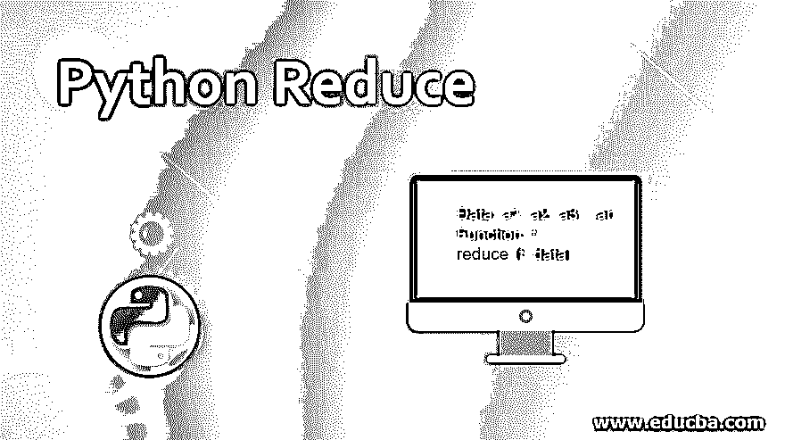
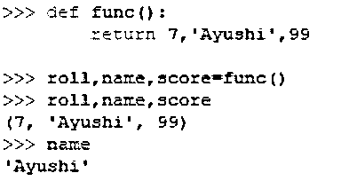
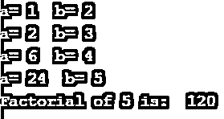

# Python Reduce

> 原文：<https://www.educba.com/python-reduce/>




## Python Reduce 简介

用于定义 Reduce 函数的模块是 functools **。**与 filter()和 map()函数一样，reduce 接收两个参数。Reduce 函数不返回 iterable，而是返回单个值。Reduce 是一个执行元素的特定功能的函数。这些函数应该是可迭代的。函数将参数作为项发送。
Reduce()函数返回一个地图对象。将传递给列表中所有元素的函数应用于其参数中。Lambda 函数和其他运算符函数用于提高代码的可读性。在本主题中，我们将学习 Python Reduce。

### Python Reduce 的语法

```
reduce (function, iterable)
```

**语法术语:**

<small>网页开发、编程语言、软件测试&其他</small>

*   为每个项目执行的功能义务。
*   Iterable 是一个序列，一个集合。它返回一个迭代器对象，可以发送尽可能多的可迭代对象。
*   函数由每个 iterable 的一个参数组成。

今天的工程师主要忙于工作和处理列表。假设:

你在华尔街工作——你正在分析股票价格列表。

为无人机送货服务编写软件——你正在处理订单列表。

你在 friendface 工作——你在用你堆积如山的个人数据分析用户名单。

大量代码用于分析、过滤和组合列表中的项目。

Python 为您提供了简化这些任务的函数。一个这样的函数被简化为()。
Map、Filter 和 Reduce 函数是 Python 中内置的高阶函数。

通常，在简化函数上使用生成器表达式是首选。涉及用户偏好。使用 lambda 内联定义函数，首选表达式是生成器，将比 reduce 函数干净。

函数的一般用法–Python:




### 什么是 Lambda 表达式？

lambda 表达式是函数的匿名内嵌声明，通常作为参数传递。Lambda 函数可以做普通函数或常规函数能做的事情。例外是 lambda 函数不能从外部调用。意义，在定义的地方。所谓的匿名也是出于同样的原因。

当你需要一个简短的、一次性的匿名函数时，Lambda 函数非常有用。简单就是只能用一次。明确应用于数据的排序和过滤。

lambda 参数:表达式

键入 Lambda 关键字，然后键入零和其他更多输入。就像函数一样，没有输入的匿名函数是完全可以接受的。

接下来，键入一个冒号。最后你输入一个表达式。这个表达式是一个返回值。使用此类功能无法实现多行功能或多行功能。

### Reduce 的功能预览

```
Data: a1, a2, a3,..,an
Function: f
reduce (f, data) :
```

1.  假设你有一个列表/元组/其他可迭代的数据集合，(考虑数据:a1，a2，a3…..，安。暂且称之为吧)
2.  每一段数据都应用了函数:f。
3.  使用 reduce 函数(reduce (f，Data):)，首先指定函数，然后指定要迭代的数据。
4.  reduce 函数将遍历集合(f(a1)，f(a2)，，…。，f(an))应用于每条数据。

*   结果是通过挑选一个序列的前两个元素获得的。
*   对先前获得的结果应用相同的函数和第二个元素旁边的数字，结果被缓存。
*   这个过程一直持续到容器中没有任何元素为止。
*   控制台返回最终结果。

### Python Reduce 的例子

1.假设我们通过 reduce 函数来乘一个链表。你试着在不降低功能的情况下做同样的事情，然后评估哪个更好。

*   首先考虑导入工具 functools 并从其中减少函数。
*   现在，为了执行乘法，给出一个期望值列表。

*   Lambda 函数的使用如上所述，为什么以及如何使用它。
*   如果只是打印乘数，它会返回 reduce 对象。
*   我们需要将 reduce 对象转换成我们正在寻找的返回结果。

```
from functools import reduce
#Multiplication of all the numbers in the list
data = [2, 3, 5, 7, 9, 11, 17, 19, 23, 29]
multiplier = lambda x, y : x*y
print(reduce (multiplier, data))
```

**输出:**


2.这里，在下一个例子中，我们尝试使用 reduce 函数来寻找给定数字的阶乘。

```
import functools
def multiply(a,b):
    print("a=",a," b=",b)
    return a*b
factorial=functools.reduce(multiply, range(1, 6))
print ('Factorial of 5 is: ', factorial)
```

**输出:**




3.在下面的示例中，使用 reduce 函数对给定的数字求和。

```
from functools import reduce
def do_sum(x1, x2): return x1 + x2
print(reduce(do_sum, [1, 2, 3, 4]))
```

**输出:**


### 结论

map、filter 和 reduce 函数极大地简化了处理列表和其他可迭代数据集合的过程，事实上，如果您使用 lambda 表达式，您的工作通常可以在一行中完成。在你掌握了这些函数之后，你会意识到 Python 应该是一个喜剧演员，因为它充满了俏皮话。

### 推荐文章

这是 Python Reduce 的指南。这里我们讨论 Reduce 的功能预览，Python Reduce 的例子以及输出。您也可以看看以下文章，了解更多信息–

1.  [用 Python 打印语句](https://www.educba.com/print-statement-in-python/)
2.  [Python 倒计时定时器](https://www.educba.com/python-countdown-timer/)
3.  [Python if main](https://www.educba.com/python-if-main/)
4.  [Python Tkinter 标签](https://www.educba.com/python-tkinter-label/)


