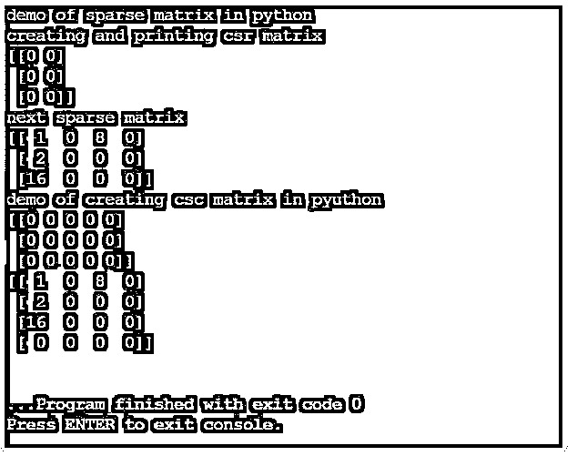
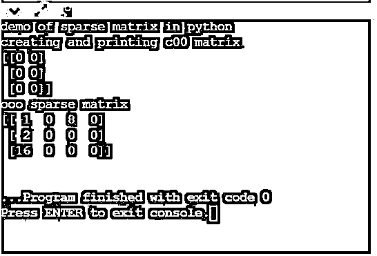

# Python 中的稀疏矩阵

> 原文：<https://www.educba.com/sparse-matrix-in-python/>

## Python 中稀疏矩阵的介绍

以下文章提供了 Python 中稀疏矩阵的概要。在一个矩阵中，如果大部分值都是 0，那么它就是一个稀疏矩阵。它广泛应用于数据编码的机器学习和其他领域，如自然语言处理。稀疏矩阵的主要优点是存储容量和计算时间。因为大多数值都是零，所以它只占用较少的内存，并且可以通过创建一个只查找非零值的数据结构来轻松计算。

**稀疏矩阵的语法**

<small>网页开发、编程语言、软件测试&其他</small>

以下矩阵是稀疏矩阵的一个示例:

0 0 5 0 9
0 0 0 7 0
0 0 0 0 0 0
0 1 7 0 0

使用以下公式计算矩阵的稀疏度:

Sparsity=(no of zero’s)/ size of the matrix

在上面的例子中，它有 15 个零值。因此，矩阵的稀疏度是 0.75 或 75%。因此，如果矩阵只有几个非零值，稀疏矩阵被认为是存储的最佳数据结构。

有七种不同类型的稀疏矩阵可用。

*   块稀疏矩阵
*   坐标格式矩阵
*   压缩空间列矩阵
*   压缩空间行矩阵
*   对角存储稀疏矩阵
*   基于关键字字典的稀疏矩阵(dok)
*   链表稀疏矩阵

### 选择正确的稀疏矩阵类型

*   知道何时使用哪种类型的稀疏矩阵是非常重要的。选择正确的矩阵只会使操作更有效。
*   每当必须从底部构建新的稀疏矩阵时，建议使用链表稀疏矩阵或关键字字典矩阵。
*   然而，这两个矩阵对于进行算术计算来说效率不高。
*   每当需要乘法或遍历压缩空间列时，压缩空间行将是最佳选择；前者在对列进行切片时效率很高，而后者用于对行进行高效切片。

### 稀疏矩阵的缺点

下面是稀疏矩阵的两个主要缺点。

它们是空间复杂性和时间复杂性。

#### 1.空间复杂性

在现实生活的例子中，大多数矩阵是稀疏的。需要大内存来存储大矩阵，尤其是显示从一个站点到另一个站点的链接的链接矩阵。较小矩阵的一个例子是一个单词在书中相对于语言中所有单词的出现。在这两种情况下，矩阵的结果大多是零，必须为所有结果分配内存。

#### 2.时间复杂度

稀疏矩阵的运算(例如两个稀疏矩阵的加法或乘法)可能需要很长时间，即使大多数运算的输出将为零。这是一个随着矩阵的大小而增加的问题。考虑到所有机器学习方法都需要对每一行和每一列进行操作，这会导致更长的执行时间，因此这一点会加倍。

**稀疏矩阵的真实例子:**

*   如果用户已经观看了电影目录中的至少一部电影。
*   如果用户购买了产品目录中列出的任何产品。
*   歌曲在歌曲目录中被收听的次数。
*   操纵文本文件的自然语言处理。
*   产品目录中的产品推荐。
*   当处理大量具有大量黑色像素的图像时。
*   标准化词典中的词频分数。

### Python 中稀疏矩阵的示例

以下是 Python 中稀疏矩阵的示例:

#### 示例#1

**代码:**

`print("demo of sparse matrix in python")
print("creating and printing csr matrix")
import numpy as num
from scipy.sparse import csr_matrix,csc_matrix
csrmatrixeg = csr_matrix((3, 2),dtype = num.int8).toarray()
print(csrmatrixeg)
print("next sparse matrix")
r= num.array([0, 1, 0, 2, 2, 0])
c = num.array([0, 0, 2, 0, 0, 2])
d = num.array([1, 2, 5, 7, 9, 3])
op= csr_matrix((d, (r, c)), shape = (3, 4)).toarray()
print(op)
print("demo of creating csc matrix in pyuthon")
egmat = csc_matrix((3, 5),dtype = num.int8).toarray()
print(egmat)
r1= num.array([0, 0, 0, 2, 2, 0])
c1 = num.array([0, 0, 1, 0, 0, 0])
d1 = num.array([1, 2, 0, 0, 9, 3])
op1= csc_matrix((d, (r, c)), shape = (4, 4)).toarray()
print(op1)`

**输出:**

#### 实施例 2

**代码:**

`print("demo of sparse matrix in python")
print("creating and printing c00 matrix")
import numpy as num
from scipy.sparse import coo_matrix
coomateg = coo_matrix((3, 2),dtype = num.int8).toarray()
print(coomateg)
print("ooo sparse matrix")
r= num.array([0, 1, 0, 2, 2, 0])
c = num.array([0, 0, 2, 0, 0, 2])
d = num.array([1, 2, 5, 7, 9, 3])
op= coo_matrix((d, (r, c)), shape = (3, 4)).toarray()
print(op)`

**输出:**

使用稀疏矩阵时，需要考虑替代数据结构。例如，应该只考虑非零值，而忽略零。

有多种这样的数据结构如下:

*   **字典:**在这里，一个值是由一行和一列的交集来映射的。
*   **列表的列表:**这里用一个列表存储一个矩阵，用一个子列表存储列表的值和列。
*   **坐标列表:**矩阵存储为元组列表，元组的值是行和列的索引以及相应的值。

压缩稀疏行和压缩稀疏列是其他常用的数据结构。然而，压缩空间行更常用于机器学习，因为它支持矩阵乘法。

### 结论

因此，本文详细解释了 Python 中的稀疏矩阵。它详细解释了各种类型的稀疏矩阵，它们的使用和效率，以及适当的例子。它还解释了如何计算矩阵的稀疏性，以及何时何地使用哪种类型的稀疏矩阵。

### 推荐文章

这是 Python 中稀疏矩阵的指南。在这里我们讨论介绍，选择正确的稀疏矩阵类型，缺点和例子。您也可以看看以下文章，了解更多信息–

1.  [Python 中的 Shell 排序](https://www.educba.com/shell-sort-in-python/)
2.  [Python 中的插入排序](https://www.educba.com/insertion-sort-in-python/)
3.  [Python 中的烧瓶](https://www.educba.com/flask-in-python/)
4.  [Python 列表扩展](https://www.educba.com/python-list-extend/)

