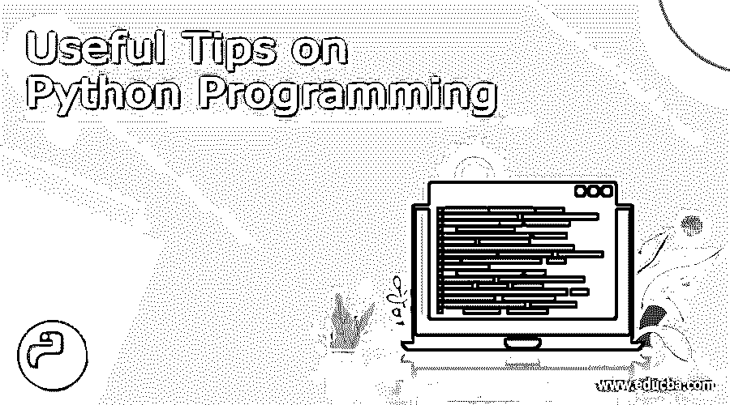

# Python 编程的 10 个简单而有用的技巧(窍门)

> 原文：<https://www.educba.com/10-simple-yet-useful-tips-on-python-programming/>




## Python 编程技巧介绍

在当今世界，Python 是使用最多的语言之一。它不仅仅是一种语言；这是一种以恰当、简单和紧凑的方式做事的方式。Python 是最知名的高级语言之一，尤其是在开源方面。这确实是一种庞大的 python 语言。关键是，你对 Python 编程了解得越多，你就越会知道还有你不知道的东西。我知道这种说法很讽刺，但 Python 就是这样。

Python 编程是一种语言，它快速、紧凑，可以很容易地渲染到任何操作系统中。此外，如果你环顾四周，你会发现大多数东西都运行在 Python 上；你可以举谷歌或者 YouTube 的例子。有些框架专门支持 Python，比如 Django 和 Pyramid。甚至还有烧瓶、瓶子等微框架。Python 的标准库由 HTML、 [XML](https://www.educba.com/course/xml-training/ "XML Training Course") 、JSON、电子邮件处理等多种互联网协议组成，支持 FTP、IMAP 及其易用的[套接字接口](https://www.educba.com/socket-programming-in-python/ "What is Python Socket Programming?")。Python 最常见的用途是用于科学和数值计算。比如 SciPy，熊猫，iPython。现在你知道了 Python 是什么，它是如何工作的，让我们来了解一下我比其他语言更支持 Python 的一些原因。我接触 Python 已经很久了。长到足以理解 python 语言的基本和高级解释的重要性。尽管如此，还是有一段时间，即使是已经使用 Python 足够长时间的人也会忘记 Python 编程中一些最基本的重要内容。所以，给你们复习一下，我写了这篇文章。

<small>网页开发、编程语言、软件测试&其他</small>

无论你是专家还是初学者，这些东西将永远提醒你为什么 python 编程仍然是有史以来最灵活、最简单和最有创造力的 Python 语言。我已经花时间详细解释了这些例子，所以如果你仍然很难理解它们，你可以简单地谷歌一下我给这些例子的标题，你会很容易理解我在说什么。那么，事不宜迟，我们开始吧。

这是我在过去几年中学到的一些技巧，我把它们保存在一个文本文件中。因此，每当我被任何一段代码卡住时，我只要扫一眼这些东西，我的大部分问题就解决了很多次。

### Python 编程技巧/诀窍

所以，这些是关于 [Python 编程](https://www.educba.com/software-development/courses/python-certification-course/ "Python Programming - Comprehensive Training")的 10 个简单却最有用的提示

#### 1.模块

python 最大的优点是可以创建自己的模块。例如，我可以创建自己的函数和模块，并将它们放在一个单独的文件夹中。所以我做的是写下具体的代码，我知道我会在大部分工作中用到它们，然后把它们转换成一个模块，放在一个单独的文件夹里。通过这样做，我节省了大量的时间，不用重新编写它们，也不用调试它们来检查错误。另一个原因是，如果程序很大，你需要保持程序的高效和可管理性。要做到这一点，您可以将它们分成单独的文件，将多个函数和定义放入一个文件中，并通过将它们导入脚本和程序来使用它们。请注意，这些文件将带有一个*。py 扩展名。一旦您导入它们，它将自动创建一个*。pyc 扩展文件，加载速度比普通*文件快得多。py 文件。

#### 2.真假

这也是最常用的方法之一。如果你玩过游戏，我说的游戏是指高端游戏，你一定注意到有时候你不得不降低图形。但是，有时候，你甚至无法在游戏中找到这些选项。因此，您通常要做的是，在 documents 文件夹中找到配置文件并对其进行更改。例如，您可以根据情况更改 Vsync = True 或 False。但是我在这里试图解释的这个有点不同，但仍然与之相关。在 python 中 True 等于 1，False 等于 0。简而言之，真意味着你同意，假意味着你不同意。这些东西在 python 中最常用。因此，您可以使用“=”符号来指定 True 和 False 语句，也可以使用“==”符号来检查等式。就这么简单。

#### 3.Python 性能调试

写程序的时候，我们的主要目标是让程序高效、快速、紧凑。但是有些时候，你根本无法使程序紧凑。因此，在这些时候，你可能并不真的想让程序变得紧凑，以使它更快。你能做的是，例如，当处理字典中的代码时，你可以尝试口述一个项目的替代方法。迷茫？我来解释一下。您可以简单地选择直接添加一个条目，然后检查插入的条目是否存在或者是否需要更新。因此，通过这样做，你不需要检查每一个和每一个其他项目来匹配它，然后更新它，这种方式会使应用程序变慢。下面是一个著名的例子:

```
p = 16
```

```
myDiction = {}
```

```
for i in range(0, p):
```

```
char = 'abcd'[i%4]
```

```
if char not in myDict:
```

```
myDiction[char] = 0
```

```
myDiction[char] += 1
```

```
print(myDiction)
```

上面的例子是正常的写法。这就是它如何让代码运行得更快，

```
p = 16
myDiction = {}
for I in range(0, p):
char = 'abcd'[i%4]
try:
myDiction[char] += 1
except KeyError:
myDiction[char] = 1
print(myDiction)
```

#### 4.Py2exe

我能想到的另一个有用的技巧是 py2exe。通常，当用任何语言编写代码时，将它们编译成可执行文件有时会很麻烦，尤其是在使用 windows 的情况下。但是对于 Python 编程来说，其实很简单。你可以简单地下载 py2exe，这也是一个开源软件，你可以从 sourceforge.net 下载。使用这个应用程序，你甚至可以简单地将你的模块转换成 exe 文件，不像 [C](https://www.educba.com/course/c-training-bundle/ "C Bundle") 或 [C++](https://www.educba.com/course/online-c-plus-plus-programming-training/ "Online C++ Programming Training") ，这实际上是编译成 exe 文件时的精神压力。

#### 5.设置

如果你是一个数学迷，你一定会喜欢下面的建议。你可能在下层阶级使用过器械包。记得什么吗？对，没错，工会之类的。所以，有些人和我一样，有时不喜欢使用自动化软件。这样做的原因是安全。我们举一个简单的[微软 Excel](https://www.educba.com/course/microsoft-excel-2016-basic-course/ "Microsoft Excel 2016 Basic Course") 的例子。有些人倾向于只使用 excel 来分组和创建数据库。他们只需要这些和良好的安全保障。他们对文本格式、颜色之类的东西不感兴趣。因此，在那些时候，我所做的就是创建我自己的 python 编程软件堆栈和我自己的数据库。出于一些安全原因，我更喜欢 Python 而不是 T2 MYSql T3。所以，回到我关于集合的观点，集合在创建数据库时非常有用。尤其是当你想寻找匹配，创建组和其他类似的任务。下面是一个简单的例子。

```
>>> A = {1, 2, 3, 3}
>>> A
set([1, 2, 3])
>>> B = {3, 4, 5, 6, 7}
>>> B
set([3, 4, 5, 6, 7])
>>> A | B
set([1, 2, 3, 4, 5, 6, 7])
>>> A & B
set([3])
>>> A - B
set([1, 2])
>>> B - A
set([4, 5, 6, 7])
>>> A ^ B
set([1, 2, 4, 5, 6, 7])
>>> (A ^ B) == ((A - B) | (B - A))
True
```

#### 6.合并 Python 和 Shell 脚本

现在，这是你不能用 C 或 c++做的事情。如果你是一个开源的人，你肯定会使用 Linux 作为主要的操作系统，或者至少是双引导。所以， [Linux 已经包含了 python](https://www.educba.com/software-development/courses/linux-training-certification/ "Linux System Administration with Python") 。而且 python 和 Linux 极其兼容。这给了我们编译和合并它们的好处。你可以简单地创建一个脚本，它可以同时作为一个普通的 [Unix](https://www.educba.com/course/unix-1/ "The Complete Unix (Module #1) - Unix Fundamentals") 脚本和一个解释的 Python 代码。当编写一个 [shell 脚本](https://www.educba.com/shell-scripting-in-linux/ "The Beginners Guide To Shell Scripting In Linux")时，您需要一个四引号字符和一个空字符串，但是在 python 中您需要用一个带引号字符的三引号字符串来完成。请记住，脚本中的第一个字符串可以很容易地存储为模块的 doc 字符串，但是在那之后，python 解释器就会忽略它。

**一个例子如下:**

```
#!/bin/sh
__doc__ = """
Demonstrate how to mix Python + shell script.
"""
import sys
print "Hello World!"
print "This is Python", sys.version
print "This is my argument vector:", sys.argv
print "This is my doc string:", __doc__
sys.exit (0)
```

#### 7.JSON 式的

Python 下面有很多隐藏的东西。只需要一个人和他的时间去发现所有的魔法算子和东西都藏在里面。其中一个是著名的 JSON-esque。您可以创建嵌套字典，而无需显式创建子字典。当我们提到它们时，它们神奇地出现了。

**举例如下:**

```
users = tree()
users['harold']['username'] = 'hrldcpr'
users['handler']['username'] = 'matthandlersux'
```

现在，您可以用 JSON 格式打印上面的内容:

```
print(json.dumps(users))
```

它看起来会像这样

```
{"harold": {"username": "hrldcpr"}, "handler": {"username": "matthandlersux"}}
```

#### 8.点

皮普可能是大多数人都知道的东西。但是，如果你开始使用 python，这仍然是你需要知道的很棒的东西。有时，您需要在安装软件包之前检查它的源代码。大多数时候，这是为了安装某个包的新版本。因此，您可以简单地安装 pip 并执行以下操作:

```
pip install --download sqlalchemy_download sqlalchemy
pip install --no-install sqlalchemy
pip install --no-download sqlalchemy
```

如果你想安装一个包的最新版本，你可以直接从 GIT 库检查它。

```
pip install git+https://github.com/simplejson/simplejson.git
pip install svn+svn://svn.zope.org/repos/main/zope.interface/trunk
```

#### 9.Virtualenv(虚拟环境)

python 的另一个重要功能是 Virtualenv。Virtualenv 的意思是虚拟环境。朋友们，这是 python 的一个非常棒的功能。基本上，要在不同的条件下测试 python，通常你必须改变全局 python 环境。但是，将您的 python 环境沙箱化的一个关键好处是，您可以轻松地在不同的 python 版本和包依赖关系下测试一个代码。要安装 virtualenv，需要先安装 pip。
你可以这样做:

```
easy_install pip
pip install virtualenv
virtualenv python-workspace
cd python-workspace
source ./bin/activate
python
```

#### 10.Python 的禅

最后但同样重要的是，这是 python 的禅。python 的 Zen 是 python 编程的迷你指南。即使不编程 python，读起来还是一件有趣的事情。只需在 python 解释器中输入:

```
import this
```

我不会解释这一点，因为你自己去尝试它实在是太棒了。

而现在，我们已经走到了路的尽头。这些只是我的经验，但是如果你找到了一些，当然，一定要把它贴出来，这样世界就知道 python 到底有多棒了。

第一张图片来源:pixabay.com

### 相关文章

这里有一些文章可以帮助你获得更多关于 Python 编程的细节，所以只要浏览一下链接就可以了。

1.  [Python 和 JavaScript](https://www.educba.com/python-vs-javascript/)
2.  [必须知道！发现 8 个惊人的技巧–html 5 与 Flash](https://www.educba.com/html5-vs-flash/)
3.  [25 个最惊艳的 Python 面试问答](https://www.educba.com/python-interview-questions/)
4.  [Python 职业生涯](https://www.educba.com/careers-in-python/)
5.  [开始使用 Python 和 Django 进行 Web 开发](https://www.educba.com/python-and-django-for-web-development/)


