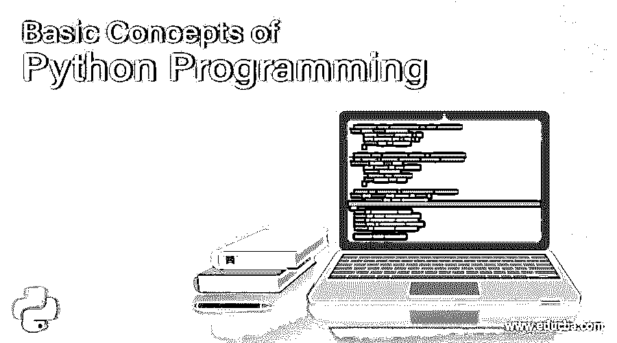

# Python 编程的基本概念(初学者指南)

> 原文：<https://www.educba.com/python-programming-beginners-tutorial/>

## Python 编程的基本概念

**Python 编程语言—**想踏入编程的世界吗？还是想探索新的语言？Python 编程通常是这两者的首选之一，因为它既容易掌握，又有巨大的功能。Python 编程语言使用简单的面向对象编程方法和非常高效的高级数据结构。Python 编程也使用非常简单明了的语法和动态类型。如果您想要一种语言来快速构建应用程序和编写几个领域的脚本，您将很难找到比 Python 更好的替代语言。

Python 编程的主要好处之一是它的解释性。Python 解释器和标准库可以从 Python 网站上以二进制或源代码形式获得，并且可以在所有主要操作系统上无缝运行。Python 编程语言也是可以自由分发的，同一个站点甚至还有提示和其他第三方工具、程序、模块和更多文档。

<small>网页开发、编程语言、软件测试&其他</small>

Python 解释器可以通过 C++、C 或任何其他可从 C 调用的语言轻松扩展新的数据类型或函数。Python 编程语言是可定制应用程序的扩展。使这种语言如此容易学习的事实是，它使用英语关键字而不是标点符号，并且它的语法结构比其他编程语言少。

### Python 编程语言的优势

*   解释语言:语言是由解释器在运行时处理的，像 PHP 或 PERL，所以你不必在执行前编译程序。
*   交互式:您可以在 Python 提示符下直接与解释器交互来编写您的程序。
*   非常适合初学者:对于初级程序员来说，Python 是一个很好的选择，因为它支持从游戏到浏览器到文本处理的应用程序开发。

### Python 编程开始的地方

Python 也是较早的 web 开发语言之一，由荷兰国家数学和计算机科学研究所的吉多·范·罗苏姆在 90 年代早期开发。该语言大量借鉴了 C、C++、SmallTalk、Unix Shell、Modula-3、ABC、Algol-68 等脚本语言。Rossum 继续指导语言的发展，尽管学院的一个核心开发团队现在维护着大部分工作。

### 学习 Python 编程语言

如前所述，英语关键字构成了 Python 中的大部分编程。如果你掌握了它们，你就掌握了 Python 的大部分。这需要一些练习，在开始之前你需要知道一些基本的概念。所以让我们从看它们开始:

#### 属性

Python 是隐式动态类型的，因此您不必声明变量。类型是强制的，变量也区分大小写，因此 var 和 VAR 被视为两个独立的变量。如果你想知道任何对象是如何工作的，你只需要键入以下内容:

帮助(对象)

还可以使用 dir(object)命令找出某个特定选项的所有方法，并且可以使用 object。__doc__ 来找出它的文档字符串。

Python 没有终止语句的强制字符。任何块都是用缩进来指定的，所以你缩进开始一个块，缩进结束一个块。需要缩进级别的语句以冒号结尾。如果您想添加注释，请在每一行使用#号。多行注释需要使用多行字符串。使用“=”符号赋值，并且使用其中的两个“==”进行相等性测试。您可以使用运算符+=或-=在右侧减少或增加数值。这可以处理字符串和其他数据类型。您也可以在一行中使用多个变量，如下所示:

#### 数据类型

让我们继续讨论数据类型。Python 中的数据结构是字典、元组和列表。从 2.5 开始，可以在 Python 的所有[版本的集合库中找到集合。列表类似于一维数组，尽管您也可以拥有其他列表的列表。字典本质上是](https://www.educba.com/versions-of-python/)[关联数组](https://www.educba.com/associative-array-in-php/)或哈希表。元组是一维数组。现在，Python 数组可以是任何类型，并且类型总是为零。负数从结尾开始到开头，-1 是最后一项。变量也可以指向函数。下面是一个用法示例:

您可以使用冒号来访问数组范围。如果将起始索引留空，解释器将假定第一项，因此结束索引将假定最后一项。负索引从最后一项开始计数，因此-1 被视为最后一项。这里有一个例子:

添加第三个参数将会看到 Python 步骤以 N 项为增量，而不是最后一行中的 1 项。例如，在上面的示例代码中，首先返回第一项，然后返回第三项，因此零索引中的第 0 项和第 2 项。

#### 琴弦

让我们继续讨论弦乐。 [Python 字符串](https://www.educba.com/python-string-functions/)既可以使用单引号，也可以使用双引号，你可以在使用一种引号的字符串中使用另一种引号，所以下面是有效的:

"这是一个“有效”字符串。"

多字符串用单引号或三重双引号括起来。Python 可以从一开始就支持 Unicode，使用以下语法:

u "这是 Unicode。"

要用值填充字符串，可以使用模(%)运算符，然后使用元组。每个%从左到右被一个元组项替换，您也可以使用字典替换。

`print "Name: %s\
Number: %s\
String: %s" % (myclass.name, 3, 3 * "-")
Name: Poromenos
Number: 3
String: ---`

`strString = """This is a multiline string."""
>>> print "This %(verb)s a %(noun)s." % {"noun": "test", "verb": "is"}
This is a test.`

#### 流量控制语句

Python 的流控制语句是‘while’、‘for’和‘if’。对于开关，您需要使用“if”。若要枚举成员列表，请使用“For”。要获取编号列表，请使用 range (number)。以下是语句语法:

`rangelist = range(10)
print rangelist
[0, 1, 2, 3, 4, 5, 6, 7, 8, 9] for number in rangelist:
if number in (3, 4, 7, 9):
break
else:
continue
else:
pass
if rangelist[1] == 2:
print "The second item (lists are 0-based) is 2"
elif rangelist[1] == 3:
print "The second item (lists are 0-based) is 3"
else:
print "Dunno"
while rangelist[1] == 1:
pass`

#### 功能

“def”关键字用于声明函数。可选参数可以在函数声明中设置在强制参数之后，方法是为它们分配默认值。在命名参数的情况下，参数名被赋予一个值。函数可以返回一个元组，使用元组解包可以有效地返回几个值。参数通过引用传递，但是元组、int、strings 和其他不可变类型是不可改变的，因为只传递该项的内存位置。将另一个对象绑定到变量会移除旧的对象，并替换不可变类型。这里有一个例子:

`funcvar = lambda x: x + 1
print funcvar(1)
2
def passing_example(a_list, an_int=2, a_string="A default string"):
a_list.append("A new item")
an_int = 4
return a_list, an_int, a_string`
T1】

#### 类

Python 支持非常有限的多类继承。私有方法和变量可以通过添加两个或多个下划线和至多一个尾随下划线来声明。您还可以将名称绑定到类实例，就像这样。

`class MyClass(object):
common = 10
def __init__(self):
self.myvariable = 3
def myfunction(self, arg1, arg2):
return self.myvariable
>>> classinstance = MyClass()
>>> classinstance.myfunction(1, 2)
3
>>> classinstance2 = MyClass()
>>> classinstance.common
10
>>> classinstance2.common
10
>>> MyClass.common = 30
>>> classinstance.common
30
>>> classinstance2.common
30
>>> classinstance.common = 10
>>> classinstance.common
10
>>> classinstance2.common
30
>>> MyClass.common = 50
>>> classinstance.common
10
>>> classinstance2.common
50
def __init__(self, arg1):
self.myvariable = 3
print arg1
>>> classinstance = OtherClass("hello")
hello
>>> classinstance.myfunction(1, 2)
3
>>> classinstance.test = 10
>>> classinstance.test
10`

#### 异常情况

在 Python 中，异常是通过 try-except 块[exceptionname]处理的。下面是一个语法示例:

`def some_function():
try:
10 / 0
except ZeroDivisionError:
print "Oops, invalid."
else:
pass
finally:
print "We're done with that."
>>> some_function()
Oops, invalid.
We're done with that.
Importing`

在 Python 中，可以使用关键字 import[library]来使用外部库。对于单个函数，可以使用 from [funcname]或[libname] import。看一下下面的示例语法:

`import random
from time import clock
randomint = random.randint(1, 100)
>>> print randomint
64`

#### 文件输入/输出

首先，Python 编程语言附带了许多库。例如，下面看一下我们如何使用 pickle 库通过文件 I/O 将数据结构转换成字符串:

`import pickle
mylist = ["This", "is", 4, 13327] # Open the file C:\\binary.dat for writing. The letter r before the
# filename string is used to prevent backslash escaping.
myfile = open(r"C:\\binary.dat", "w")
pickle.dump(mylist, myfile)
myfile.close()
myfile = open(r"C:\\text.txt", "w")
myfile.write("This is a sample string")
myfile.close()
myfile = open(r"C:\\text.txt")
>>> print myfile.read()
'This is a sample string'
myfile.close()
# Open the file for reading.
myfile = open(r"C:\\binary.dat")
loadedlist = pickle.load(myfile)
myfile.close()
>>> print loadedlist
['This', 'is', 4, 13327]`

### 条件和变量

Python 中的条件是可以改变的。例如，看看这个条件:

1 < a < 3

该条件检查 a 是否大于 1 且小于 3。您也可以使用' del '删除数组中的项目或变量。操作和创建列表的一个很好的方法是通过列表理解来操作[，它有一个表达式，然后是一个‘for’子句，后面是零个或多个‘for’或‘if’子句。这里有一个例子:](https://www.educba.com/list-comprehensions-python/)

`>>> lst1 = [1, 2, 3] >>> lst2 = [3, 4, 5] >>> print [x * y for x in lst1 for y in lst2] [3, 4, 5, 6, 8, 10, 9, 12, 15] >>> print [x for x in lst1 if 4 > x > 1] [2, 3] # Check if a condition is true for any items.
# "any" returns true if any item in the list is true.
>>> any([i % 3 for i in [3, 3, 4, 4, 3]])
True
# This is because 4 % 3 = 1, and 1 is true, so any()
# returns True.
# Check for how many items a condition is true.
>>> sum(1 for i in [3, 3, 4, 4, 3] if i == 4)
2
>>> del lst1[0] >>> print lst1
[2, 3] >>> del lst1`

全局变量之所以这样叫，是因为它们是在函数外部声明的，不需要特殊声明就可以读取。但是，如果你想写它们，你需要在函数的开始用' global '关键字声明它们。否则，Python 会将对象绑定到一个新的局部变量。看看下面的示例语法:

`number = 5
def myfunc():
# This will print 5.
print number
def anotherfunc():
# This raises an exception because the variable has not
# been bound before printing. Python knows that it an
# object will be bound to it later and creates a new, local
# object instead of accessing the global one.
print number
number = 3
def yetanotherfunc():
global number
# This will correctly change the global.
number = 3`

### 结论——Python 编程

除了上面提到的，python 还有很多其他的东西。一如既往，学习编程，尤其是 Python 的关键是不断练习和尝试。Python 有大量的库和大量的功能，您可以发现和利用它们。您还可以找到其他一些很棒的书籍和资源，以便更深入地了解 Python。从类和错误处理到子集等等，您的 Python 之旅才刚刚开始。会有大量的语法错误，但是坚持下去，利用优秀的 Python 社区和可用的资源，你很快就会精通它。

### 推荐文章

这里有一些文章可以帮助你获得更多关于 Python 编程的细节，所以只要浏览一下链接就可以了。

1.  [Python 面试问题](https://www.educba.com/python-interview-questions/)
2.  [Python 职业生涯](https://www.educba.com/careers-in-python/)
3.  [Python 和 Go](https://www.educba.com/python-vs-go/)
4.  [Python pip](https://www.educba.com/python-pip/)

