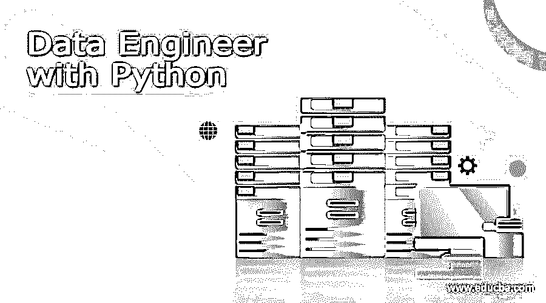

# 使用 Python 的数据工程师

> 原文：<https://www.educba.com/data-engineer-with-python/>

## Python 数据工程简介

数据工程师使用 Python 进行数据分析和数据管道的创建，这有助于数据争论活动，如聚合、连接多个源、重塑和 ETL 活动。Python 有几个工具可以帮助进行数据分析，还有一些库可以帮助用很少的代码完成分析过程。对于数据工程师来说，掌握数据库工具的知识对于管理好数据和了解分析过程非常重要。这有助于将多项任务合并为一个角色，从而轻松管理分析流程。在分析中使用 Python 可以轻松解决复杂的问题。

### Python 的数据工程是什么？

编程技能对数据工程师来说很重要，Python 易于编码，大多数数据工程师乐于将 Python 用于管道和数据分析。数据工程师知道数据架构和数据库的工作方式，因此他们可以很容易地开始所有的实现和数据库开发。这个数据库应该与任何应用程序和 Python 知识是不可避免的。机器学习对于数据工程师也很重要，可以用 Python 的知识来管理。

<small>网页开发、编程语言、软件测试&其他</small>

### 数据工程中使用的 5 大 Python

这些是数据工程中最常用的 Python 包。

#### 1.我的天啊

除了数值方法之外，本模块还提供了各种科学方法，可供数据工程师用来解决复杂的问题。在 Python 中的 SciPy 模块的帮助下，可以完成优化模块以及线性代数、积分和插值函数、几个特殊函数，甚至信号图像处理。

#### 2.熊猫

这里提供的数据结构简单易懂，在所有提供的数据中具有很高的性能。这个包在数据争论和数据操作方面很好。数据的可视化和处理速度比 Python 提供的任何其他模块都要快。

#### 3.美味的汤

该模块通过抓取和解析技术帮助数据提取。任何格式都可以很容易地解析，因为它认为数据是分层排序的，包括网页。这甚至有助于数据工程师解析 HTML 和任何其他网页。

#### 4\. Petl

该模块仅用于数据提取、操作和数据表加载。这里可以用几行代码轻松地转换表格，并且还支持数据导出。这有助于轻松地从 SQL、CSV 或任何其他格式传输数据。由于用于提取、转换和加载表的 Python 模块，这被称为 PETL。

#### 5.Pygrametl

使用 Pygrametl 可以很容易地创建 etl 工作流，因为它具有所有的 ETL 功能。这样更快，所有代码都可以直接在模块中获得。ETL 中的维度由维度对象度量，并且与数据流中的一个或多个表相关联。ETL 的所有活动，比如查找、插入和删除数据，将数据从一个数据源复制到另一个数据源，都是由 Pygrametl 自己完成的。

### 使用 Python 的用例数据工程师

**1。数据获取:**数据获取包括联系数据源并获取所需格式的数据，这些数据源可以是 API 或任何 web 应用程序。Python 在这里通过编码和包来帮助构建基于源代码的管道并收集信息。此外，我们可以使用 ETL 作业来进行数据采集，这也涉及到 Python。

**2。数据操作:** Python 有几个库，Pandas 库以根据用户需求操作数据而闻名。我们可以读取任何格式的数据并对其进行操作。如果数据集很大，我们可以使用 PySpark 库来管理数据。

**3。数据建模:** Python 可以像机器学习一样与团队交流，TensorFlow 参与了这项工作。它使用 Keras、Scikit-learn 或 PyTorch 进行数据建模，因此可以用来查看数据相对于数据工程师的位置。

**4。Data Surfacing:** Python 可以设置 API，这样就可以很容易地看到数据，这是在 Flask 和 Django 框架的帮助下完成的。这也包括正常的报告创建。

### Python 中数据工程师的角色

*   从事数据架构的工作对于数据工程师来说很重要，因为他们应该知道系统的工作方式，并且应该根据组织的需求来计划工作。Python 在这里用得不多，因为可视化工具在这里用得最多。
*   数据收集是数据工程中的另一个重要过程，他们从不同的来源收集数据并对其进行处理。Python 在这里被用来在数据砖或任何其他分析平台的帮助下，以管道和数据操作的形式从源收集数据。
*   数据工程师应该研究数据以及数据在过去几年中的表现。在 Python 的帮助下，可以很容易地绘制图表，以了解数据性能，从而使工作更快、更高效。
*   数据工程师不应该只依赖 Python 中的一个库，因为其他库对同一问题有不同的方法和更快的解决方案。当找到有效的方法时，数据工程师应该不断学习并改变他们的方法。
*   在数据存储之后，识别来自相同来源的数据模式是很重要的。在这里，Python 的可视化技巧非常有用。如果有任何数据异常，这是可以解决的，任何 IDE 如 Jupyter IDE 都可以用来做数据工程问题。
*   在创建数据管道时，需要几个自动化，Python 在这里会派上用场，因为它可以高效地完成所有的编码工作。

### 结论

对于刚接触数据工程的新手来说，学习 Python 和做数据分析都很容易。来自世界各地的数据由数据工程师处理，随后由数据科学家处理，因此在未来几年也将需要使用 Python 的数据工程师。

### 推荐文章

这是一个使用 Python 的数据工程指南。在这里，我们讨论介绍，什么是 Python 数据工程师，用例，角色。您也可以看看以下文章，了解更多信息–

1.  [什么是数据工程？](https://www.educba.com/what-is-data-engineering/)
2.  [数据工程师面试问题](https://www.educba.com/data-engineer-interview-questions/)
3.  [数据科学家 vs 数据工程师](https://www.educba.com/data-scientist-vs-data-engineer/)
4.  [数据科学 vs 数据工程](https://www.educba.com/data-science-vs-data-engineering/)

