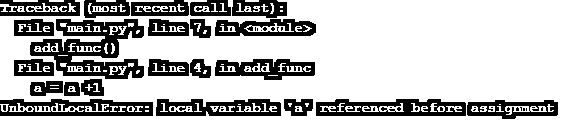
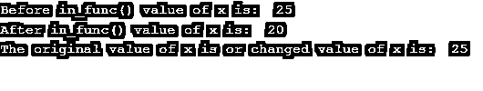

# Python 全局变量

> 原文：<https://www.educba.com/python-global-variable/>


## Python 全局变量简介

以下文章提供了 Python 全局变量的概要。一般来说，任何编程语言中的变量都可以定义为一个用来存储某个特定名称下的值的元素。该变量在存储器中用作存储单元中的识别对象。它有两种类型，全局变量和局部变量，其中全局变量可以在整个程序中从函数外部访问，而局部变量只能在函数内部访问。但是在 python 中，如果变量是在函数内部声明的，那么默认情况下，它就是局部变量。同样，如果一个变量是在函数之外声明的，默认情况下它是一个全局变量。

### 什么是全局变量？

全局变量是函数或程序之外的变量，但是可以使用关键字“Global”将它们变成函数之内的变量的全局变量。

<small>网页开发、编程语言、软件测试&其他</small>

**语法:**

```
a = a = "value for variable"
def function_name():
    global a
    statement(s)
```

### Python 全局变量的示例

下面是提到的例子:

#### 示例#1

**代码:**

```
a = 1
def add_func():
    print(a)
add_func()
```

**输出:**


在上面的例子中，默认情况下，变量“a”是一个全局变量，当您打印“a”的值或调用一个函数时，它会输出 1。但是如果我们想访问变量“a”的变化值，那么当我们调用函数 add_func()时，我们会得到一个错误，说变量“a”是一个局部变量。所以为了避免这样的问题，我们使用全局变量。

#### 实施例 2

**代码:**

```
a = 1
def add_func():
    a = a +1
    print (a)
add_func()
```

**输出:**

这将给出一个错误，说明变量“a”是一个局部变量。




为避免这种错误，上述代码的修改程序使用了一个全局关键字。

**代码:**

```
a = 1
def add_func():
           global a
           a = a+1
           print("Inside the function",a)
add_func()
print("In main after a change in the value of the variable", a)
```

**输出:**


在上面这个修改过的程序中，变量“a”的初始值是 1，而在函数 add_func()中，我们将它增加 1，然后函数内部变量的值变成 2，所以现在函数外部变量“a”的值从 1 变成 2。

#### 实施例 3

在下面的程序中，它既有局部变量又有全局变量。

**代码:**

```
a = 5
def variable_func():
           a =10
           print("Local variable value", a)
variable_func()
print("Global variable value", a)
```

**输出:**


在上面这个包含局部和全局变量的例子中，它没有使用全局关键字，因为变量“a”是在包含值“5”的函数 variable_func()之外声明的，所以这个变量在默认情况下被认为是全局变量。变量“a”在被赋值为“10”的 variable_func()函数中声明时，默认情况下该变量也是局部变量。因此，函数内部的 print 语句打印局部变量的值，而函数体外部的 print 语句分别打印全局变量的值，如 10 和 5。

全局变量可以在嵌套函数中使用[，这也可以通过下面的例子来说明。](https://www.educba.com/javascript-nested-functions/)

#### 实施例 4

**代码:**

```
def out_func():
 x = 20
def in_func():
    global x
x = 25
print("Before in_func() value of x is: ", x)
in_func()
print("After in_func() value of x is: ", x)
out_func()
print("The original value of x is or changed value of x is: ", x)
```

**输出:**




上面的嵌套函数中全局变量的例子，在上面的程序中，我们在 in_func()中声明了全局变量，而 out_func()中的变量“x”的值保持不变，因为它不是 in_func()的全局变量，所以在 in_func()中声明的关键字 global 对 out_func()中的变量“x”没有影响。稍后在调用 in_func()之前和之后，变量“x”的值保持为 20，因为它将它作为一个局部变量。类似地，out_func()外部的变量“x”的值将取值为 25，因为我们已经使用 global 关键字在 in_func()内部创建了一个全局变量。因此，如果我们在 in_func()函数中对变量“x”进行任何更改，那么即使在 in_func()之外，即 out_func()之外，也会反映变量值的变化。

在 Python 中，要访问函数中的局部变量和全局变量，我们需要使用 globals()函数，该函数返回当前程序中的项目列表，可用于访问或修改全局变量，而无需使用 global 关键字。这可以从下面的例子中看出。

#### 实施例 5

**代码:**

```
t= 100
def func():
           list_of_items = globals()
           list_of_items[‘t’] = 15
           t = 22
           print("Local value of t is:", t)
print("The value of t is:", t)
func()
print("Change in the value of t is:", t)
```

**输出:**


在上面的例子中，局部和全局变量用相同的名字“t”声明，并且它在函数内部被修改了两次。所以当声明 globals()时，它引用的是一个全局变量，而不是带有关键字 global 的变量，所以它不会在函数中隐藏局部变量。

### 结论

Python 编程语言中的全局变量有自己的工作方式，这对于访问或获取变量的变化值很有用。如果变量是在函数外声明的，默认情况下它是全局的，但是如果我们希望函数内的变量也是全局的，那么我们必须在函数内声明的变量之前使用一个全局关键字。如上例所示，局部变量和全局变量都可以以不同的方式声明和使用。

### 推荐文章

这是 Python 全局变量的指南。在这里，我们讨论 python 全局变量及其代码实现的简要概述。您也可以浏览我们推荐的其他文章，了解更多信息——

1.  [Python 的优势](https://www.educba.com/advantages-of-python/)
2.  [Python 中的星形模式](https://www.educba.com/star-patterns-in-python/)
3.  [Python 框架](https://www.educba.com/python-frameworks/)
4.  [Python 编译器](https://www.educba.com/python-compilers/)


