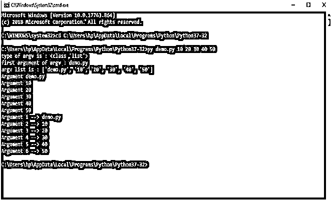
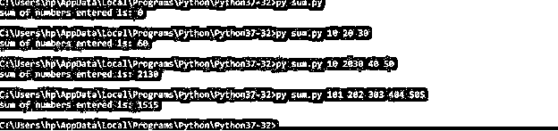
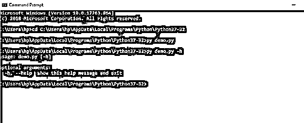
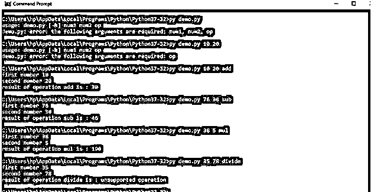
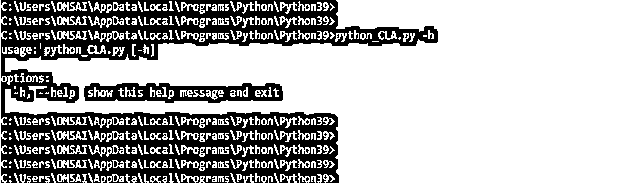
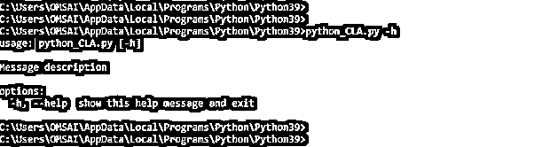
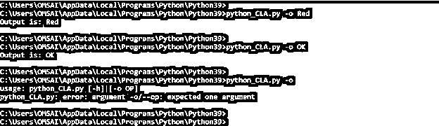

# Python 命令行参数

> 原文：<https://www.educba.com/python-command-line-arguments/>


## Python 命令行参数简介

Python 命令行参数是出现在操作系统命令行 shell 中程序名称之后的参数。Python 有很多方法来处理这些参数。sys 模块包含用于操纵 Python 运行时的许多方面的方法和变量。该模块提供了对几个解释器变量和函数的访问。sys.argv 是一个基本的列表结构，是这些变量之一。

程序接受用户输入有许多不同的方式。Python 命令行参数的常见方式是 input()方法。

<small>网页开发、编程语言、软件测试&其他</small>

```
name=input("enter your name")
print('Hey',name)
=== RESTART:C:/Users/hp/AppData/Local/Programs/Python/Python37-32/demo.py ===
enter your name John
Hey John 
```

向程序传递输入的另一种方式是命令行参数。几乎所有现代编程语言都支持命令行参数。同样，python 也支持命令行参数。这是一个非常重要的特性，因为它允许用户进行动态输入。在命令行参数中，输入是通过命令提示符提供给程序的，而不是像上面显示的 input()方法那样的 python 脚本。

### 命令行参数中可用的选项

Python 3 支持四种不同的方式来处理命令行参数。

1.  系统模块
2.  getopt 模块
3.  argparse 模块

#### 1.系统模块

这是 python 中处理命令行参数的最基本也是最古老的方法。它有一个与 C 库 argc/argv 非常相似的方法来访问参数。sys 模块通过名为 sys.argv 的列表结构实现命令行参数 argv 是内部列表结构，用于保存在命令提示符下传递的参数

系统à模块名称

argv à list 处理来自用户的动态输入

argv[0]到 python filename

argv[1]à参数 1

argv[2]到参数 2

argv[3]到参数 3

诸如此类。

**步骤:**

1.  写一个 python 程序
2.  将 python 程序另存为<program name="">。py 扩展</program>
3.  打开命令提示符，将目录更改为 python 程序路径
4.  使用下面的命令执行程序

py< python file.py >< arg1 >< arg2 >T3】

示例:py demo.py 10 20 30 40 50

argv 列表中的第一项即 argv[0]是 python 文件名，在本例中为 demo.py

argv[1]是第一个参数±10

argv[2]是第二个参数±20

argv[3]是第三个参数±30，以此类推

默认情况下，argv 的类型是“String ”,所以我们必须按照我们的要求进行类型转换。

**代号:**

```
# Importing argv from sys module
from sys import argv
# type of argv
print('type of argv is :',type(argv))
# first element is the file name
print('first argument of argv :',argv[0])
# printing the complete argv list
print("argv list is :",argv)
# traversing through the list : method 1
for x in argv:
  print('Argument',x)
# traversing through the argv list : method 2
for i in range(len(argv)):
  print('Argument',(i+1),'-->',argv[i]) 
```

**输出:**




**通过 input()传递的数字总和:**

**代码:**

```
sum_num=0
# getting input from the user
a=int(input('Enter value for a '))
b=int(input('Enter value for b '))
c=int(input('Enter value for c '))
# calculating sum of numbers
sum_num+=a+b+c
# displaying sum of numbers
print("Sum of entered numbers is :",sum_num) 
```

这是计算用户输入的一些数字的基本方法。程序中的参数通过 input()方法接受，然后该方法被转换为整型，因为 input()返回字符串类型数据。

**输出:**


**计算一些通过命令行输入的数字:**

**代码:**

```
# importing argv from sys module
from sys import argv
sum_num=0
# traversing through the list elements skipping the first element(filename)
for i in range(1,len(argv)):
    sum_num+=int(argv[i])
print("sum of numbers entered is:",sum_num) 
```

**输出:**




**说明:** sys.argv 导入。然后使用 for 循环遍历 argv 列表，计算命令行参数的总和。因为参数是字符串类型，所以它们是求和运算之前第一个转换为整数类型的类型。然后打印结果，如上面的屏幕截图所示。

#### 2.getopt 模块

python 中实现命令行参数的第二种方法是使用 getopt 模块。Python getopt 模块类似于 C getopt()函数的模块，用于解析命令行参数。

getopt 模块提供了两个函数和一个异常来简化命令行参数解析。

```
getopt.getopt(args,UNIX options, [long_options or gnu options])
args  arguments list to be parsed
unix options  “ho:v”
gnu options  long options parameter  ["help", "output=", "verbose"] 
```

**代码:**

```
# importing standard libraries
import getopt
import sys
# extracting command line arguments excluding file name
argv = sys.argv[1:]
# parsing the argument list
try:
     opts, args = getopt.getopt(argv, 'ho:v')
     print(opts)
     print(args)
except getopt.GetoptError:
     print('Something went wrong!')
     sys.exit(2) 
```

**输出:**


**说明:**导入标准库。Sys 模块用于获取命令行参数，getopt 模块用于解析命令行参数。通过排除 argv[0]即文件名从 argv 中提取参数。使用 getopt.getopt()解析参数。具有相应值的参数存储在名为 opts 和 args 的两个变量中

#### 3.argparse 模块

Python argparse 模块是解析命令行参数的最佳方式，因为它提供了许多选项，如位置参数、参数的默认值、帮助消息等。

**代码:**

```
import argparse
parser = argparse.ArgumentParser()
args = parser.parse_args() 
```

导入第一个 argparse 模块。然后是 argparse 的对象。ArgumentParser()已创建。

在命令提示符下执行上述程序时，如果我们不提供任何输入，什么也不会发生。但是当我们给出可选的帮助参数时，我们得到下面的输出

**输出:**




argparse 支持两种类型的参数:

1.  位置参数
2.  可选参数

**代码:**

```
# importing argparse module
import argparse
# creating parser object
parser = argparse.ArgumentParser()
# adding positional arguments
parser.add_argument("num1",help='number 1')
parser.add_argument("num2",help='number 2')
parser.add_argument("op",help='operation')
args = parser.parse_args()
# type cast the arguments as default is string type
n1=int(args.num1)
n2=int(args.num2)
print("first number",n1)
print("second number",n2)
result=None
if args.op == 'add':
    result = n1 + n2
elif args.op == 'sub':
    result = n1 - n2
elif args.op == 'mul':
    result = n1 * n2
elif args.op == 'div':
    result = n1 / n2
else :
     result = 'unsupported operation'
print("result of operation",args.op,'is :',result) 
```

**输出:**




### Python 命令行参数示例–如何传递

*   以下示例显示了 argparse 方法的用法。

**代码:**

`import argparse
parser = argparse.ArgumentParser ()
parser.parse_args ()`




*   通过使用 argparse 方法，我们可以传递和添加帮助消息，描述如下。

**代码:**

`import argparse
parse = "Message description"
parser = argparse.ArgumentParser(description = parse)
parser.parse_args ()`




*   以下示例显示了如何使用命令行参数定义可选值，如下所示。

**代码:**

`import argparse
py = argparse.ArgumentParser()
py.add_argument ("-o", "--op", help = "Show op")
args = py.parse_args ()
if args.op:
print("Output is: % s" % args.op)`




### 结论

这就是 python 中读取和解析命令行参数的所有不同方式。由用户决定哪一个最适合他们的特定需求。

### 推荐文章

这是 Python 命令行参数的指南。这里我们讨论一个介绍，选项，以及如何通过例子传递 python 命令行参数。您也可以浏览我们的其他相关文章，了解更多信息——

1.  [Python 3 命令](https://www.educba.com/python-3-commands/)
2.  [Python argparse](https://www.educba.com/python-argparse/)
3.  [Python 枚举](https://www.educba.com/python-enumerate/)
4.  [蟒龟](https://www.educba.com/python-turtle/)


