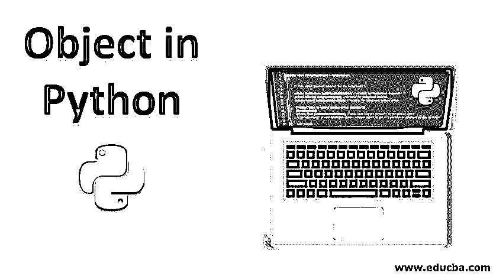
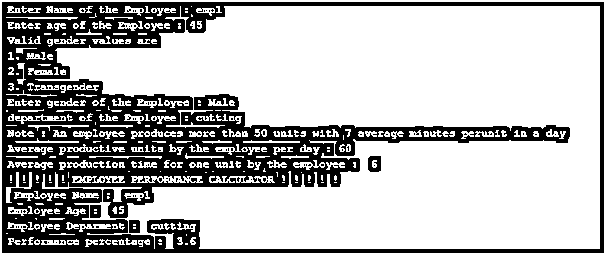
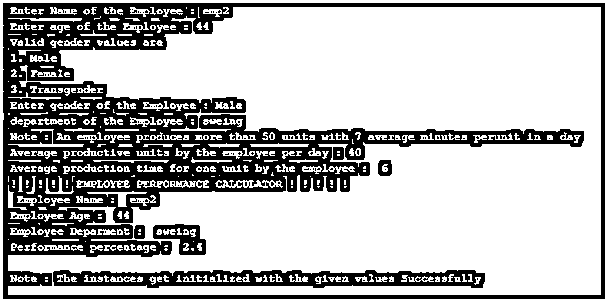

# Python 中的对象

> 原文：<https://www.educba.com/object-in-python/>




## Python 中对象的介绍

Python 是一种面向对象的语言，不像面向过程的编程语言那样主要关注函数。Python 强调对象和类；对象是对数据进行操作的变量和方法的集合，而类是对象的蓝图。我们可以从一个类中创建尽可能多的对象；对象也称为类的实例，创建类的实例称为实例化。

**语法**

<small>网页开发、编程语言、软件测试&其他</small>

`Class Class_Name:
.....................................
Object_Name = Class_Name()
Object_Name.Method_Name()`

### 示例程序

确定员工绩效百分比的程序

#### 目标

*   该计划的目标是评估员工的表现。
*   员工生产的平均单位和生产这些单位所用的时间是键入的，这反过来又键入了员工的绩效值。
*   因此，使用此绩效值，可以确定员工的评级。

这个程序旨在[处理多重继承](https://www.educba.com/multiple-inheritance-in-python/)主题，其中子类负责调用其相应父类中隐含的方法。

```
#!/usr/bin/evn python

#      Define a class as 'Individual'      #
import sys

class Individual:
#      Constructor#1     #

Valid_genders = ['Male','Female','transgender']

def __init__(self):
self.Employee_Name = input( " Enter Name of the Employee : " )
self.Employee_age = input( " Enter age of the Employee : " )
print( " Valid gender values are " )
print( " 1\. Male " ) 
print( " 2\. Female " )
print( " 3\. Transgender " )
try:
self.Employee_gender = input( " Enter gender of the Employee : " )
if self.Employee_gender not in self.Valid_genders:
raise Exception('valueerror')
except Exception as valueerror:
print("PLEASE ENTER A VALID GENDER")
sys.exit(0)
# Method
def display(self):
print( " ! ! ! ! ! EMPLOYEE PERFORMANCE CALCULATOR ! ! ! ! ! " )
print( "  Employee Name : " , self.Employee_Name )
print( " Employee Age : " , self.Employee_age )
print( " Employee Gender : " , self.Employee_gender )

#      Define a class as 'Evaluated_Rating'      #
class Evaluated_Rating:
#      Constructor#2     #

def __init__(self):
self.department = input( " department of the Employee : " )
print( " Note : An employee produces more than 50 units with 7 average minutes perunit in a day " )
self.Productivity = int(input( " Average productive units by the employee per day : " ) )
self.production_time = int(input( " Average production time for one unit by the employee :  " ) )

# Method
def display(self):
print( " Employee Deparment : " , self.department )        
performance_percentage = (self.Productivity * self.production_time)/100
print( " Performance percentage : " , performance_percentage )
if (performance_percentage > 4 ) :
print(" THE EMPLOYEE HAS SCORED RATING 3 ")
elif (performance_percentage > 6 ) :
print(" THE EMPLOYEE HAS SCORED RATING 2 ")
elif (performance_percentage > 9):
print(" THE EMPLOYEE HAS SCORED RATING 1 ")

class Employee(Individual, Evaluated_Rating):

def __init__(self):
# Call ' Individual ' super class constructor     
Individual.__init__(self)
# Call ' Evaluated_Rating ' super class constructor
Evaluated_Rating.__init__(self)

def result(self):
# Call method of class 'Individual'
Individual.display(self)
# Call method of class 'Evaluated_Rating'
Evaluated_Rating.display(self)

#      Objects of class 'Employee1'    # 
Employee1 = Employee()
Employee1.result() # object using the methods of the declared class
#      Objects of class 'Employee'    # 
Employee2 = Employee()
Employee2.result() # object using the methods of the declared class

print("                                                                           ") 
print( " Note : The instances get initialized with the given values Successfully " ) 
```

**输出:**







### 说明

该计划的目标是评估员工的表现。因此，员工生产的平均单位和生产这些单位所用的时间是键入的，这反过来又键入了员工的绩效值。因此，使用此绩效值，可以确定员工的评级。

从技术角度来看，对象' Employee1 '和' Employee2 '被实例化，程序的流程得到了明智的控制。

下面是程序为单个员工显示的元素列表，

输入员工姓名:

输入员工的年龄:

有效的性别值包括

1.  男性的
2.  女性的
3.  变性人

输入员工的性别:

员工所属部门:

**Note:** An employee produces more than 50 units with 7 average minutes per unit in a day

员工每天的平均生产单位:

员工生产一个单位的平均时间:

！！！！！员工绩效计算器！！！！！

员工姓名:

员工年龄:

员工部门:

性能百分比:

该员工已获得评分

### 通过面向对象编程使用对象的优势

*   对象在代码重用中起着至关重要的作用。这种重用主要通过面向对象编程中[继承的概念来实现。](https://www.educba.com/inheritance-in-php/)
*   面向对象编程中的多态性给代码带来了更大程度的灵活性。
*   随着对象的引入，解决问题变得相对容易得多；这是可以实现的，因为对象的代码控制非常灵活。

### 结论–Python 中的对象

面向对象编程的概念在 python 语言中隐含高效的高级编程方面发挥了便利的作用。并且这些对象在这些概念的执行中充当关键中枢。

### 推荐文章

这是 Python 中对象的指南。在这里，我们讨论用于确定员工绩效百分比的程序示例。您也可以阅读以下文章，了解更多信息——

1.  [Python 中的抽象类](https://www.educba.com/abstract-class-in-python/)
2.  [Python 中的列表操作](https://www.educba.com/list-operations-in-python/)
3.  [Python 编辑器](https://www.educba.com/python-editors/)
4.  [Python 中的循环](https://www.educba.com/loops-in-python/)


