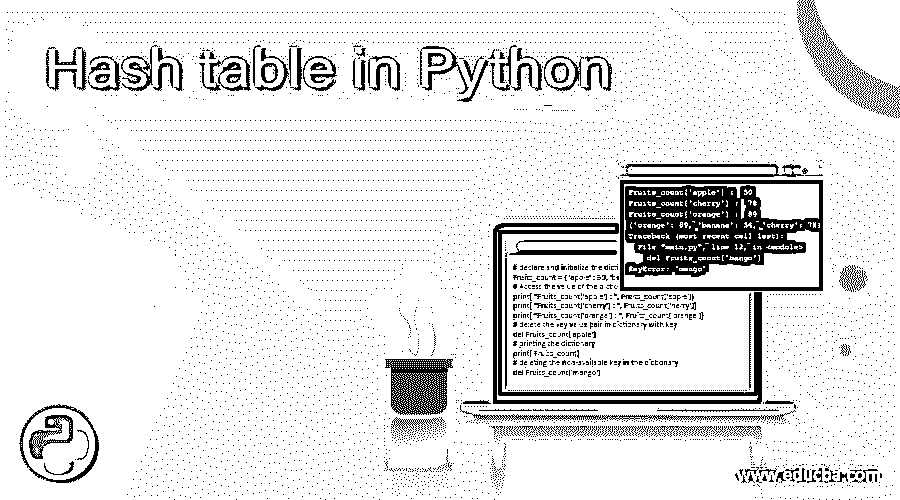
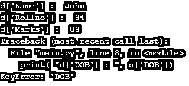
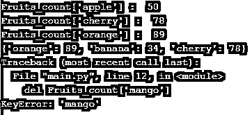
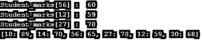

# python 中的哈希表

> 原文：<https://www.educba.com/hash-table-in-python/>




## Python 中哈希表的介绍

python 中的哈希表用于通过键值对存储数据；它是通过使用字典实现的。哈希表是以键值对的形式存储数据的数据结构之一。每个值都有一个通过哈希函数生成的唯一键，这使得访问哈希表中的数据或值更快，而不管哈希表中存在多少个值。

Dictionary 是 python 中内置的数据类型，借助 dictionary 实现 python 中的哈希表。Python 中使用散列函数来生成字典的键。字典的关键字没有顺序，可以修改。

<small>网页开发、编程语言、软件测试&其他</small>

**在 python 中创建字典的语法—**

`d = { key : value }`

或者

`d = dict( key = value )`

可以使用大括号“{”和“}”在 python 中创建字典，也可以使用 dict()函数创建字典。使用花括号创建字典时，键和值由“:”分隔，每对由“，”分隔。dict()是使用 dict()函数创建字典的内置函数，键和值由“=”分隔，每个键-值对由“，”分隔。

### python 中散列表的使用

python 中的哈希表可以在字典的帮助下创建，使用花括号和 dict()函数可以创建字典。假设我们有一个包含学生标记的学生标记字典。现在我们需要更新学生标记数据，因此我们可以执行“Student_marks[56] = 65”，其中 Student_marks 是字典，56 是存储在字典中的第 56 个学生的键。因此它更新了卷 56 的标记值 65。

### python 中散列表的示例

下面是 pyhton 中散列表的示例:

#### 示例#1

python 中创建和访问字典值的散列表示例——

**代码:**

```
# declare and initialize the dictionary
d = { 'Name' : 'John', 'Rollno' : 34, 'Marks' : 89}
# Access the value of the dictionary with the key
print( "d['Name'] : ", d['Name'])
print( "d['Rollno'] : ", d['Rollno'])
print( "d['Marks'] : ", d['Marks'])
# passing the non-available key in the dictionary
print( "d['DOB'] : ", d['DOB'])
```

上述代码的输出是–




与上面的程序一样，创建了学生记录的字典，其中包含姓名、卷号和标记作为键。接下来，在键的帮助下以“d['Name']”的形式访问字典的值，其中“d”是字典，“Name”是键。接下来，尝试使用字典中不存在的键从字典中访问值，这通过“keyError”实现，正如我们在上面的输出中看到的。

#### 实施例 2

python 中删除字典键值对的散列表示例——

**代码:**

```
# declare and initialize the dictionary
Fruits_count = { 'apple' : 50, 'banana' : 34, 'orange' : 89, 'cherry' : 78}
# Access the value of the dictionary with the key
print( "Fruits_count['apple'] : ", Fruits_count['apple'])
print( "Fruits_count['cherry'] : ", Fruits_count['herry'])
print( "Fruits_count['orange'] : ", Fruits_count['orange'])
# delete the key value pair in dictionary with key
del Fruits_count['apple']
# printing the dictionary
print( Fruits_count)
# deleting the non-available key in the dictionary
del Fruits_count['mango']
```

上述代码的输出是–




在上面的程序中，创建了水果计数的字典，其中包含水果的名称作为键，以及相应的可用数量作为值。接下来，在键的帮助下访问字典的值，如“Fruits_count['apple']”，其中“Fruits_count”是字典，“apple”是键。接下来，从字典中删除关键字值，关键字为“del Fruits_count['mango']”，其中 del 是删除元素的关键字。接下来，尝试用字典中不存在的键从字典中删除键值，这是通过“keyError”实现的，我们可以在上面的输出中看到。

#### 实施例 3

python 中用于更新字典值的哈希表示例–

**代码:**

```
# declare and initialize the dictionary
Student_marks = { 12 : 59, 56 : 60, 18 : 89, 27 :78, 30 : 68}
# Access the value of the dictionary with the key
print( "Student_marks[56] : ", Student_marks[56] )
print( "Student_marks[12] : ", Student_marks[12] )
print( "Student_marks[27] : ", Student_marks[27] )
# update the value in dictionary with key
Student_marks[56] = 65
# add new key value pair
Student_marks[14] = 70
# printing the dictionary
print( Student_marks )
```

上述代码的输出是–




在上面的程序中，创建了学生标记的字典，其中包含作为键的学生编号和作为值的相应标记。接下来，在键的帮助下访问字典的值，如“Student_marks[56]”，其中“Student_marks”是字典，“56”是键。接下来，用关键字“Student_marks[56] = 65”更新字典的值，这更新了关键字 56 的标记 65。接下来，添加新的键-值对“Student_marks[14] = 70”，这将新的键 14 和值 70 添加到 Student_marks 字典中，正如我们在上面的输出中看到的。

### 结论

python 中的哈希表是通过使用字典实现的，字典用于通过键值对存储数据。

### 推荐文章

这是 Python 中散列表的指南。在这里，我们将讨论 python 中散列表的工作方式，以及示例和输出。您也可以看看以下文章，了解更多信息–

1.  [Python 中的烧瓶](https://www.educba.com/flask-in-python/)
2.  [Python 字符串包含](https://www.educba.com/python-string-contains/)
3.  [Python 列表扩展](https://www.educba.com/python-list-extend/)
4.  [Python mkdir](https://www.educba.com/python-mkdir/)


