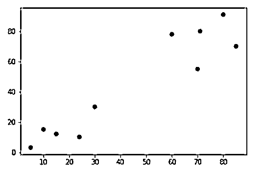

# 分层集群 Python

> 原文：<https://www.educba.com/hierarchical-cluster-python/>


## 分层集群 Python 简介

以下文章提供了分层集群 Python 的概述。分层方法中的聚类允许对未标记的数据进行聚类。因此，所有相同类型的数据点都应该在一个特定的集群下获取。这就是分层集群的工作方式。因此，层次聚类的核心思想是将所有具有非常相似特征的数据点关联到同一个聚类下。甚至在某些特定情况下，K-means 聚类和层次聚类结果的值可能完全相同。层次聚类有两种方式:凝聚式和分裂式。

### 分层聚类是如何工作的？

下面给出了聚集聚类中涉及的步骤:

<small>网页开发、编程语言、软件测试&其他</small>

*   每个数据点都包含在数据点的集群中。因此，聚类总数需要与一个名为 K 的值相关联。这里，K 将是所有数据点都要考虑的一个点。因此群集的总数将从值 K 开始。该 K 值是对应于数据点数量的距离值。因此 K 的值在设置对应于数据点的距离值时将是有用的。
*   下一步是集群的形成。这是非常重要的一步。这一步在设置 k 值之后进行。因此，在考虑 K 值之后，必须通过连接两个非常接近的数据点来形成聚类。这两个最接近的数据点将产生 K-1 个聚类。这就是 K-1 集群设置的框架。
*   上述步骤必须一次又一次地重复，以形成更多的簇。通过连接其他几个最近的数据点，可以形成更多的聚类。这些形成了 K-2 星团。
*   现在需要形成最终的集群结构。最终的集群形成期待最关键的一步。为了形成最终的聚类，必须考虑先前考虑的所有数据点。最终聚类包括循环执行上述三个步骤来设置最终聚类。这种重复将导致一个大集群，这将是最后的集群。
*   在单个聚类形成之后，并且该单个聚类是通过来自各种其他小聚类的值形成的，那么树形图在基于所涉及的问题类型划分成多个聚类时是有用的。
*   在下一节中，我们将看到如何进行去 dograms。
*   关键是要确定群集之间的距离，这意味着要确定群集之间的距离，可以执行下面给出的步骤。
*   主要考虑的是测量两个数据点之间的距离。这是需要考虑的一个非常重要的方面。我们需要测量两个不同点之间的距离，这两个不同点构成了给定集群的各个部分。
*   下一句与上一句截然相反。据此，需要确定两个集群之间的最远点。因此必须识别和确定两个集群之间的最大距离。这可以通过以下方法实现。可以考虑与聚类的端点相关联的数据点，然后这些数据点可以用于确定聚类的最远点。
*   接下来应该考虑质心。因此，必须考虑两个聚类的质心，并且必须计算质心之间的距离。这是流程部分的下一项。
*   最后一点是确定平均值，必须在所有可能的组合之间确定平均值。这意味着必须考虑所有的值和组合来确定两个聚类之间的点，然后必须计算这两个点之间相关的平均值。这是在这里完成的。

### 分层集群 Python 示例

下面的例子展示了如何设计一个层次聚类代码，并把它执行成一个 grap 输出。

**代码:**

```
import matplotlib.pyplot as plt
import pandas as pd
import numpy as np
Input = np.array([[5,3],
    [20,25],
    [35,42],
    [44,30],
    [50,30],
    [65,70],
    [71,30],
    [80,78],
    [90,55],
    [80,91],])
from sklearn.cluster import AgglomerativeClustering
cluster = AgglomerativeClustering(n_clusters=2, affinity='euclidean', linkage='ward')
cluster.fit_predict(Input)
plt.scatter(Input[:,0],Input[:,1], c=cluster.labels_, cmap='rainbow') 
```

**说明:**

*   定义分层集群的过程包括以下步骤。首先必须通过 pyplot 使用 matplot 库。matplot 库在制作与 pyplot 相关的图形时非常有用。所以这是层次聚类过程的第一个重要项目。然后熊猫和熊猫的宣言将被期待。接下来，输入数据需要被期望馈送。numpy 数组。numpy 数组用值填充并加载。接下来，通过从 sklearn 库的 cluster 项下导入 AgglomerativeClustering 来设计 agglomerative cluster。所以从 sklearn 库的 cluster 项开始，进行凝聚聚类。这是设计这些集群的关键步骤。下一步是集群的形成。
*   接下来，必须通过调用凝聚聚类方法来执行聚类，聚类后的值将存储在 cluster 变量中。集群变量将具有此输出值。然后使用预测方法通过拟合方法预测来自聚类的输出值。plt。散点图用于描述输出的图形表示，以及与之相关的所有分类。因此，所有的聚类都将通过散点图方法与数据点一起描绘在图上。

**输出:**




### 结论

上面给出的文章清楚地展示了如何使用层次聚类进行预测。“如何工作”一节简要描述了该过程背后的算法，该示例显示了一个与执行分层聚类的过程相关的实时示例。

### 推荐文章

这是一个层次集群 Python 的指南。这里我们讨论一下介绍，层次聚类是如何工作的？还有例子。您也可以看看以下文章，了解更多信息–

1.  [背包问题 Python](https://www.educba.com/knapsack-problem-python/)
2.  [Python 中的回溯](https://www.educba.com/traceback-in-python/)
3.  [BFS 算法 Python](https://www.educba.com/bfs-algorithm-python/)
4.  [Python 中的多态性](https://www.educba.com/polymorphism-in-python/)


