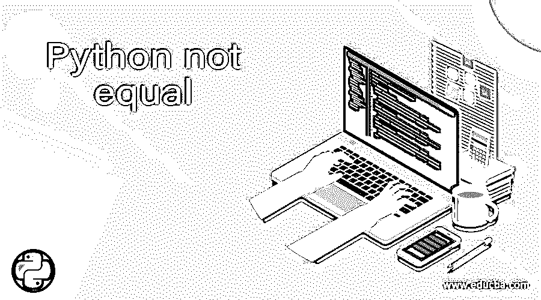
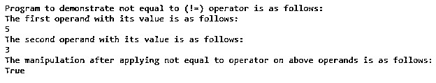
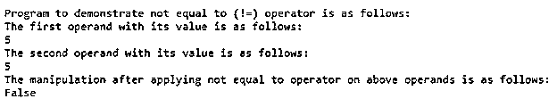
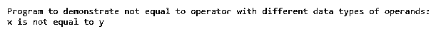
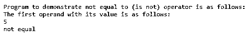
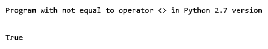

# Python 不等于

> 原文：<https://www.educba.com/python-not-equal/>




## Python 简介不等于运算符

在本文中，我们将讨论一个不等于操作符的 Python。一般来说，任何编程语言中的运算符概念都是用来对已定义的变量及其值执行任何逻辑或算术运算的，这种运算符称为比较运算符。这个不等于运算符是 Python 中的一个特殊符号，可以计算逻辑或算术表达式。这通常表示为“！= "和" is not "来运算这个不等于运算符。在 Python 中，不等于运算符所运算的值称为操作数。这个不等于运算符与等于运算符正好相反。当每一边的操作数的值不匹配或不相等时，返回 true 否则，它将返回 false。

### 使用语法在 Python 中处理不等于运算符

在本节中，我们将看到 Python 中不等于运算符的语法和示例。该运算符用于比较两个值，如果运算符两边的两个操作数值不相等，但具有相同的类型，则返回 true，否则返回 false。因此，不等于运算符是一个比较运算符，表示为“！=".现在让我们在下面的章节中详细介绍。

<small>网页开发、编程语言、软件测试&其他</small>

**语法:**

```
opr1 != opr2
```

或者

```
if…else (opr1 is not equal opr2)
```

**opr1:** 任何有效的操作数或对象。

**opr2:** 任何有效的操作数或对象。

该语句或表达式将返回布尔值，如“真”或“假”。

在上面的语法中，我们看到在 Python 中可以用两种方式定义“不等于”使用“！= "或"不是"，并返回布尔值"真"或"假"，在运算符的两边有相同类型的操作数。

### Python 不相等的示例

现在让我们看一个例子来演示不等于运算符(！=).

#### 示例#1

**代码:**

```
print("Program to demonstrate not equal to (!=) operator is as follows:")
x = 5
print("The first operand with its value is as follows:")
print(x)
y = 3
print("The second operand with its value is as follows:")
print(y)
print("The manipulation after applying not equal to operator on above operands is as follows:")
print(x != y)
```

**输出:**




在上面的程序中，我们可以看到我们声明了两个变量，x 和 y，它们被认为是值为 5 和 3 的操作数。我们可以看到我们试图打印表达式 x 的结果！= y，当两个给定的操作数不相等时，它将打印“True”。

要看到上面的程序输出为“False”，那么我们需要用相同的值定义两个操作数 x 和 y 的值。所以我们可以看到下面的截图。




在 Python 中，当我们使用 not equal to 运算符时，我们必须注意，声明的两个操作数必须是相同的数据类型；否则在 Python 中，如果两个操作数有不同的数据类型，那么它将返回不等于。下面让我们用一个例子来说明。

#### 实施例 2

**代码:**

```
print("Program to demonstrate not equal to operator with different data types of operands:")
x = 5
y = "5"
if ( x != y ):
print("x is not equal to y")
```

**输出:**




在上面的程序中，我们可以看到我们声明了两个变量，x 是值为 5 的 int 数据类型，y 是值为“5”的 string 数据类型。因此，不等于运算符打印出来，虽然两个操作数的值都是 5，其中一个是 int 类型，另一个是 string 类型，但操作数具有不同的值。

现在让我们看一个例子，当使用 if … else 这样的条件循环时，不等于运算符可以定义为“is not”。让我们用下面的例子来证明这一点。

#### 实施例 3

**代码:**

```
print("Program to demonstrate not equal to (is not) operator is as follows:")
x = 5
print("The first operand with its value is as follows:")
print(x)
if x is not 7:
print("not equal")
else:
print("equal")
```

**输出:**




在上面的程序中，我们可以看到我们只声明了一个值为 5 的操作数 x。然后，我们试图检查 x 值是否“不”等于 7。在程序中，我们可以看到“if”条件中给出的表达式使用“is not”来比较给定操作数的值和 if 循环内表达式中指定的值。所以如果这个表达式是令人满意的，那么它会打印“不相等”；否则，如果表达式不令人满意，它将打印“相等”。从上面的截图可以看到这个结果。

在 Python 中，不等于运算符用(！idspnonenote)表示。=)并且更受开发者推荐，受 Python 2 和 3 版本支持。在 Python 中，旧版本有另一个用于比较不等于运算符的运算符，表示为(< >)。但是这个操作符在最新版本和 Python 3 一样不支持，上面的版本也不支持。现在让我们看看下面的例子，当< >不等于程序中的运算符而不是(！idspnonenote)时，会显示错误。= ).

#### 实施例 4

**代码:**

```
print("Program with not equal to operator <> in Python 2.7 version")
print("\n")
x = 4
y = 5
print(x<>y)
```

**输出:**




在上面的程序中，我们可以看到我们使用了<>不等于运算符，该运算符仅在 Python 3.0 以下版本中有效，而在 Python 3.0 以上版本中不受支持，这将导致语法错误为“< >”。此运算符已被弃用。

### 结论

在这篇文章中，我们得出结论，在 Python 中，有 3 种方法来定义不等于运算符，如"！= "，"不是"，还有"<>"。在本文中，我们看到了每个操作符的语法和示例。我们看到使用“！= "运算符是最常用的运算符，也是不等于运算符的推荐运算符。我们还看到，这是一个比较运算符，当两个操作数属于同一类型时起作用，如果两个值不相等，则返回 true，如果两个值相同，则返回 false。我们还看到，在 if 循环中，我们使用“is not”来检查值之间的相等性。最后，我们看到<>不等于运算符示例。

### 推荐文章

这是一个不等于 Python 的指南。在这里，我们将讨论 Python 中不等于运算符的工作原理，包括语法和示例，以及代码和输出。您也可以看看以下文章，了解更多信息–

1.  [Python 结束于](https://www.educba.com/python-endswith/)
2.  [Python 操作系统模块](https://www.educba.com/python-os-module/)
3.  [Python 事件循环](https://www.educba.com/python-event-loop/)
4.  [字符串长度 Python](https://www.educba.com/string-length-python/)


