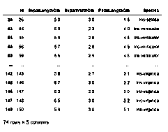
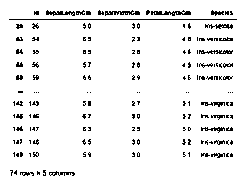
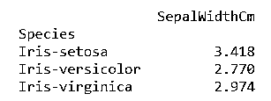
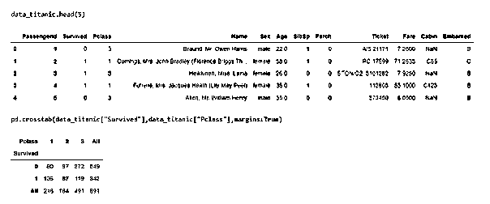
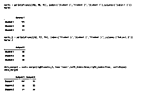
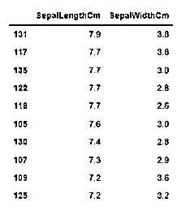
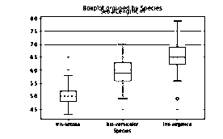
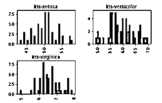

# 使用 Python 进行数据操作

> 原文：<https://www.educba.com/data-manipulation-with-python/>


## 用 Python 定义数据操作

使用 python 的数据操作被定义为 python 编程语言中的一个过程，该过程使用户能够组织数据，以使读取或解释来自数据的洞察力更加结构化，并且包括具有更好的设计。例如，按字母顺序排列雇员的姓名将能够更快地按姓名搜索特定的雇员。数据操作的关键特性是实现更快的业务运营，同时强调流程中的优化。通过适当的处理数据，人们可以分析趋势，从金融数据中解读见解，分析消费者行为或模式等。不仅是分析，而且它还使用户能够忽略数据集中任何不必要的数据，以便节省空间，仅用重要和必要的数据填充有限的空间。在本文中，我们将研究 python 中不同的操作方法，并研究一些例子

### 用 Python 处理数据的方法

Python 是开发人员中最著名和最常用的语言，用于操作数据集中的数据。使用 Python 中的开源实现，我们有各种方法来帮助实现 Python 中的操作方法。对于以下所有方法，我们首先需要在 python 中安装 pandas，这可以通过在命令提示符下运行以下命令来实现:

<small>网页开发、编程语言、软件测试&其他</small>

```
pip install pandas
```

一旦 pandas 包安装到系统中，我们需要通过运行以下命令将 pandas 库导入到我们的代码库中:

```
import pandas as pd
```

使用 pd 的原因是为了确保我们可以在任何需要调用相应包的地方使用缩写形式。现在我们已经安装并导入了 pandas 库，我们将使用它的一个函数来读取 CSV 文件，然后将返回的数据集存储到一个变量中。我们将运行以下代码:

```
variable_name = pd.read_csv("file name.csv")
```

至此，我们已经准备好探索使用 python 进行数据操作的不同方法，并在下一节中通过实例研究相同的实际方面。

**1。根据给定条件过滤值:**

为了只处理符合指南所设定标准的特定数据，我们需要使用相应的数据操作来遵守条件。在这种数据操作技术中，我们将使用。loc 函数，允许使用布尔数组或标签访问一组行和/或列。

**2。应用某个函数来创建一个新变量或执行相关操作:**

为了跨行或列应用特定的函数，我们将使用。应用熊猫可用的功能。该函数将相应的声明函数应用于相应的轴(0 表示列，1 表示行)，最后根据要求返回所需的变量。

**3。使用透视函数对所需列进行聚合:**

此方法的工作方式类似于 excel 中的透视功能。在这里，我们将跨索引透视数据，并根据需要在其他列上执行所需的聚合。我们这里用的函数是. pivot。

**4。交叉表的功能:**

使用函数 crosstab，可以获得数据的原始视图。使用这一功能，人们可以通过查看问题陈述和数据的初始部分来验证一些潜在的假设。

**5。两个表格的合并:**

在正常的现实生活场景中，几乎不可能将所有数据都放在一个数据表中，因此该功能非常方便地在一个键的基础上合并两个数据集，并且可以在函数中声明为一个参数”。合并”。

**6。对表格进行排序:**

使用这种数据操作，我们可以根据将作为参数传递给函数的键对表进行排序”。排序 _ 值”。还可以传递一个列列表，并根据时间顺序对表进行排序。

**7。箱线图和直方图的绘制:**

该列表的最后一个操作是绘制箱线图和直方图，以了解数据的不同统计参数及其推断，这在视觉上对解释数据集非常有趣。例如，使用箱线图，我们可以很容易地看到数据集中离群点的数量。使用直方图可以确定数据的分布及其范围！

对于下面的例子，我们将使用 2 个公开可用的数据集，即 iris 数据集和 titanic 数据集！当示例中的变量指的是数据时，我们指的是 iris 数据集！

### 例子

让我们讨论用 Python 处理数据的例子。

#### 示例#1

根据特定列的条件获取行:

**语法:**

```
data.loc[(data["SepalLengthCm"]>=5) & (data["SepalWidthCm"]<=3) & (data["PetalLengthCm"]>1.2), ["Id", "SepalLengthCm", "SepalWidthCm", "PetalLengthCm", "Species"]]
```

**输出:**




#### 实施例 2

使用应用功能创建新变量:

**语法:**

```
def missingValues(x):
    return sum(x.isnull())
print("Number of missing elements column wise:")
print(data.apply(missingValues, axis=0))
print("\nNumber of missing elements row wise:")
print(data.apply(missingValues, axis=1).head())
```

**输出:**




#### 实施例 3

使用数据透视表找出每类物种的平均萼片宽度:

**语法:**

```
import numpy as np
pivot_table = data.pivot_table(values=["SepalWidthCm"], index=["Species"], aggfunc=np.mean)
print(pivot_table)
```

**输出:**




#### 实施例 4

查找跨 2 个分类列的数据分布:

**语法:**

```
import pandas as pd
data_titanic = pd.read_csv("train.csv")
pd.crosstab(data_titanic["Survived"],data_titanic["Pclass"],margins=True)
```

**输出:**




#### 实施例 5

基于各个表的索引合并 2 个表:

**语法:**

```
marks = pd.DataFrame([100, 98, 91], index=['Student 1','Student 2','Student 3'],columns=['Subject 1'])
marks
marks_2 = pd.DataFrame([92, 93, 99], index=['Student 1', 'Student 2', 'Student 3'],columns=['Subject 2'])
marks_2
data_merged = marks.merge(right=marks_2, how='inner', left_index=True, right_index=True, sort=False)
data_merged
```

**输出:**




#### 实施例 6

通过多列以降序排列表格，先排列一列，然后排列另一列:

**语法:**

```
data_sorted = data.sort_values(['SepalLengthCm','SepalWidthCm'], ascending=False)
data_sorted[['SepalLengthCm','SepalWidthCm']].head(10)
```

**输出:**




#### 实施例 7

虹膜数据集上的绘图框绘图:

**语法:**

```
import matplotlib.pyplot as plt
%matplotlib inline
data.boxplot(column="SepalLengthCm",by="Species")
```

**输出:**




#### 实施例 8

在虹膜数据集上绘制直方图:

**语法:**

```
import matplotlib.pyplot as plt
%matplotlib inline
data.hist(column="SepalLengthCm",by="Species",bins=30)
```

**输出:**




### 结论

在这篇文章的帮助下，我们已经看到了可能的操作方法以及每种方法的相应示例。虽然这些并不是详尽的列表，但我们已经尽力覆盖了行业中广泛使用的方法的最大范围。一个人可以和其他人一起试验，这显然是需要学习更多！

### 推荐文章

这是一个用 Python 操作数据的指南。在这里，我们讨论定义、语法、使用 python 的数据操作方法，并举例说明以便更好地理解。您也可以看看以下文章，了解更多信息–

1.  [背包问题 Python](https://www.educba.com/knapsack-problem-python/)
2.  [Python 中的回溯](https://www.educba.com/traceback-in-python/)
3.  [Python 中的 CGI](https://www.educba.com/cgi-in-python/)
4.  [OpenCV Python](https://www.educba.com/opencv-python/)


