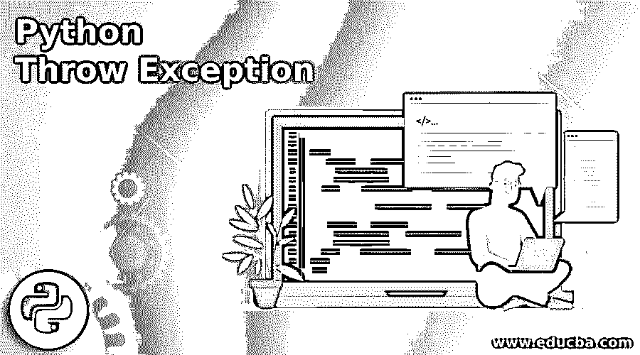
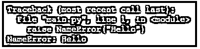
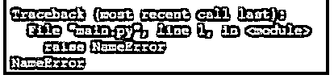

# Python 抛出异常

> 原文：<https://www.educba.com/python-throw-exception/>




## Python 抛出异常简介

以下文章提供了 Python 抛出异常的概述。Python 有时会返回一个错误或异常当我们的程序中没有编程或语法错误时，有时错误的输入也会生成异常，比如两个数相除不会返回异常，但数被零除会返回异常。因此，我们需要进行适当的异常处理，我们需要检测程序的哪个部分会返回异常，我们可以用 try-catch 块包围该部分，并向用户返回适当的异常，以便用户可以识别程序执行期间出现的程序。

### 引发异常

我们可以使用异常的 raise 关键字和名称，通过 python 强制抛出异常。我们也可以在异常中传递任何消息，或者简单地写一个异常名。

<small>网页开发、编程语言、软件测试&其他</small>

#### 示例#1

**代码:**

```
raise NameError("Hello")
```

**输出:**




如您所见，python 返回了一个带有 Hello 消息的 NameError 异常。我们也可以生成没有任何消息的异常。

#### 实施例 2

**代码:**

```
raise NameError
```

**输出:**

**

** 

如您所见，生成了异常，但这并不好。所以我们可以尝试捕捉这个异常，并在程序执行过程中出现这种异常时尝试显示一条自定义消息。

#### 实施例 3

**代码:**

```
try:
raise NameError('Hello')
except NameError:
print('Sorry Exception is generated')
```

**输出:**

**

** 

在本例中，您可以看到我们已经在 try 块中编写了代码。我们编写一段代码，这段代码可能会在 try 块中返回一个异常，并在 catch 块中捕获该异常。我们已经定义了 except 块，并定义了我们正在寻找的异常的名称。如果程序返回那个异常，那么我们向用户返回一个定制的消息，它看起来比默认的 python 异常更干净、更有希望。

### 用户定义的异常

用户通过创建类来定义这些类型的异常。通常，异常是从 Exception 类继承的。这个类与我们在程序中创建的其他自定义类非常相似。我们可以在这些类中编写任何东西，但是最好保持简单，只定义异常处理程序需要的属性、变量或信息。

#### 示例#1

**代码:**

```
class failedException(Exception):
def __init__(self):
super()
try:
marks = 35
print("Your marks are: "+str(marks))
if marks<36:
raise failedException
except failedException:
print("Sorry! You are failed!")
else:
print("Congratulations! You are passed")
```

**输出:**

**

** 

在上面的程序中，你可以看到我们已经定义了我们的类 failedException。您可以根据自己的意愿定义任何名称。我们继承了异常类。我们在里面定义并使用了构造函数；我们称之为基类方法，即 super()。我们创建了一个 try 块，然后定义了一个值为 35 的变量标记。首先，我们只是打印变量的消息和值。然后我们检查该值是否小于 36，然后我们抛出异常。

我们可以为异常编写任何名称，因为它是用户定义的。然后我们定义了 except，它捕捉我们的异常并输出定义的消息，在 else 条件下，我们定义了另一个消息。当我们的条件失败时，就会调用我们定义的异常，并打印一条消息。

#### 实施例 2

**代码:**

```
class MarksRange(Exception):
def __init__(self, marks, message="You are failed!"):
self.marks = marks
self.message = message
super().__init__(self.message)
def __str__(self):
return f'{self.marks} -> {self.message}'
marks = int(input("Enter marks: "))
if not marks > 36:
raise MarksRange(marks)
```

**输出:**

**

** 

在上面的程序中，我们创建了一个自定义类 MarksRange 并继承了基类 Exception。

我们在类中定义了构造函数，并传递了保存我们的值的 self、marks 和 message 变量。我们用自定义参数，即标记和消息来覆盖我们的构造函数。我们使用 super()手动调用带有自身参数标记和消息的父类的异常。

我们使用 __str__ 来显示类的异常和我们定义的消息，我们的异常标记范围将被引发。Python 会要求用户输入分数，然后检查分数是否小于 36。如果条件匹配，那么我们抛出异常；如果条件不匹配，什么都不会发生。当我们创建一个大的 python 程序时，将自定义的用户定义的异常保存在一个单独的文件中总是一个好的做法；这是一种被遵循的标准流程。我们也可以将异常文件命名为 exception.py 或 error.py。

### 结论–Python 抛出异常

用户定义的异常是用户定义的异常，用于处理一些非内置的错误场景。我们希望定制异常，并相应地向用户端显示它们。

### 推荐文章

这是一个 Python 抛出异常的指南。这里我们分别讨论引入、引发和用户定义的异常。您也可以看看以下文章，了解更多信息–

1.  [Python 流](https://www.educba.com/python-stream/)
2.  [Python 缓冲器](https://www.educba.com/python-bufferedreader/)
3.  [Python 转储](https://www.educba.com/python-dump/)
4.  [Python 写 CSV 文件](https://www.educba.com/python-write-csv-file/)


