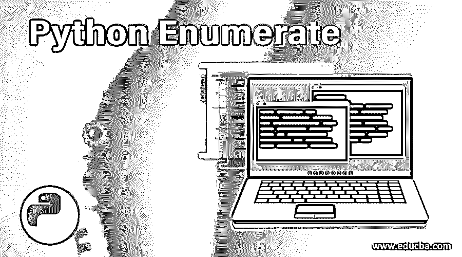
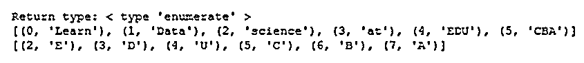
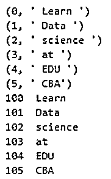
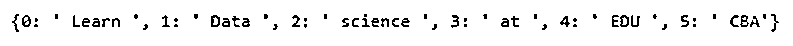
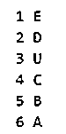

# Python 枚举

> 原文：<https://www.educba.com/python-enumerate/>




## Python 枚举简介

很多时候，当我们使用迭代器时，我们可能需要计算迭代次数。这可以通过多种方式解决，但幸运的是，python 为我们提供了一个内置的功能，称为 enumerate()函数来完成这项任务。简而言之，enumerate function()向 iterable 对象添加一个计数器，然后将其作为 enumerate 对象返回。

然后返回的这个枚举对象可以以直接的方式在循环中使用，或者枚举对象然后可以被转换成元组的列表并被相应地使用。

<small>网页开发、编程语言、软件测试&其他</small>

**enumerate()函数的语法为:**

`enumerate(iterateable_object, start=0)`

枚举函数也传递了几个参数:

*   **iteratable _ object:**可以被迭代的对象，例如列表、元组等。
*   **start=0:** 这是计数器开始计数的索引值。默认情况下，计数器将从 0 开始计数

### Python 枚举示例

我们举个例子来详细了解一下这个。Python 程序展示了枚举函数的功能

**代码:**

```
list = [ " Learn " , " Data " , " science " , " at ", " EDU " , " CBA" ]
str = "EDUCBA"
# Here we are creating the enumerate objects
obj1 = enumerate( list )
obj2 = enumerate( str )
print ("Return type of object 1 is:",type(obj1) )
print (list(enumerate(list)))
# here we are changing the start index to 2 from th default option that is 0
print (list(enumerate(str,2)) ) 
```

**输出:**




*   我们已经初始化了一个列表和一个字符串，它们都是可迭代的对象，可以用作枚举函数的参数
*   然后我们定义了枚举函数对象。obj1 计算可迭代列表的迭代次数& obj2 计算列表中对象的迭代次数。
    *   obj1 =枚举(列表)
    *   obj2 =枚举(字符串)
*   此后，print 函数用于打印由 enumerate 函数返回的枚举对象。
*   第一个 print 语句标识了枚举函数的返回类型，我们可以在输出中看到它是一个枚举对象。
    *   print("对象 1 的返回类型是:"，类型(obj1))
    *   返回类型:< type ‘enumerate’ >
*   第二个和第三个 print 语句分别与 list 和 string 一起使用。

### 在循环中使用枚举对象

如果我们想在循环中使用枚举对象。我们举个例子来理解同样的道理。

#### 例子

Python 程序理解循环中枚举函数的用法

**代码:**

```
list = [ " Learn " , " Data " , " science " , " at ", " EDU " , " CBA" ]
# printing the tuples in object directly 
for element in enumerate(list):
print (element )
# changing index and printing separately
for count,element in enumerate(list,100):
print (count,element) 
```

**输出:**




*   我们已经在这个名为“list”的程序的开头初始化了一个可迭代的对象。
*   For 循环用于打印列表中的每个元素
*   在第二个循环中，start 从 100 开始初始化，默认情况下是 0，也用于打印计数和可迭代对象列表的元素

### 使用 Python 列表和枚举函数创建 Python 字典

我们举个例子来详细了解一下这个。

#### 例子

**代码:**

```
List = [ " Learn " , " Data " , " science " , " at ", " EDU " , " CBA" ]
Dictionary = dict(enumerate(List))
print(Dictionary )
2 
```

**输出:**




#### 它是如何工作的？

*   我们在程序中定义了一个列表
*   此后，我们使用该列表创建了一个枚举对象，并将其转换为 dict，进一步保存到“Dictionary”变量中
*   最后，我们打印名为“Dictionary”的对象。

### 如何才能从一个具体的指标来枚举？

让我们举一个例子来详细理解这一点

#### 例子

Python 程序，了解如何枚举一个字符串

**代码:**

`String = 'EDUCBA'
for i, j in enumerate(String, 1):
print(i, j)`

**输出:**




**Note:** Here, we have initialized a string and then have looped through each element of this string. Again, instead of using the default start that is 0 in the case of enumerate function, we have defined the start as 1 over here.

### 推荐文章

这是一个 Python 枚举的指南。这里我们讨论 Python Enumerate 的介绍，以及不同的例子和代码实现。您也可以看看以下文章，了解更多信息–

1.  [Python Tkinter Canvas](https://www.educba.com/python-tkinter-canvas/)
2.  [Python 命令](https://www.educba.com/python-commands/)
3.  [Python 中的循环](https://www.educba.com/loops-in-python/)
4.  [蟒龟](https://www.educba.com/python-turtle/)


