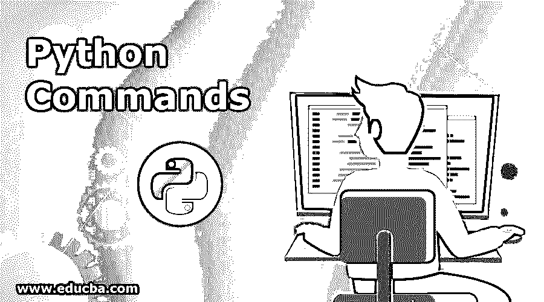

# Python 命令

> 原文：<https://www.educba.com/python-commands/>

## Python 命令简介

Python 被认为是一种高级的、解释的和面向对象的编程语言。吉多·范·罗苏姆发展了它。 [Python 易学](https://www.educba.com/what-is-python/)，易用，可移植，可扩展，可伸缩， [GUI 编程](https://www.educba.com/what-is-gui/)。Python 可以作为脚本语言使用。它支持自动垃圾收集，提供高级动态类型和动态类型检查。Python 有一个命令列表，在编程时会用到。

### 基本 Python 命令

基本命令如下。

*   **注释** : #符号用于 python 中的注释。对于[多行注释](https://www.educba.com/python-multiline-comment/)，你必须使用""符号或将注释括在""符号中。

**例:**
打印“Hello World”#这是评论区。

**举例:**
“这是 Hello world 项目。”""

*   **类型函数**:这些 Python 命令用于检查变量的类型，并使用内置函数进行检查。

**例:**
类型(20)，其类型为 int。
> > >类型(20) <类型‘int’>

**举例:**
(-1+j)型，其类型为复数
>>>(-1+j)
<型【复数】>

*   **字符串:**主要用双引号括起来。

**举例:**
类型(“hello World”)，类型是字符串
> > >类型(“hello World”)
<类型“str”>

*   **列表:**列表主要用方括号括起来。

**举例** :
型(【1，2】)，是列表型
> > >型(【1，2，3】)
<型‘列表’>

*   **元组:**元组主要用括号括起来。

**举例:**
类型(1，2，3)，一个类型是一个元组。
> > >类型((1，2，3) )
<类型‘元组’>

*   **范围:**该函数用于创建整数列表。

**举例:**
> > >范围(10 )
**输出:**【0，1，2，3，4，5，6，7，8，9】

**举例:**
> > >范围(1，10)
**输出:**【1，2，3，4，5，6，7，8，9】

*   **布尔值:**这种数据类型有助于检索真或假形式的数据。

**举例:**
> > >真
真
> > >型(真)
<型‘布尔’>

**举例:**
> > >假
假
> > >型(假)
<型‘布尔’>

*   **运算符:**不同的运算符用于不同的功能，如除法、乘法、加法和减法。

**举例:**
>>>16/2
8
**举例:**
> > > 2 * *
1

*   **变量和赋值:**赋值语句有变量=表达式。单个' = '用于赋值，双' = = '用于测试质量。

**举例:**
>>>X = 235
>>>打印 X
235
>>>Z = 2 * X
>>>打印 Z
470

*   **比较运算符:**比较两个值，比较的[结果](https://www.educba.com/python-comparison-operators/)总是布尔值。

**举例:**
> > > 2 < 3
真

### 中间 Python 命令

中间 Python 命令如下。

*   **条件/决策:**用于在两个或多个值之间做出决策，如 if-else

**例:**
如果 x=0:
打印“Hello，world。”
Else:
打印“你好，Else 中的世界。”

*   **For Loop:** 当迭代和动作由相同的元素组成时，使用这个 Python 命令。

**举例:**
对于[ 1，2，3，4，5，6]中的 x:
打印 x；

*   **While 循环:** [如果条件第一次评估为假，While 循环](https://www.educba.com/while-loop-in-python/)将永远不会执行。

**举例:**
x =0
而 x < 10:
打印 X，
X= x+2

*   **Else in loop:** Loop 有可选的 Else 供执行。

**举例:**
对于 x in [ 1，3，5，7，9，11]:
打印 x
Else:
打印“In Else”

*   **Break，continue 语句:** [break 语句用于](https://www.educba.com/break-statement-in-python/)当达到特定输出时退出循环；continue 用于继续循环的下一次迭代。

**例:**
如果 x==0:
打印“X 为 0”
Break
Else:
打印“X 大于 0”

*   **列表:**它是有限数量的项目，通过给列表赋值，列表值将被改变。

**举例:**
> > > a = [1，"周杰伦"，34]>>>a[0]1
>>>a[0]= 101
>>>a
【101，"周杰伦"，34】

*   **列表长度:**了解列表的长度。

**举例:**
>>X =【1，4，67，9】>>>len(X)
4

*   **子列表:**它将给出所提到的开始索引和结束索引之间的值。

**举例:**
x【开始:结束】>>T5】X【1，3，4，6，7，8，9，0，2】>>>X【2:5】【4，6，7】

*   **连接两个列表:** +运算符用于连接两个列表。

**举例:**
>>>【2，1，5】+【0，4，6，7】【2，1，5，0，4，6，7】

*   **Strings:** 用来查索引，知道用 string 写的字符。

**举例:**
> > > x= "你好，世界"
>>>x[2]' l '
>>>x[5]' o '

### 高级 Python 命令

高级 Python 命令如下。

*   **列表方法:**列表中可用于执行该功能的不同方法。

**举例:** X [1，2，3，4，5]

*   > > > X.append (7)

> > > x
[1，2，3，4，5，7]

*   > > > X.insert (0，0)

> > > x
[0，1，2，3，4，5]

*   > > > X.remove (2)

> > > x
[0，1，3，4，5]

*   > > > X.pop (1)

> > > x
[2，3，4，5]

### 使用 Python 命令的提示和技巧

*   使用数据排版，这是 python 中用于列表的内置函数。
*   使用 enumerate 函数迭代对象。
*   使用动态类型。
*   比较值时使用运算符。
*   使用条件表达式可以获得更好的结果。
*   使用模块使程序分离并可重复使用。

### 结论

它们易于使用，易于书写，易于学习。这是非常多才多艺的，有助于以不同的方式实现结果。Python 是当今自动化领域使用最多的语言之一，因为它是一种多样化的、发展良好的语言。上面的命令帮助你对 python 命令的[用法以及如何使用它们有一个简单的了解。](https://www.educba.com/uses-of-python/)

它应该被很好地管理和编写，以获得良好的性能。Python 是一种广泛使用的语言，有一个庞大的社区来支持它。它现在和将来在 It 行业都有很好的发展前景。对于了解面向对象编程的人来说，学习 python 命令非常简单直接。组织也需要更高水平的 python 来完成他们的目标，人们在这方面的专业知识赚得非常多。

### 推荐文章

这是 Python 命令的指南。在这里，我们讨论了初级、中级和高级 Python 命令以及使用的技巧和诀窍。您也可以阅读以下文章，了解更多信息——

1.  [HBase 命令](https://www.educba.com/hbase-commands/)
2.  [猪命令](https://www.educba.com/pig-commands/)
3.  [Python 框架](https://www.educba.com/python-frameworks/)
4.  [Python 类型函数](https://www.educba.com/python-type-function/)

