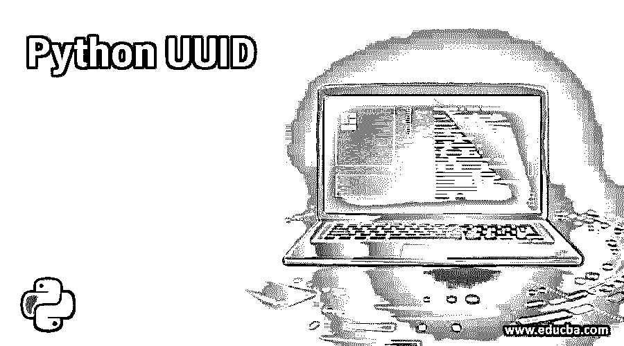
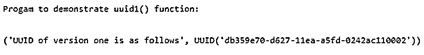
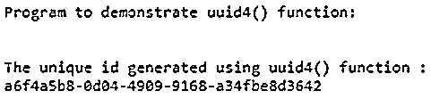
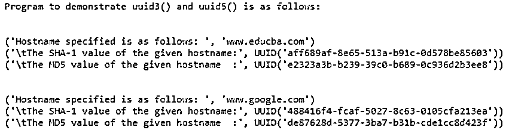

# 蟒蛇 UUID

> 原文：<https://www.educba.com/python-uuid/>




## Python UUID 简介

在本文中，我们将讨论 Python UUID，这是一个用于实现或生成通用唯一标识符的 Python 模块，也称为 GUID 全局唯一标识符。Python UUID 模块随机生成长度为 128 位的标识符，这些标识符对于计算机系统、应用程序、主机和许多使用唯一标识符的不同情况中的文档或信息非常有用。这个 Python UUID 模块提供了不同的不可变对象和不同版本的函数，例如 uuid1()、uuid3()、uuid4()、uuid5()，用于生成版本 1、3、4 和 5 的 UUID。

### Python UUID 的使用示例

在 Python 中，有一个内置的库或模块，用于生成通用或全局的唯一标识符，这个模块被称为 UUID，这个模块也可以生成不同版本的 uuid，这些模块是不可变的，这意味着它们的值一旦生成就不能改变。UUID 主要由 5 个固定长度的组件组成，每个组件由连字符分隔，并使用读取属性来定义 UUID 字符串。这个 Python UUID 是基于 RFC 4211 实现的，RFC 4211 包括不同的算法和关于唯一标识符的信息，唯一标识符将与所需版本的 UUID 一起生成。在 Python 中，该模块为不同版本提供了各种函数，如 uuid1()、uuid3()、uuid4()和 uuid5()。

<small>网页开发、编程语言、软件测试&其他</small>

在 Python 中，UUID 模块提供了各种只读属性，例如:

*   UUID.bytes，包括一个 16 字节的字符串。
*   UUID.fields，包括时间、时钟序列、节点等字段。
*   UUID.hex 可以保存 32 位十六进制字符串。
*   UUID.int 可以容纳 128 位整数
*   UUID。Safe 这个属性告诉我们所使用的 uuid 版本是否安全。

### Python UUID 的示例

在下一节中，让我们看几个使用 Python uuid 模块使用函数 uuid1()、uuid3()、uuid4()和 uuid5()的例子，该模块主要用于使用 MAC 地址生成 UUID。我们还将看到 UUID 是什么样子，这意味着 UUID 的结构。

#### 示例#1

但我们应该注意，当使用 uuid1()时，它可能会显示网络详细信息，如 uuid 计算机的网络地址，因此使用 uuid1()不太安全，因为它可能会出现隐私问题，因为它使用系统的 MAC 地址。让我们看一个简单的例子。

**代码:**

```
import uuid
print("Progam to demonstrate uuid1() function:")
print("\n")
uuid_version_1 = uuid.uuid1()
print("UUID of version one is as follows", uuid_version_1)
```

**输出:**




在上面的程序中，我们可以看到使用了 uuid1()函数来生成主机 id，显示了序列号。我们可以使用主机的 MAC 地址来计算这些函数值，这可以使用 UUID 模块的 getnode()方法来完成，该方法将显示给定系统的 MAC 值。比如说

```
print(hex(uuid.getnode())) 
```

上面的语句将以十六进制值输出 mAC 值，如果这个 getnode()方法无法显示 MAC 地址，那么默认情况下，它将返回一个 48 位的数字以及多播位。正如我们所见，uuid1()使用起来不安全，可能会危及隐私，现在我们将看到 uuid4()，它不会危及隐私，因为它使用伪随机数生成器来生成唯一标识符。让我们看一个实现这个 uuid4()函数的简单例子。

#### 实施例 2

**代码:**

```
import uuid
print("Program to demonstrate uuid4() function:")
print("\n")
unique_id = uuid.uuid4()
print ("The unique id generated using uuid4() function : ")
print (unique_id)
```

**输出:**




在上面的程序中，我们可以看到使用 uuid4()生成了一个惟一的 id。uuid4()使用加密的安全随机数生成器生成 id，因此冲突的可能性较小。

现在我们将看到 uuid3()和 uuid5()，其中我们看到了使用随机数生成 uuid。现在我们将看到如何使用名称而不是随机数生成 uuid。uuid 3()和 uuid5()使用加密哈希值(如 MD5 或 SHA-1)将值与主机名、URL 等名称组合在一起。一般来说，uuid3()和 uuid5()版本是用一个名字散列命名空间标识符，很少有命名空间是由 uuid 模块如 uuid 定义的。名称空间 _DNS，UUID。NAmESPACE_URL 等。现在让我们看看下面的例子。

#### 实施例 3

**代码:**

```
import uuid 
print("Program to demonstrate uuid3() and uuid5() is as follows:")
print("\n")
hosts_sample = ('www.educba.com', 'www.google.com') 
for hostname in hosts_sample:
  print("Hostname specified is as follows: ",hostname)
  print('\tThe SHA-1 value of the given hostname:', uuid.uuid5(uuid.NAMESPACE_DNS, hostname))
  print('\tThe MD5 value of the given hostname  :', uuid.uuid3(uuid.NAMESPACE_DNS, hostname))
  print("\n")
```

**输出:**




在上面的程序中，我们可以看到我们使用了 uuid3()和 uuid5()函数，这两个函数在不同的时间生成 uuid，但是具有相同的名称空间和名称。在上面的程序中，我们有两个不同的主机名，我们使用 for 循环进行迭代。我们可以指定任意数量的主机名，并使用 for 循环迭代它。

由于 UUID 是一个唯一的通用标识符，因此存在一些隐私问题，正如我们在上一节中看到的那样，uuid1()会损害隐私，因为它使用系统 MAC 地址，而 uuid4()不会损害隐私，因此它使用随机数生成器来生成 uuid。因此，我们可以说 uuid1()使用起来不安全，uuid4()比 uuid1()更安全。因此，为了检查 UUID 函数在最新的 Python 版本 3.7 中是否安全，使用 UUID 的一个实例(如 is_safe 属性)来检查 UUID 是否安全。UUIDs 用于各种应用程序中，例如 web 应用程序、数据库系统等。在 Python 中，我们可以使用 str 类将 UUID 转换为字符串，反之亦然，例如，我们可以通过使用字符串方法 replace()将“-”替换为“”，来删除 UUID 中用于分隔组件的连字符，从而获得字符串格式

```
UUID_id = uuid.uuid1()
str_uuid = str(UUID_id). replace("-", "")
```

同样，我们可以使用 UUID 实例将字符串转换回 UUID，如下所示:

```
uuid_id = uuid.UUID(string)
```

### 结论

在本文中，我们得出结论，UUID 是一个唯一的通用标识符，也称为全球标识符。在本文中，我们还看到了使用几个不同版本的 UUID 函数来生成标识符的 Python UUID 模块，我们还看到了不同的 uuid()版本，如 uuid1()、uuid3()、uuid4()和 uuid5()及其示例和隐私条款。在这里，我们还看到了不同的读取属性，uuid()函数的安全检查，以及 UUID 到字符串的转换，反之亦然。

### 推荐文章

这是 Python UUID 的指南。在这里，我们还将讨论 python uuid 的介绍和工作原理，以及不同的例子和它的代码实现。您也可以看看以下文章，了解更多信息–

1.  [Python 导入错误](https://www.educba.com/python-importerror/)
2.  [Python 函数生成器](https://www.educba.com/python-function-generator/)
3.  [Python 索引错误](https://www.educba.com/python-indexerror/)
4.  [Python 系统模块](https://www.educba.com/python-sys-module/)


