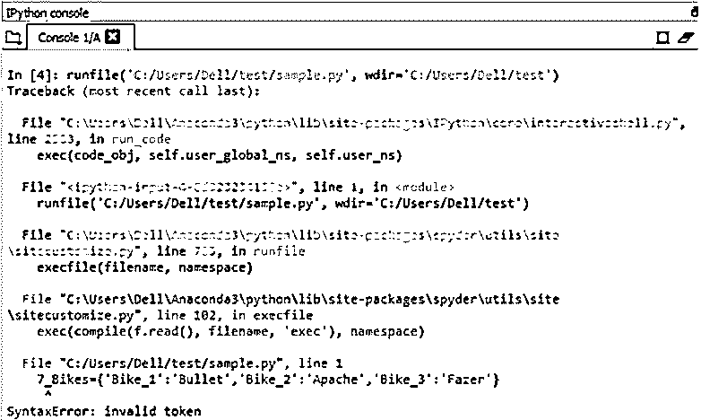
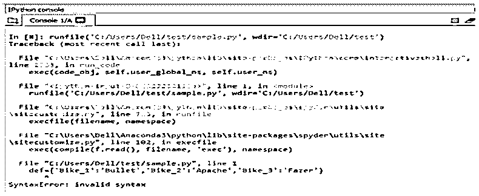
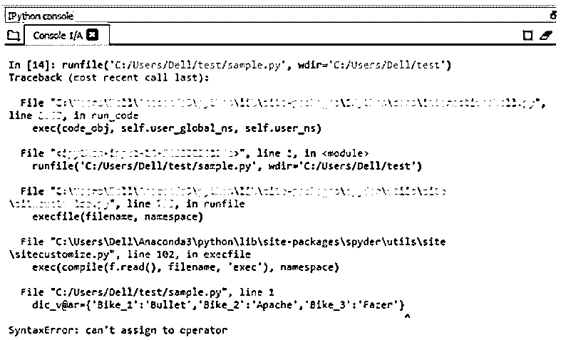
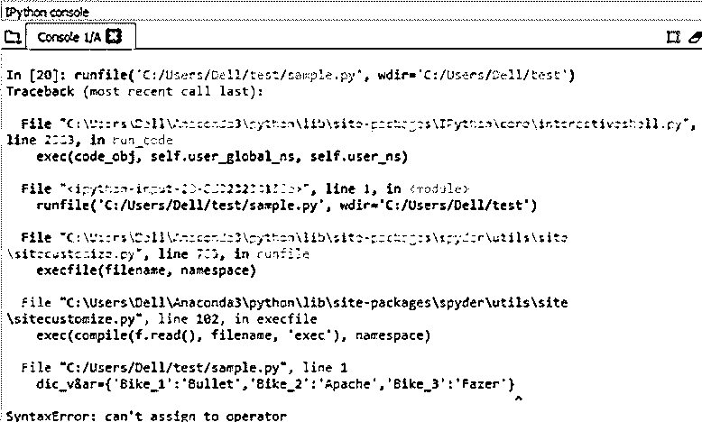
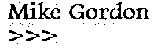

# Python 标识符

> 原文：<https://www.educba.com/python-identifiers/>

## Python 标识符简介

下面的文章提供了关于 Python 标识符的概述。Python 标识符是与 python 中的实体相关联的名称。换句话说，它可以被称为 python 编程中使用的命名约定。考虑应用命名约定的实体是类、变量、项、函数等。在命名实体上使用这些标识符考虑的主要优点是有助于区分或识别一个实体与另一个实体。此外，在 python 编程中，还可以测试给定特定标识符的有效性。

### Python 标识符的规则

以下是规则:

<small>网页开发、编程语言、软件测试&其他</small>

#### 规则 1

python 编程中的标识符可以由大写字母(A 到 Z)、小写字母(A 到 Z)和数字值(1 到 9)组合而成。除了大写、小写和数字值，还可以使用下划线等符号。下面列出了这些标识符值的一些示例:

**举例:**

num1，样本类，测试变量。

#### 规则 2

数字值永远不能用于表示标识符值的开始。任何以数字作为变量名前缀的实例都被认为是无效声明的 python 标识符。

**举例:**

1num，7Test_class，3Employee_function。

**代码:**

`7_Bikes={'Bike_1':'Bullet','Bike_2':'Apache','Bike_3':'Fazer'}
7_Bikes.update({'Bike#_4': 'Discover'})
print("Top Bikes list after update:", 7_Bikes)`

**输出:**

**说明:**

*   我们可以注意到 dictionary 类型元素的前缀是一个数字标识符名称。
*   将这个以数字为前缀的值传递给解释器会抛出一个错误，指出一个无效的令牌与这个特定的标识符相关联。

#### 规则 3

在 python 中，预定义的关键字中没有一个可以用作标识符。预定义的关键字是 python 中的保留字。关键字是 python 编程语言的保留字，这意味着这些字不能在任何其他用户实例中使用，只能用于专有用途。python 中有大约 33 个关键字。

python 中的关键字列表如下:

| **Python 保留关键字** |
| 错误的 | 等待 | 其他 | 进口 | 及格 |
| 没有人 | 破裂 | 除...之外 | 在 | 上升 |
| 真实的 | 班级 | 最后 | 是 | 返回 |
| 和 | 继续 | 为 | 希腊字母的第 11 个 | 尝试 |
| 如同 | 极好的 | 从 | 非局部的 | 在…期间 |
| 维护 | 是吗 | 全球的 | 不 | 随着 |
| 异步ˌ非同步(asynchronous) | 艾列弗 | 如果 | 或者 | 产量 |

**举例:**

**代码:**

`def={'Bike_1':'Bullet','Bike_2':'Apache','Bike_3':'Fazer'}
7_Bikes.update({'Bike#_4': 'Discover'})
print("Top Bikes list after update:", def)`

**输出:**

**说明:**

*   我们可以注意到保留关键字 def 被用作声明 python dict 变量的标识符。
*   因此，在解释代码时，它会抛出一个错误，指出分配了一个无效的令牌。
*   这描述了当一个保留的关键字被无效地用作变量的标识符时，python 解释器是如何抛出语法级错误的。

#### 规则 4

标识符在执行时不能包含除 _ 以外的任何特殊字符。标识符声明中不可接受的一些特殊字符如下所示"！, @, #, $, %, ^, &, *, ( , ), ~, ".

**例#1**

**代码:**

`dic_v@ar={'Bike_1':'Bullet','Bike_2':'Apache','Bike_3':'Fazer'}
dic_v@ar.update({'Bike#_4': 'Discover'})
print("Top Bikes list after update:", dic_v@ar)`

**输出:**

<u>

</u> 

**说明:**

*   这里，在 dict 变量的声明中使用了特殊字符' @ '，但是我们可以注意到，在变量中使用特殊字符' @ '会限制变量绑定有效的引用，并抛出错误“不能给操作符赋值”。

**例 2**

**代码:**

`dic_v%ar={'Bike_1':'Bullet','Bike_2':'Apache','Bike_3':'Fazer'}
dic_v%ar.update({'Bike#_4': 'Discover'})
print("Top Bikes list after update:", dic_v%ar)`

**输出:**

**说明:**

*   这里，在 dict 变量的声明中使用了特殊字符“%”，但是我们可以注意到，在变量中使用特殊字符“%”会限制变量绑定有效的引用，并抛出错误“不能赋值给操作符”。

**例 3**

**代码:**

`dic_v&ar={'Bike_1':'Bullet','Bike_2':'Apache','Bike_3':'Fazer'}
dic_v&ar.update({'Bike#_4': 'Discover'})
print("Top Bikes list after update:", dic_v&ar)`

**输出:**

<u>

</u> 

**说明:**

*   这里在 dict 变量的声明中使用了特殊字符' & '，但是我们可以注意到在变量中使用特殊字符' & '会限制变量绑定有效的引用，并抛出错误“不能赋值给操作符”。

#### 规则 5

标识符的长度是灵活开放的。

这意味着标识符可以是任何特定的长度。

### Python 标识符的最佳实践

*   大写字母总是用来表示类的开始，而对于所有其他已声明的标识符，不使用大写字母更好。
*   当一个实体需要被表示为私有实体时，就像该实体的内容不适合用于任何其他实例一样，该实体可以在开头用 _(下划线)表示。
*   在为迭代器声明索引时，最好使用一个单词，而不是只提到迭代器索引的一个字符。示例:“index”的迭代器名称比使用“I”的迭代器值更好。
*   Python 是区分大小写的语言，所以区分大小写的标识符是完全不同的。示例:标识名“编号变量”与标识名“编号变量”非常不同。在 python 编程中，两者被认为是不同的变量。

### 具有精确标识符的示例

下面给出了一个例子:

**代码:**

`class Person_class:
def __init__(self, first_name, last_name):
self.first_name = first_name
self.last_name = last_name
def name_method(self):
print(self.first_name, self.last_name)
x = Person_class("Mike", "Gordon")
x.name_method()`

**输出:**

**说明:**

*   上面的程序包括一个有效的 python 类和一个 python 函数，它们负责接收字符串值并将相应的组合字符串发送到控制台。
*   这里表示的类名和对象值非常符合标识符协议，并相应地进行声明。
*   我们可以注意到棒形字符串被很好地显示在控制台中。

### 结论

关联标识符的过程是任何编程语言的主要内容，从 python 的角度来看，这在 python 中已经非常灵活地实现了。这个概念非常类似于 python perception 中的变量声明，通过引入许多面向 python 的协议降低了复杂性。像标识符这样的概念在 python 的编码标准中提供了广泛的稳定性。

### 推荐文章

这是 Python 标识符的指南。这里我们讨论 python 标识符的介绍以及规则和例子。您也可以看看以下文章，了解更多信息–

1.  [Python 类常数](https://www.educba.com/python-class-constants/)
2.  [Python 的幂函数](https://www.educba.com/python-power-function/)
3.  [Python 排序数组](https://www.educba.com/python-sort-array/)
4.  [Python argparse](https://www.educba.com/python-argparse/)

