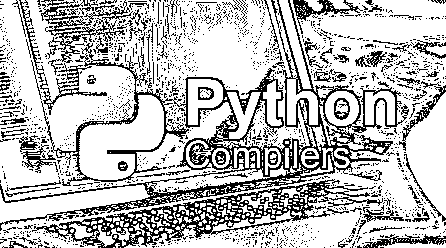

# Python 编译器

> 原文：<https://www.educba.com/python-compilers/>

## Python 编译器简介

在下面的文章中，python 编译器提供了 Python 前 7 名编译器的概述。Python 是世界上发展最快的编程语言，在数据分析和可视化、人工智能和机器学习以及自动化等领域非常受欢迎。Python 也用于开发 Web 应用、移动应用和桌面应用。

Python 是由 Guido Van Rossum 于 1991 年创建的。

<small>网页开发、编程语言、软件测试&其他</small>

Python 之所以流行，是因为它提供了实现多种范例的机会，如面向对象编程、过程编程、函数编程等。Python 是一种高级语言，为用户提供了不必为诸如内存管理之类的复杂任务而烦恼的优势；它是跨平台的，有一个庞大的图书馆生态系统。简单的语法是它受欢迎的原因之一。主要应用是 web 开发、数据科学、机器学习、数据分析和可视化。

### 什么是 Python 编译器？

*   编译器是将高级编程语言转换成低级语言的程序，低级语言可以被汇编理解并解释成逻辑输入。Python 被错误地归类为解释型语言，因为它有各种实现版本，如 CPython、Pypy 和 Iron Python。
*   CPython 是一个标准版本。它遵循到字节码的转换，导致 python 已经解释的误解。这些解释的代码对于 CPU 单元来说是不可理解的，需要一个解释器。Python 虚拟机将字节码转换成机器码。

### Python 编译器的类型

让我们看看不同类型的 Python 编译器:

(1) CPython。

2) Jython 或 Jpython。

3)铁皮屋顶。

4) ActivePython。

5) PyJS(旧称 Pyjamas)。

6)努特卡。

7)无栈 Python。

让我们详细看看 Python 各个编译器的重要性——

#### 1) CPython

*   它是 python 中使用最广泛的解释器，用 C 和 Python 开发；解释器的绑定必须用 Python 之外的其他语言编写。CPython 在每个进程上使用一个全局解释器锁(GIL)；因此，单个进程的 python 字节码是在单个线程上执行的。
*   这个解释器不适合 CPU 密集型算法。CPython 找到了它的用处，因为许多库都是 C 优化的，也就是说，许多库在基于 C 的代码中运行它们的进程会更快。此外，Python 是一种动态编程语言，因为它随时分配资源，不考虑未来的后果。
*   但是，如果为基于 CPython 的编译器系统定义了相同的代码，则需要考虑类型定义。编译步骤是:-解码、标记化、解析、AST(抽象语法树)和编译。

#### 2) Jython 或 Jpython

*   Jython 是一个实现，旨在无缝集成 Java 虚拟机上的 Python 代码；这种集成为将流行的脚本语言 python 合并到 Java 虚拟机的庞大库中提供了机会。Jython 将文件编译成。类扩展。
*   Jython 程序可以继承和运行任何 Java 类，并将代码编译成字节码。除此之外，Jython 还可以用来实现基于 Java 的包，特别适合使用 Servlets、Swing、SWT 和 AWT 包创建解决方案。Jython 是由 Jim Hugunin 在 1997 年创建的。Jython 像 CPython 一样使用全局解释器锁(GIL)。

#### 3)铁皮屋顶

*   Iron Python 是以. net 框架为目标设计的 Python 实现。这个项目目前由 Github 上的一个小型用户社区维护。要用于脚本编写，需要安装 Python tools for visual studio，它是 visual studio IDE 的一个扩展。完整的实现是用 C#编写的。
*   Iron Python 使用. net 框架中提供的动态语言运行时框架来编写动态语言。iron python 在执行之前将 python 代码解释为内存中的字节码。IronPython 设计背后的主要目标是实现. net 框架，以充分利用. net 框架可用的大量用户界面库的潜力。

#### 4) ActivePython

*   ActivePython 是由开源组织 ActiveState 设计和开发的 Python 脚本平台的商业版本。它提供了 Python 包和一些额外的包。
*   与 ActivePython 相关的最显著的优点是它支持在许多平台上安装，甚至是那些不受 Python 源代码支持的平台，比如 AIX 平台。尽管在技术上，它的所有操作都类似于 python，但它是基于其兼容性来区分的。

#### PyJS 以前也被称为 Pyjamas

**

** 

PyJs 是一个富互联网应用程序，主要用于使用 Python 脚本开发客户端 web 和桌面应用程序。PyJs 有一个将 Python 翻译成 JavaScript 的编译器，主要是在 [Ajax](https://www.educba.com/what-is-ajax/) 框架上设计的。

#### 6)努特卡

**

** 

Nuitka 是一个源代码到源代码编译器的理想例子。即使计算机没有安装 python 版本，编译器也允许用户输入 python 代码并生成 C/C++扩展。

#### 7)无堆叠

*   它是开发人员在多线程编程中使用的编程语言解释器的高级版本，而不会损害传统多线程编程语言所面临的性能复杂性和性能问题。
*   解释器之所以得名，是因为它不使用 C 调用栈，而是在函数调用期间释放 C 调用栈。它产生了一种叫做微线程的方法。

#### PyPy

*   由于其快速和兼容的特性，这是作为传统 python 的替代的流行实现。PyPy 使用 Just in time 编译器，这是一个精通源代码动态编译的运行时编译器。PyPy 代码占用的空间在内存需求方面更小。
*   PyPy 与 python 源代码高度兼容，甚至允许实现像 Django 和 twisted 这样的 web 开发框架。它还具有无堆栈的额外产品优势，并提供微线程优化和并发范围。

### 结论

因此，从以上几点，我们已经理解了 python 编译器和解释器的使用以及它们不同的类型。我们已经意识到它们的优势和好处。Python 作为一种开发语言，为许多这样的实现提供了广阔的空间。

### 推荐文章

这是 Python 编译器的指南。这里我们以简洁的方式讨论了不同类型编译器的基本概念。您也可以浏览我们推荐的其他文章，了解更多信息——

1.  [PowerShell vs Python](https://www.educba.com/powershell-vs-python/)
2.  [如何安装 Python](https://www.educba.com/install-python/)
3.  [Python 职业生涯](https://www.educba.com/careers-in-python/)
4.  [25 最神奇的蟒蛇面试问&答](https://www.educba.com/python-interview-questions/)

