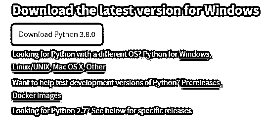
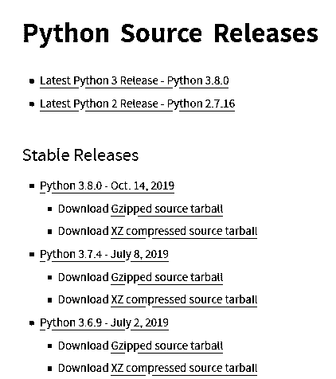
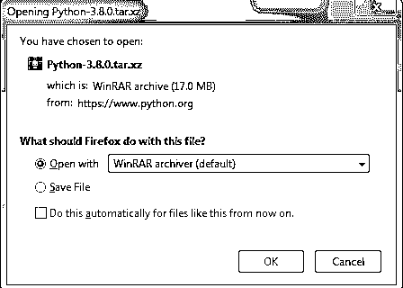
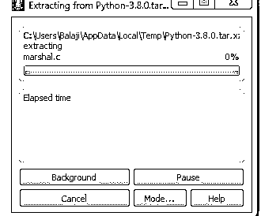
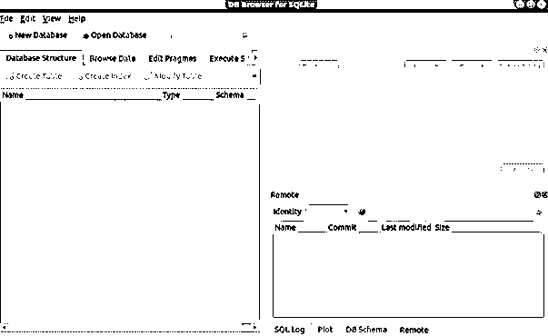
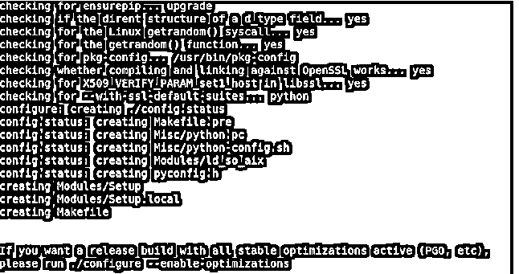
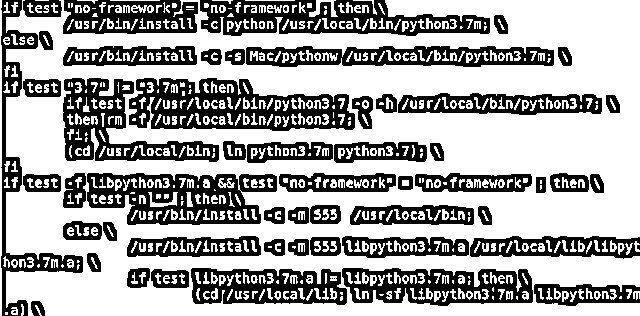

# 在 Linux 上安装 Python

> 原文：<https://www.educba.com/install-python-on-linux/>


## Linux 系统介绍

下面的文章提供了在 Linux 上安装 Python 的概要。在我们学习 python 安装教程之前，理解 Linux 操作系统是很重要的。与其他操作系统一样，Linux 是一个接口提供者，但与其他操作系统不同的是，它具有各种优势，这些优势使 Linux 成为几乎所有技术领域的重中之重。

它的一些优点是:

<small>网页开发、编程语言、软件测试&其他</small>

*   免费的开源操作系统。
*   与其他操作系统相比，它是安全的。
*   它速度更快，兼容性更好；它可以处理任何文件格式。
*   Linux 有 Arch Linux、Ubuntu、Fedora、Kubuntu 等各种发行系统。
*   Linux 可以很容易地根据我们的喜好进行定制。

因此，即使在数据科学领域，人们也因为 Linux 操作系统的优势而更喜欢它。

### Linux 上的 Python

下面是 Python 在 Linux 上的细节:

Python 是一种强大而流行的编程语言。它可以安装在各种版本的 Linux 操作系统上。一些具有 RPM 包管理器的 Linux 版本，例如， [CentOS](https://en.wikipedia.org/wiki/CentOS) ， [Fedora](https://en.wikipedia.org/wiki/Fedora_(operating_system)) 已经预装了 Python，我们可以通过在命令提示符下键入以下代码来检查它:

**代码:**

```
Python - - version
```

如果下面的代码给出一个错误，我们可以假设 python 不是预装的。即使 python 是 pe 安装的，我们也可以更新版本使用交互环境(IDLE)。python 安装需要 python 解释器，可以从 Python 软件基金会([https://www.python.org/](https://www.python.org/))获得，用于在其他操作系统中安装，对于 Linux，使用包管理器安装 Python。

### 在 Linux 系统上安装 Python

以下是需要遵循的步骤:

**步骤 1:** 通过浏览器进入 Python 站点，导航到下载页面。(【https://www.python.org/downloads/】T2)。从给定的各种其他操作系统中，我们需要选择 Linux/UNIX 选项。




**第二步:**现在，一个网页由不同版本的 python 组成。我们需要从不同的版本中选择我们的 Linux 版本所需的链接。




**第三步:**点击想要的链接后，我们会得到一个弹出窗口，用于打开或保存 python 下载文件；点击保存选项。这将让 Python 源文件开始下载。




**第四步:**文件下载完成后，打开 zipper 下载的文件。将文件提取到特定的 Python 文件夹中。单击 Python 文件夹，归档管理器将开始提取 Python 子文件夹中的下载文件。




**步骤 5:** 现在，终端窗口打开，要继续安装，必须在我们的系统中安装 build-essentials，例如 SQLite 或 bzip2。

**第六步:**在终端中，键入并输入代码。

**代码:**

```
sudo apt-get install build-essential
```

*   Linux 安装构建软件包所需的构建基础。


**第七步:**在终端中，我们需要键入并输入以下代码。

**代码:**

```
sudo apt-get install libsqlite3-dev
```

*   代码运行后，Linux 将安装 Python 对数据库管理所需的 SQLite 支持。




**第 8 步:**安装完 SQLite 后，我们需要安装归档操作类型所需的 bzip2，并输入以下命令。

**代码:**

```
sudo apt-get install libbz2-dev
```

Linux 安装 Python 所需的 bzip2 支持。

**第九步:**bzip 安装完成后，在终端窗口输入 CD Python <版本>。终端会将目录更改为我们系统上的 Python 3.3.4 文件夹。

**步骤 10:** 一旦目录被更改，我们需要配置系统来验证系统构建的类型。

要执行此任务，请键入并输入以下代码:

**代码:**

```
./configure
```




**步骤 11:** 这个任务一执行完，就打字输入。

**代码:**

```
make
```

*   按回车键后，python 应用软件创建完成。这个应用软件的创建需要时间，这取决于我们系统的速度。


**步骤 12:** 在这个阶段，安装已经基本完成，我们需要在下面的代码中给出管理员密码来完成该类型的过程，然后按 Enter 键。

**代码:**

```
sudo make altinstall
```




**第十三步:**输入代码后，python 就被安装到我们的系统中了。通过键入“python–version”代码检查版本，并检查是否安装了特定版本。现在我们可以在我们的 Linux 系统中执行 python 编程了。

### 结论

尽管 python 可以在各种环境中工作，但 Linux 操作系统总是比其他操作系统有优势。与 windows 相比，它是稳定的，特别是当我们使用大量数据时，甚至在部署过程中，环境主要是 Linux。因此，在 Linux 环境中练习 python 编程总是更好。

### 推荐文章

这是一个在 Linux 上安装 Python 的指南。这里我们讨论 linux 系统的介绍，linux 中的 python 和在 linux 上安装 python。您也可以浏览我们的其他相关文章，了解更多信息——

1.  [安装 Kali Linux](https://www.educba.com/install-kali-linux/)
2.  [在 Windows 上安装 Python](https://www.educba.com/install-python-on-windows/)
3.  [安装 TestNG](https://www.educba.com/install-testng/)
4.  [安装 UNIX](https://www.educba.com/install-unix/)


