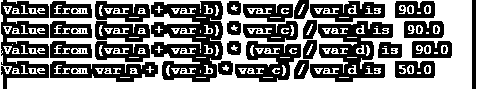
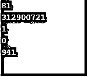
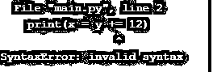

# Python 中的运算符优先级

> 原文：<https://www.educba.com/operator-precedence-in-python/>


## Python 中运算符优先级的介绍

运算符优先级是 python 中考虑运算符的优先级。运算符的作用是在使用表达式的时候。表达式是变量、函数、值和运算符的组合使用。所有这些元素结合起来形成有效的表达式。并且这些表达式中需要使用的运算符的优先级是由 python 中的运算符优先级规则决定的。此规则有助于评估表达式并验证这些表达式中执行操作的顺序。

### Python 中运算符优先级是如何工作的？

如前所述，表达式是由一组有效的操作符、函数、变量和相关值生成的。以正确格式出现的这些将被解释器视为有效的 python 表达式。

<small>网页开发、编程语言、软件测试&其他</small>

例如:变量 a = 3 + 7

这被称为有效的 python 表达式。这些表达式总是可以用更复杂的方式来表达。描述每个操作者的优先级的优先顺序图如下所示，

| **操作员** | **描述** |
| ** | 提高幂或指数 |
| – ~+ | 减号、补号和加号 |
| * / % // | 乘法、除法、模运算和地板除法 |
| – + | 减法和加法 |
| << >> | 按位左移和右移是按位的。 |
| & | 按位“与”td > |
| &#124; | 按位异或和常规异或 |
| <= < > >= | 比较运算符 |
| <> ==！= | 等式运算符 |
| = %= /= //= -= += *= **= | 赋值运算符 |
| 不是是 | 标识运算符 |
| 在不在 | 成员运算符 |
| 和或不 | 逻辑运算符 |

### 在 Python 中实现运算符优先级的示例

#### 示例#1

**代码:**

```
var_a = 20
var_b = 10
var_c = 15
var_d = 5
var_e = 0
var_e = (var_a + var_b) * var_c / var_d #( 30 * 15 ) / 5
print("Value from (var_a + var_b) * var_c / var_d is ", var_e)
var_e = ((var_a + var_b) * var_c) / var_d # (30 * 15 ) / 5
print("Value from (var_a + var_b) * var_c) / var_d is ", var_e)
var_e = (var_a + var_b) * (var_c / var_d); # (30) * (15/5)
print("Value from (var_a + var_b) * (var_c / var_d) is ", var_e)
var_e = var_a + (var_b * var_c) / var_d; # 20 + (150/5)
print("Value from var_a + (var_b * var_c) / var_d is ", var_e) 
```

**输出:**




**解释:**声明了五个变量，这些变量根据优先级的不同实例进行乘法和除法运算。变量 var_e 用于记录和打印所有结果。在第一个实例和第二个实例中，var_a 和 var_b 相加并乘以 var_c，然后将乘积除以 var_e。在第三个实例中，再次将 var_a 和 var_b 相加，并将增加值乘以 var_c 和 var_d 的除法结果。因此，这两个不同的集合相乘并分配给 var_e，并在控制台中打印出来。最后，优先级以 var_a 保持单例的方式运行。因此，var_b 和 var_e 相乘，相乘的结果除以 var_d，结果被添加到 var_a 并打印到控制台。

#### 实施例 2

**代码:**

```
Var = 7
if Var > 1 and Var < 10:
   print( " \n \n Hello World ! \n" )
else:
   print( " \n \n END OF PROGRAM \n \n" ) 
```

**输出:**


**说明:**保留关键字 AND 用于实现 python 编程中的逻辑 AND 运算。AND 关键字的操作方式是，只有当 AND 条件中指定的声明都为真时，底层的已知进程才会获取委托。这个程序用于证实特定的整数是否是在一个明确分类的值中间的欺骗。需要确认的混合物是通过 AND 运算符预先计划好的。范围的初值和终值被检查为大于和小于值(值验证> 1 和值验证< 10)。当设定值在此范围内时，控制台会显示“Hello World！”已打印。如果上述条件不成立，则打印控制台声明“程序结束”。

#### 实施例 3

**代码:**

```
print( 3 ** 2 ** 2)
print((133 ** 2) ** 2)
print( 1 * 3 //
3)
print( 15 * (2 // 3))
print(((( (26+43) *32 )-310)//2)-4*2 ) 
```

**输出:**




**解释:**这里反映了优先级操作符的几个不同的实例，这个例子包含了优先级的更复杂的实现。这里，第一个表达式是三个值的乘法，下一个也是一个非常相似的实例，但是这里使用大括号允许首先操作第一个集合，然后与第三个集合相乘。下一个实例是先进行除法运算，然后进行输出的乘法运算。下一个也以非常相似的方式运行。最后使用的表达式是一个非常复杂的表达式，或者说是表达式中优先操作符的使用。它表示在更嵌套的表达式中乘法、减法、除法的组合使用，其输出也在控制台中描述。

#### 实施例 4

**代码:**

```
x = 11, y = 12, z = 13
print(x = y += 12) 
```

**输出:**




**解释:**这个例子描述了当优先操作符在表达式序列中放错位置时，语法错误是如何产生的。在本例中，等号运算符中出现的+运算符会破坏表达式，并在控制台上引发一个语法错误。我们可以注意到，控制台中的语法错误表示清楚地指出了给定表达式中'+= '的错误使用。

### 结论

优先操作符的优化使用对于任何编程语言中的表达式结构来说都是非常关键的，从 python 的角度来看，优先操作符的优先级非常稳定，使用起来也非常复杂。

### 推荐文章

这是 Python 中运算符优先级的指南。这里我们讨论 Python 中运算符优先级的介绍，它是如何工作的，代码和输出的例子。您也可以浏览我们的其他相关文章，了解更多信息——

1.  [Matlab 逻辑运算符](https://www.educba.com/matlab-logical-operators/)
2.  [Python 余数运算符](https://www.educba.com/python-remainder-operator/)
3.  [Python 三元运算符](https://www.educba.com/python-ternary-operator/)
4.  [Python 中的恒等运算符](https://www.educba.com/identity-operators-in-python/)


