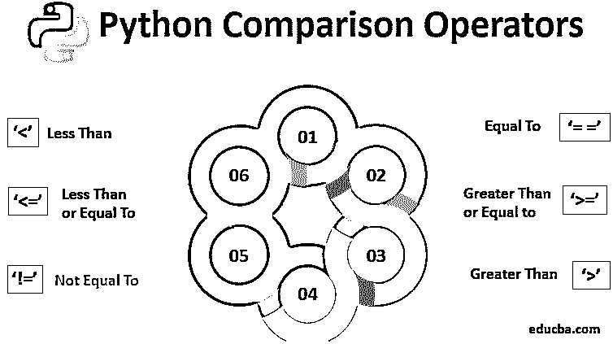

# Python 比较运算符

> 原文：<https://www.educba.com/python-comparison-operators/>




## Python 比较运算符简介

这些是 python 中的特殊符号。基本上，这些是用来执行算术或逻辑计算。在数学语言中，我们可以说 Python 运算符是一种特殊的符号，用于执行与一个或多个操作数相关的运算。一个操作数可以被描述为一个值，也可以是一个变量。随着我们向前推进，我们将深入了解 Python 中的比较运算符及其各自的语法和实例。

### Python 运算符的不同基本类型

Python 语言支持以下运算符:

<small>网页开发、编程语言、软件测试&其他</small>

#### 1.算术运算符

Python [算术运算符](https://www.educba.com/arithmetic-operators-in-javascript/)用于执行基本的数学运算，包括加、减等。各种运算符是减法、除法、加法、乘法、底数除法、指数和模数。

#### 2.比较(关系)运算符

*   Python 比较运算符用于比较两边的值。各种运算符==，！=，<>，>，< =，等等。
*   【这个比较运算符我们下面要详细讨论。]

#### 3.赋值运算符

Python [赋值操作符](https://www.educba.com/assignment-operators-in-java/)用于给变量赋值。各种运算符有+=、–=、*=、/=等。

#### 4.逻辑运算符

Python 逻辑运算符用于条件语句。各种运算符有逻辑 AND、逻辑 OR 和逻辑 NOT。

#### 5.按位运算符

[Python 按位运算符](https://www.educba.com/python-bitwise-operator/)对位起作用，对操作数逐位而不是整体进行运算。各种运算符是–Python 按位 AND、OR、XOR、左移、右移和 1 的补码按位运算符。

#### 6.成员运算符

Python 成员运算符用于测试值，无论它是否是序列的成员。这个序列可以是列表、元组或字符串。Python 中使用的两个标识操作符是中的*和不在*中的*。*

#### 7.标识运算符

*   [Python 恒等运算符](https://www.educba.com/identity-operators-in-python/)用于比较两个对象的内存位置。Python 中使用的两个确定的运算符是“is”和“is not”。
*   那么，让我们开始了解更多关于比较运算符的知识。

### Python 比较运算符

[比较运算符](https://www.educba.com/comparison-operators-in-powershell/)也被称为关系运算符。这些运算符用于比较值，并根据条件返回“真”或“假”。

**Python 中的比较运算符**

等于-' = = . '
大于—“>。”
小于—“【T6”。”
大于或等于-'>= . '
小于或等于-'<= . '
不等于——’！=.'

#### 1.等于

等于运算符，用“==”表示，检查左侧运算符的值是否等于右侧的值。如果两边的运算符的值相等，则等于运算符返回“真”,否则返回“假”。

**例#1**

```
x = 7
y = 5
print(x == y)
```

输出:假

#返回“False”，因为 7 不等于 5。

**例 2**

```
x = 10
y = 20
print(x == y)
```

输出:假

#返回“False”，因为 10 不等于 20。

#### 2.大于

大于运算符用“>”表示，检查左侧运算符的值是否大于右侧运算符的值。

**例#1**

```
x = 7
y = 5
print(x > y)
```

输出:真

#返回“True ”,因为 7 大于 5。

**例 2**

```
x = 10
y = 20
print(x > y)
```

输出:假

#返回“False”，因为 10 不大于 20。

#### 3.不到

小于运算符用“

**例#1**

```
x = 7
y = 5
print(x < y)
```

输出:假

#返回“False ”,因为 7 不小于 5

**例 2**

```
x = 10
y = 20
print(x < y)
```

输出:真

#返回“真”,因为 10 小于 20

#### 4.大于或等于

当且仅当左侧运算符的值大于或等于右侧运算符的值时，由“> =”表示的大于或等于运算符返回“True”。

**例#1**

```
x = 7
y = 5
print(x >= y)
```

输出:真

#返回“True ”,因为 7 大于或等于 5

**例 2**

```
x = 10
y = 20
print(x >= y)
```

输出:假

#返回“False ”,因为 10 既不大于也不等于 20

#### 5.小于或等于

小于或等于运算符表示为“< =”，当且仅当左侧运算符的值小于或等于右侧运算符的值时，该运算符返回“True”。

**例#1**

```
x = 7
y = 5
print(x <= y)
```

输出:假

#返回“False ”,因为 7 既不小于也不等于 5

**例 2**

```
x = 10
y = 20
print(x <= y)
```

输出:真

#返回“True ”,因为 10 小于或等于 20

#### 6.不等于

不等于运算符，用“！= '，与等于运算符完全相反。

如果两边的运算符的值不相等，则该运算符返回“真”，否则将返回“假”。

**例#1**

```
x = 7
y = 5
print(x != y)
```

输出:真

#返回“真”,因为 7 不等于 5

**例 2**

```
x = 10
y = 20
print(x != y)
```

输出:真

#返回“True”，因为 10 不等于 20。

### 结论

总而言之，我们已经提出了关于 python 比较运算符的要点，并了解了 Python 中的各种类型及其功能。准确地说，我们已经详细介绍了 Python 比较运算符的主要亮点。我们学习了比较运算符等于、小于、大于、大于或等于、小于或等于和不等于。

由此，我们可以肯定地说 Python 比较操作符的功能非常容易理解。我希望您已经收集了关于 Python 操作符的全面信息，并且这篇文章将有效地帮助您完成进一步的任务。

### 推荐文章

这是 Python 比较运算符的指南。这里我们讨论 Python 中的简介和不同的比较操作符，并给出例子。您也可以阅读以下文章，了解更多信息——

1.  [什么是 Python 运算符？](https://www.educba.com/python-operators/)
2.  [VB.NET 算子的类型](https://www.educba.com/vb-dot-net-operators/)
3.  [Matlab 运算符](https://www.educba.com/matlab-operators/)
4.  [Python 中的布尔运算符](https://www.educba.com/boolean-operators-in-python/)


