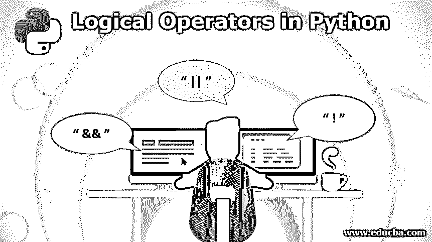
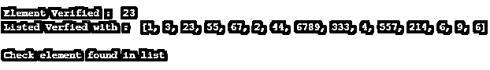

# Python 中的逻辑运算符

> 原文：<https://www.educba.com/logical-operators-in-python/>

## Python 中的逻辑运算符简介

编程中的逻辑运算符有助于实现和证明程序控制流和逻辑设计中的几种逻辑复杂性；python 中的三个主要逻辑运算符是 AND、or 和 NOT。下面简要解释 python 中的所有这些逻辑运算符。

### 逻辑运算符的类型及示例

以下是 python 的一些逻辑运算符:

<small>网页开发、编程语言、软件测试&其他</small>

#### 1.逻辑积算符

在 python 编程中，保留关键字“and”用于实现逻辑 AND 运算。AND 关键字的工作方式是，只有当 AND 条件中给出的两个语句都为真时，下面给出的操作才会发生。

**代码:**

`Value_verified = 5
if Value_verified > 1 and Value_verified < 10 :
print( " \n \n Hello World ! \n " )
else:
print( " \n \n END OF PROGRAM \n \n " )`

**输出:**

**说明:**该程序用于确认指定的整数是否在精确的取值范围内。需要验证的分类是通过 AND 运算符设计的。检查范围的起始值和结束值是否大于和小于值(值验证> 1 和值验证< 10)。当验证值在此范围内时，控制台会显示“Hello World！”已打印。如果上述条件不成立，则打印控制台声明“程序结束”。

**代码:**

`class Boolean_value_check:
check_element = 0
def __init__(self, i):
self.check_element = i
# Boolean check method is called
def __bool__(self):
return True if self.check_element > 0 else False
Check_value1 = -10
Check_value2 = 10
print( ' \n First Value : ' , Check_value1 )
print( ' Second Value : ' , Check_value2 )
check_value1_Boolean = Boolean_value_check(Check_value1)
check_value2_Boolean = Boolean_value_check(Check_value2)
if check_value1_Boolean and check_value2_Boolean:
print( 'Both First value and Second value are positive \n \n ')
else:
print( ' Both First value and Second value are not positive \n \n ')`

**输出:**

**说明:**该程序允许确认给定的二进制数是否为正整数。键入的输入被推入变量实例。_ _ bool _ _ 函数总是返回布尔值(真或假)。负整数检查是通过检查接收到的参数是否大于零来实现的。当这些值大于零时，它们显然是正整数，布尔值 TRUE 会返回给它们，反之亦然。当两个值都为真时，将显示控制台消息“两个值都为正”。当一个或两个都为负时，将打印控制台消息“两个都不是正的”。

#### 2.OR 运算符

逻辑运算“OR”的意思与 OR 的语法意思非常相似；运算符的工作方式是，如果给定语句中的任何一个本身为真，则它执行下面陈述的运算。换句话说，当操作预期在甚至一个条件为真的情况下发生时，将使用该操作。

**代码:**

`class Boolean_value_check:
check_element = 0
def __init__(self, i):
self.check_element = i
# Boolean check method is called
def __bool__(self):
return True if self.check_element > 0 else False
Check_value1 = -10
Check_value2 = 10
print( ' \n First Value : ' , Check_value1 )
print( ' Second Value : ' , Check_value2 )
check_value1_Boolean = Boolean_value_check(Check_value1)
check_value2_Boolean = Boolean_value_check(Check_value2)
if check_value1_Boolean and check_value2_Boolean:
print( 'Both First value and Second value are positive \n \n ')
elif check_value1_Boolean or check_value2_Boolean:
print( ' Either First value or Second value is positive \n \n ')
else:
print( ' Both values are negative \n \n ')`

**输出:**

**说明:**该程序允许确认给定的二进制数是否为正整数。键入的输入被推入变量实例。_ _ bool _ _ 函数总是返回布尔值(真或假)。负整数检查是通过检查接收到的参数是否大于零来实现的。当这些值大于零时，它们显然是正整数，布尔值 TRUE 会返回给它们，反之亦然。

当两个值都为真时，将显示控制台消息“两个值都为正”。除了上面的程序 In 和运算符使用外，这里还增加了一个条件来验证给定值中的一个是否为正；这是通过具有以下条件检查的 OR 运算符实现的，

`elif check_value1_Boolean or check_value2_Boolean:`

根据该检查，如果传递的值中有一个是正值，则它会在控制台中打印消息，说明“第一个值或第二个值是正值”，而当一个值或两个值都是负值时，则显示控制台消息“两个值都是负值”。

#### 3.“非”算符

python 中的最后一个逻辑操作符是 NOT 操作符,“NOT”是为这个逻辑操作保留的。根据该运算符，只有当所述条件保持为假时，才会执行给定的操作，

**代码:**

`check_element = 23
list_elements = [1,3,23,55,67,2,44,6789,333,4,557,214,6,9,6] print(" \n Element Verified : " ,check_element)
print(" Listed Verfied with : " ,list_elements)
if check_element not in list_elements :
print(" \n Check element Not found in list \n")
else:
print(" \n Check element found in list ")`

**输出:**

**解释:**这个程序用来检查给定的数字是否是指定列表的一部分。这种检查是通过以下条件使用非逻辑运算符来实现的:

`if check_element not in list_elements`

如果在给定的列表中找到元素，则打印控制台消息“检查列表中找到的元素”；否则，将显示控制台消息“列表中未找到检查元素”。

### 推荐文章

这是 Python 中逻辑运算符的指南。这里我们讨论 Python 中逻辑运算符的基本概念、类型，以及示例和它们的代码实现。您也可以浏览我们推荐的文章，了解更多信息——

1.  [Python 全局变量](https://www.educba.com/python-global-variable/)
2.  [JavaScript 中的逻辑运算符](https://www.educba.com/logical-operators-in-javascript/)
3.  [PHP 中的逻辑运算符](https://www.educba.com/logical-operators-in-php/)
4.  [SQL 逻辑运算符](https://www.educba.com/sql-logical-operators/)

