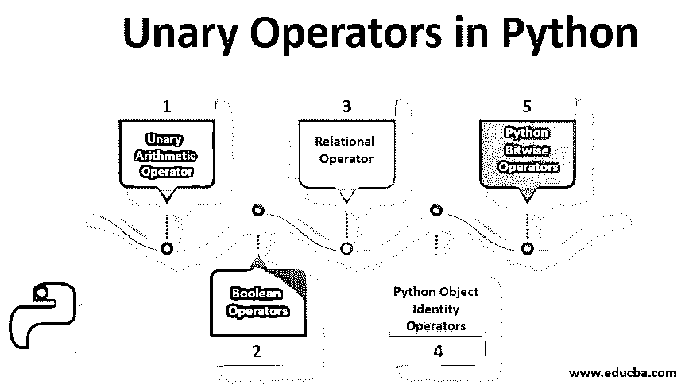
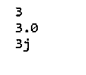
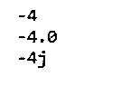
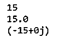
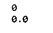
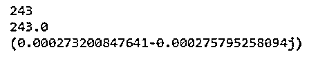
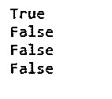
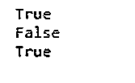
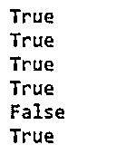
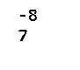

# Python 中的一元运算符

> 原文：<https://www.educba.com/unary-operators-in-python/>




## Python 中一元运算符简介

在本文中，我们将讨论 Python 中的一元运算符。操作符是一个符号，表示特定程序已经完成。编程方言中的运算符取自数学。操作数是一个操作符作用于其上的信息。我们举个例子:+A(其中+符号是运算符)和 A .一个运算符可能有几个操作数。操作数是运算符信息(争用)的来源之一。那些只处理单个操作数的运算符称为一元运算符。考虑函数 f: A → A，其中 A 将是一个集合。函数 f 是 a 上的一元活动。

### 不同一元运算符的示例

python 中一元运算符的示例如下:

<small>网页开发、编程语言、软件测试&其他</small>

#### 1.一元算术运算符

这个区域阐明了 Python 中所有[算术运算符](https://www.educba.com/arithmetic-operators-in-java/)的模型(语言结构)和语义，利用了它的三种数字排序:int、float 和 complex。

##### 添加

Python 中的 **+** 操作符可以以一元形式使用。一元结构意味着字符，恢复与其操作数相同的值。

**举例:**

| **原型** | **例子** |
| + (int) -> int | +4 返回结果 4 |
| +(浮点)->浮点 | +4.0 返回结果 4.0 |
| +(复数)->复数 | +4j 返回结果 4j |

**代码:**

```
print +3
print +3.0
print +3j
```

**输出:**




##### 减法

Python 中的**–**操作符可以以一元形式使用。一元结构意味着字符，恢复与其操作数相同的值。一元结构意味着否定，将无效的激励恢复为其操作数:零到零，正到负，负到正。

**举例:**

| **原型** | **例子** |
| –(int)-> int | -4 返回结果-4 |
| –(浮动)->浮动 | -4.0 返回结果-4.0 |
| –(复杂)->复杂 | -4j 返回结果-4j |

**代码:**

```
print -4
print -4.0
print -4j
```

**输出:**




##### 增加

Python 中的 ***** 操作符可以在成对结构中明显地使用，这意味着增加，恢复作为其操作数的标准算术乘积结果的结果。

**举例:**

| **原型** | **例子** |
| ***** (int，int) - > int | 4* 5 返回结果 20 |
| ***** (浮，浮)- >浮 | 4.0 * 5.0 返回结果 20.0 |
| ***** (复，复)——>复 | 4j * 5j 返回结果(-20+0j) |

**代码:**

```
print 3*5
print 3.0*5.0
print 3j*5j
```

**输出:**




##### 分开

Python 中的/操作符(cut)可以在并行结构中清楚地使用，这意味着除法，恢复一个输出，该输出是杂耍其操作数的剩余部分的标准数:左操作数被右操作数分割。

**举例:**

| **原型** | **例子** |
| **/** (int，int) - > int | 4 / 5 返回结果 0.8 |
| **/** (浮，浮)- >浮 | 4.0 / 5.0 返回结果 0.8 |
| **/** (复，复)——>复 | 4j / 5j 返回结果(. 08+0j) |

**代码:**

```
print 3/5
print 3.0/5.0
print 3j/5j
```

**输出:**

打印 3/5
打印 3.0/5.0
打印 3j/5j

##### 楼层划分

Python 中的**/**操作符(doubles slice)可以像在双重结构中一样使用，它还意味着除法，但恢复了标准数处理其操作数剩余部分的重要结果:左操作数被右操作数分割。

**举例:**

| **原型** | **例子** |
| // (int，int) -> int | 3 // 5 返回结果 0 |
| // (float，float) ->浮动 | 3.0 // 5.0 返回结果 0.0 |

**代码:**

```
print 3//5
print 3.0//5.0
```

**输出:**




##### 以…为模

Python 中的 **%** 运算符在并行结构中可以清楚地使用，这意味着左操作数被正确的操作数分割后的剩余部分。

**模型示例:**

| **原型** | **例子** |
| % (int，int) -> int | 3%4 返回结果 0 |
| % (float，float) ->浮动 | 3.0%5.0 返回结果 3.0 |

**Python 代码:**

```
print 3%5
print 3.0%5.0
```

**输出:**


##### 力量

Python 中的 ****** 运算符可以在 double 结构中清楚地使用，这意味着对左操作数提升到正确操作数强度的结果进行幂恢复。

**举例:**

| **原型** | **例子** |
| ** (int，int) -> int | 3 ** 5 返回结果 243 |
| **(浮，浮)->浮 | 3.0 ** 5.0 返回结果 243.0 |
| **(复杂，复杂)->复杂 | 3j ** 5j 返回结果(0.0002732008476414374-0.3763766 |

**Python 代码:**

```
print 3**5
print 3.0**5.0
print 3j**5j
```

**输出:**




#### 2.布尔运算符

在 Python 中，and、or 和 not 是布尔运算符。使用布尔运算符，我们可以执行合法的任务。这些通常与 if 和 while 关键字一起使用。

**Python 代码:**

```
print (True and True)
print (True and False)
print (False and True)
print (False and False)
```

**输出:**




#### 3.关系运算子

[用于比较值的关系运算符](https://www.educba.com/relational-operators-in-c-plus-plus/)。它返回一个布尔值。

| **符号** | **意为** |
| < | 不到 |
| <= | 小于等于 |
| > | 大于 |
| >= | 大于等于 |
| == | 等于 |
| ！= | 不等于 |

根据上表 Python 关系运算符的示例:

**代码:**

```
print 3 < 4
print 4 == 3
print 4 >= 3
```

正如我们之前提到的，社会管理员返回布尔属性:真或假。

**输出:**




#### 4.Python 对象标识运算符

对象[标识运算符](https://www.educba.com/identity-operators-in-python/)由 is 和 not is 组成；它检查它的操作符是否是相似的项。

我们举个例子。

**代码:**

```
print (Equals == Equals)
print (Equals is Equals)
print (Equals is Equals)
print ([] == [])
print ([] is [])
print ("Python" is "Python")
```

**输出:**




#### 5.Python 按位运算符

小数对人来说很正常。双数是 PC 本地的。双精度、八进制、十进制或十六进制图像只是类似数字的文档。按位管理器处理双数的位。

| **符号** | **意为** |
| ~ | 否认 |
| ^ | 异或 |
| & | 和 |
| &#124; | 或者 |
| << | 左移 |
| >> | 右移 |

按位求反运算符对每个 1 到 0 和 0 到 1 进行更改。

**代码:**

```
print ~7
print ~-8
```

**输出:**




管理员返回数字 7 的所有位。

### 结论

在本文中，我们展示了 python 编码中使用的所有必要的一元运算符和其他运算符。我们已经了解了 Python 支持的各种运算符，这些运算符将对象合并到发音中。到目前为止，你所看到的大部分模型只包含了基本的核信息。

### 推荐文章

这是 Python 中一元运算符的指南。这里我们讨论 Python 中各种一元运算符的基本概念，以及不同的例子和代码实现。您也可以阅读以下文章，了解更多信息——

1.  [Python 字符串操作](https://www.educba.com/python-string-operations/)
2.  [Python 运算符](https://www.educba.com/python-operators/)
3.  [PHP 中的算术运算符](https://www.educba.com/arithmetic-operators-in-php/)
4.  [Java 中的一元运算符](https://www.educba.com/unary-operators-in-java/)


