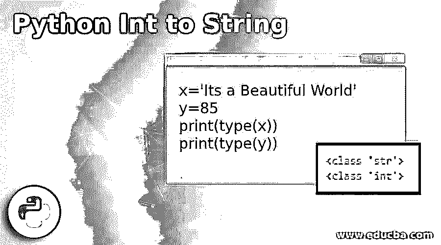
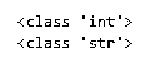
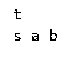
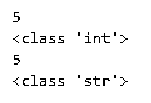
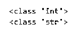
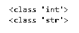
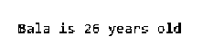
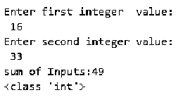
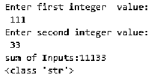

# Python Int 到 String

> 原文：<https://www.educba.com/python-int-to-string/>




## Python Int 到 String 简介

在 Python 中，我们作为变量使用或存储的所有值都将具有唯一的数据类型。它解释了值的性质，并依赖于 python 自动为该值分配数据类型。在本文中，我们将看到 python 中的 int 到 string 的转换，使用四种不同的方法将给定的整数值转换为 string 值。

**语法:**

<small>网页开发、编程语言、软件测试&其他</small>

Python 为不同的值集提供了不同的数据类型，Integers 处理可以接受字母数字值的数字和字符串，python 允许不同的数据结构，如 list、Tuple、Dictionary & sets，用于处理不同的问题。在下面的例子中，我们声明了 2 个不同的值，并检查了这些值的数据类型，以给出 python 数据类型的概念。

```
x='Its a Beautiful World'
y=85
print(type(x))
print(type(y))
```

**输出:**


从上面的例子推断，我们可以清楚地理解字符串数据类型和整数数据类型。我们在引号内给出了一个语句，并将其赋给了变量“x ”,这是一个字符串数据类型的示例，而变量“y”是一个简单的数字字符。

### Python 中如何把整数转换成字符串？

在 python 中，可以使用四种方法将整数数据类型转换为字符串数据类型。它们如下。

*   使用 str()函数
*   使用%s 字符串
*   使用。format()函数
*   使用 f 弦

#### 1.str()方法

str()函数的语法如下。

**语法:**

```
str(integer)
```

str()函数转换在 str()函数中传递的值，并返回字符串数据类型。对象可以是 char，int，甚至是一个字符串。如果函数中没有传入任何值，则不返回值。

**例子**

让我们看一个简单的代码来说明 int 到 string 的转换。

```
#int to string conversion
x = 10
# print the date type of variable x
print(type(x))
# convert the variable x into string
y = str(x)
# check and print type of y variable
print(type(y))
```

**输出:**




在上面的方法中，我们为变量“x”声明了一个 10 的整数值，并使用 python 中的 str()函数对其进行了转换，得到的“y”变量以字符串数据类型返回。

**例子**

许多操作，如切片、替换、连接等。可以用字符串数据类型来完成。让我们讨论另一个例子，如下所示

```
#code to print string value
a = 'Its a beautiful day'
print(a[1])
print(a[2:7])
```

**输出:**




在上面的代码中，我们将字符串“Its a beautiful day”声明为变量 a。在下一行中，我们打印了该字符串的第一个切片位置，它也是一个字符串。在下一行中，我们将字符串中的第 2 和第 7 个位置切片并打印出来。字符串数据类型具有多种功能，并且易于使用。

#### 2.使用%s 关键字将 Int 转换为 String

**语法:**

```
"%s" % integer value
```

**例子**

```
# int to string conversion using %s
a = 5
# print the value and data type of variable a
print(a)
print(type(a))
# convert the integer a into string and print the value and data type
b = "% s" % a
print(b)
print(type(b))
```

**输出:**




在上面的程序中，我们将一个整数值 5 赋给了变量，并打印了 a 的值和数据类型。在下一部分中，我们使用%s 关键字将整数 a 转换为字符串 b。在最后一步中，我们打印了 b 的数据类型并检查了结果。让我们看另一个例子，我们将两个整数值相加，并将它们转换成一个字符串。

**例子**

```
#code to add two int values and convert the result to string
a = 10
b = 5
c = a + b
print(type(c))
x = '%s' %c
print(type(x))
```

**输出:**




就像前面的例子一样，我们将两个 int 值相加，并将结果赋给 c 并打印数据类型。在下一部分中，我们将把 int 转换成 string 并检查数据类型。

#### 3.使用 f- String 将 Int 转换为 String

**语法:**

```
f’{integer_value}’
```

**例子**

```
# int to string conversion using f- string
a = 5
print(type(a))
b = f'{a}'
print(type(b))
```

**输出:**




#### 4.Int 到 String 的转换。format()方法

**语法:**

`‘{}’.format(integer_value)`

**例子**

```
#int to string conversion using .format() method
name = "Bala"
age = 26
# using .format() method
print("{name} is {age} years old".format(name=name, age=age))
```

**输出:**




在上面的代码中，我们将字符串“Bala”赋给了名为 name 的变量，并将 int 值 26 赋给了 age 变量。在下一步中，我们将使用。format()函数并打印输出中所示的字符串。

**例子**

在下面的例子中，我们得到了两个字符串值作为输入，进行了加法运算，并打印了结果值的数据类型。

```
#code to sum of two input strings and convert it to int value
x = input('Enter first integer value:\n')
x=int(x)
y = input('Enter second integer value:\n')
y=int(y)
sum_inputs=x+y
print('sum of Inputs:{}'.format(sum_inputs))
print(type(sum_inputs))
```

**输出:**




在上面的代码中，我们将两个输入 x 和 y 声明为一个字符串，并执行求和操作，然后将它们转换为整数值，得到的和作为输出打印出来。如果我们不将值转换成 int 并执行加法运算，我们将得到结果输出。




在上面的输出中，我们声明了两个字符串值，并执行了一个求和运算，因为它们是字符串值，输出只是两个字符串的组合，因为它是字符串值，所以不执行数学运算。

### 结论

在本文中，我们通过各种例子讨论了 int 到 string 的转换。在 python 中，数据类型转换被认为是非常重要的，因为它被用于各种实时场景。当在数据科学领域使用不同种类的算法时，我们需要转换数据类型。

### 推荐文章

这是一个 Python Int 到 String 的指南。这里我们讨论一下定义以及如何在 python 中将整数转换成字符串？以及不同的示例及其代码实现。您也可以看看以下文章，了解更多信息–

1.  [Python 导入错误](https://www.educba.com/python-importerror/)
2.  [Python 列表长度](https://www.educba.com/python-list-length/)
3.  [Python 目录](https://www.educba.com/python-directories/)
4.  [Python 类型错误](https://www.educba.com/python-typeerror/)


