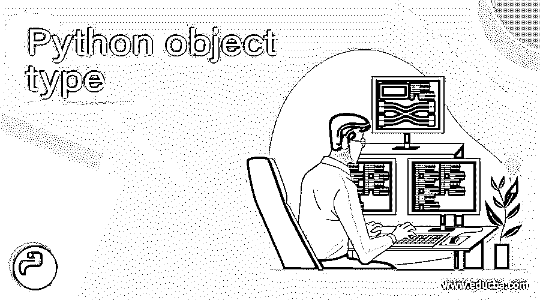
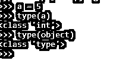
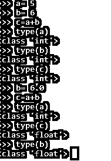
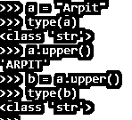
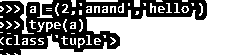
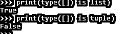
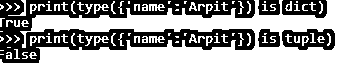

# Python 对象类型

> 原文：<https://www.educba.com/python-object-type/>




## Python 对象类型介绍

在 Python 中进行处理时，Python 数据通常采用对象的形式，无论是内置的、自行创建的还是通过外部库创建的。Python 对象类型是编程所必需的，因为它通过定义一些强大的数据处理工具使程序更容易编写。

python 中的这些对象类型得到了很好的优化，提高了代码的性能水平。它们构成了编程语言的核心。Python 有一个称为 TYPE 的内置方法，在传递对象时，会返回类型。

<small>网页开发、编程语言、软件测试&其他</small>

**语法**

```
Type(object)
>>> type(object)
<class 'type'>
>>> type(a)
<class 'int'>
```

**截图:-**




```
Type ( name , bases , dict)
Name :-  It is the class Name .
Bases :- Tuple from which the current class is derived .
Dict :- Namespaces for the classes .
```

### 对象类型的工作

对象类型使用方法 type()，该方法返回给定对象的类型。一个对象可以有两种类型的参数:-

单参数和三参数。

```
Type(object)
Type(name , bases , dict)
```

返回类型返回对象持有的对象的类型。

### 带有示例的内置对象类型

Python 有一些在编程方法中使用的内置对象类型。Python 中有很多内置的对象类型；我们将通过例子检查一些内置对象:-

数字(Int 类):-

这是整数类型。

例如:-

```
>>> a = 5
>>> type(a)
<class 'int'>
```

甚至一些超过数的运算也会给出该对象为那种特定类型的对象。

在改变任何变量的类型时，结果类型也相应地改变:-

例如:-

```
>>> a= 5
>>> b= 6
>>> c=a+b
>>> type(a)
<class 'int'>
>>> type(b)
<class 'int'>
>>> type(c)
<class 'int'>
```

这给了我们一个整数。但是假设其中一个值改变了，那么对象的类型也会改变。

```
>>> a= 5
>>> b= 6
>>> c=a+b
>>> type(a)
<class 'int'>
>>> type(b)
<class 'int'>
>>> type(c)
<class 'int'>
```

**截图:-**




**字符串** :-

这是字符串类型。String 基本上是其他对象的有序集合，这意味着它们所包含的项目有一个顺序。

```
>>> a = "1234"
>>> type(a)
<class 'str'>
```

我们也可以在 string 对象类型上使用各种方法来处理它。Python 中不可变的字符串产生了各种各样的字符串方法，这些方法可以在不改变对象类型的情况下完成。

**示例:-**

```
>>> a = "Arpit"
>>> type(a)
<class 'str'>
>>> a.upper()
'ARPIT'
>>> b = a.upper()
>>> type(b)
<class 'str'>
```




**列表:-**

这是列表类型。它们是大小可变的有序对象集合。它们也是一种序列。它们在本质上是可变的。它们也是有序的和可变的。

```
> a = ["A","b","c"]
>>> type(a)
<class 'list'>
>>>
```


```
>>> type(a)
<class 'list'>
```

**字典:-**

这是字典类型的。它们基本上也被称为映射。通过键和与特定键相关联的值来存储对象。由于本质上是可变的，它们通常具有可变的大小。


**示例:-**

```
>>> a = {‘name’ : 'anand' , 'age': '52'}
>>> type(a)
<class 'dict'>
```

**元组:-**

这是元组类型。它们本质上是不可变的，嵌入在括号中。它们也是有序的，支持所有的序列操作。它们类似于列表，但不可变。

```
>>> a =(2,'anand','hello')
>>> type(a)
<class 'tuple'>
```




**文件:-**

文件是我们在计算机上获取外部数据的接口。它们用值来参数化，我们可以对它们进行一些操作，例如:写、读、打开、关闭。

这些都是该对象类型中的内置操作。我们需要提供路径或创建文件并启动所需的操作。

**对于 Ex:-**

```
F = open(“path of File” , ‘w’) // w for write , r for read
f.write(“message1”)
f.write(“message2”)
f.close()
```

我们在 Python 编程中所做的一切都是一种对象。有了对象的类型，程序员就能清楚地了解所使用的对象和操作。

我们可以检查带有布尔值的类型名的对象的类型

**例如:-**

```
>>> print(type([]) is list)
True
>>> print(type([]) is tuple)
False
```

**截图:-**




以类似的方式，我们可以检查不同类型的对象。

```
>>> print(type({'name':'Arpit'}) is dict)
True
>>> print(type({'name':'Arpit'}) is tuple)
False
```




### 结论

从上面的文章中，我们看到了 Python 对象的用途和类型。从各种例子和分类中，我们试图理解 Python 中的一切是如何工作的，以及所使用的各种对象类型是什么。

我们看到了整数、字符串、元组和其他内置对象在 Python 中的使用，以及在各种编程方面的使用。同样，通过语法和优势，我们检查了所有的用法。所以它是任何编程语言的基本和重要的方面。

### 推荐文章

这是 Python 对象类型的指南。在这里，我们通过各种例子和分类来讨论 Python 对象的用途和类型。您也可以阅读以下文章，了解更多信息——

1.  [Python pip](https://www.educba.com/python-pip/)
2.  [Python 解析器](https://www.educba.com/python-parser/)
3.  [Python wait()](https://www.educba.com/python-wait/)
4.  [Python 系统退出](https://www.educba.com/python-systemexit/)


