# Python 模数算子

> 原文：<https://www.educba.com/python-modulus-operator/>

## Python 模数运算符简介

在任何编程中，基本的构建模块是变量(存储不同类型数据的容器)和对这些变量进行的计算。运算符是帮助进行这些计算的预定义函数。模数运算符帮助我们得到数学除法运算的余数。因此，模数运算符也称为余数运算符。它用“%”(百分比)符号表示。

### 模块操作示例

让我们有两个数字，10 和 3。我们用 10 除以 3。所以在这里，10 成为被除数，3 成为除数。一个正常的除法运算，即 10/3，将产生以下结果 10/3 = 3.3333…由于 10 不能被 3 整除，它将留下一个余数。模块操作符得到这个余数值。

<small>网页开发、编程语言、软件测试&其他</small>

我们知道，当 10 除以 3 时，余数为 1，下面的方法可以进一步解释这一点:–10 = 3 * 3+1

可以通过以下方式在 Python 中执行以下操作:

**代码:**

`a = 10
b = 3
c = a%b
print(" The value of modulus operation when " + str(a) + " is divided by " + str(b) + " is " + str(c))`

**输出:**

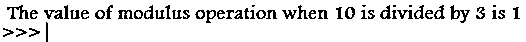

模数运算符有助于确定一个数是否能被任何数整除。
如果被除数能被除数整除，那么取模运算的结果就是 0。

**举例:**

`10 % 5`

**输出:**

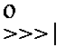

(因为 10 能被 5 整除，所以取模运算的结果是 0)

如果被除数不能被除数整除，那么模数运算的结果将在从 0 到除数-1 的范围内。

**举例:**

`10 % 8`

**输出:**

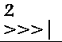

(因为 10 不能被 8 整除，所以取模运算的结果是 2)

### Python 模数运算符的类型

以下是 python 模数运算符的类型:

#### 1.整数取模

在这种情况下，除数和被除数都是整数。模数运算的结果也是一个整数。

**举例:**

`10 % 3`

**输出:**

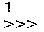

`2 % 2`

**输出:**

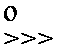

#### 2.浮点取模

在这种情况下，除数是一个浮点数。在这种情况下，模数运算的结果是浮动的。

**举例:**

`10 % 5.0`

**输出:**

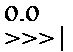

`10 % 3.0`

**输出:**

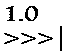

**NOTE:** When the dividend is a floating-point value, the Modulus Operation’s result is a float too.

**举例:**

`10.0 % 5.0`

**输出:**

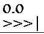

#### 3.零除法错误

当除数为 0 时，取模运算会抛出 ZeroDivisionError。我们可以使用 try catch 块来捕获这个错误。以下是除数为 0 时的示例，我们执行模数运算:

**代码:**

`a = 12.5
b = 0
c = a%b
print(" The value of modulus operation when " + str(a) + " is divided by " + str(b) + " is " + str(c))`

**输出:**

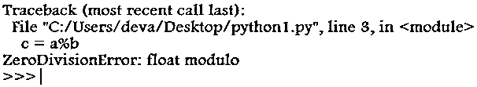

以下是除数为 0 时的示例，我们在 Python 的 try-catch 块中执行模数运算处理异常:

**代码:**

`a = 12.5
b = 0
try:
print( f '{a} % {b} = {a % b}' )
except ZeroDivisionError as zde:
print("We cannot divide by 0")`

**输出:**

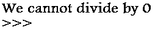

**NOTE:** It is a best practice to always use try catch while doing Modulus Operation to do away with this Runtime Exception.

#### 4.负数取模

我们可以将除数和被除数作为负数，但是模数运算将只返回与除数符号相同的余数。以下例子将有助于说明这一点

**举例:**

-10 % 3

**输出:**

10 % -3

**输出:**

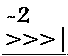

#### 5\. Python Modulo math.fmod()

这是模块函数，是函数的数学模块的内置函数。在这种情况下，模数运算的符号取决于被除数的符号。如果被除数为负，则模数运算的结果为负，如果被除数为正，则结果为正。即使被除数和除数是整数值，模数运算结果也是浮点值。

以下示例将有助于说明上述概念:

**举例:**

当被除数= -5，除数=3 时，结果是-2.0

**代码:**

`import math
print(math.fmod(-5, 3))`

**输出:**

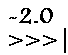

当被除数= 5，除数= -3 时，结果是 2.0

**代码:**

`import math
print(math.fmod(5, -3))`

**输出:**

**NOTE:** When the divisor is 0, we get a math domain error.

**代码:**

`import math
print(math.fmod(5, 0))`

**输出:**

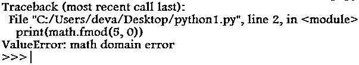

#### 6.Numpy Modulo numpy.mod()

Numpy 是 Python 中的一个模块，主要帮助我们执行数值计算。它还有一个 mod 函数来做模运算。以下代码片段说明了 numpy 的 mod 函数的用法:

**代码:**

`import numpy as np
a = 10
b = 3
print(np.mod(a, b))`

**输出:**

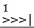

numpy 中的 mod 操作适合数组操作，如下所示:

**代码:**

`import numpy as np
a = np.array([2, -4, 7])
b = np.array([2, 3, 4])
print(np.mod(a, b))`

**输出:**

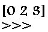

### 结论

因此，在本文中，我们简要讨论了不同的算术运算符，然后通过示例详细讨论了模数运算符。模数运算符是任何编程的一个组成部分，它的应用非常广泛。现在，您已经了解了模数运算符的所有基础知识，是时候开始用您喜欢的编程语言编写代码并应用上面提到的所有场景了。

### 推荐文章

这是一个 Python 模数运算符的指南。在这里，我们讨论不同的算术运算符，然后详细讨论模数运算符，并给出示例及其代码实现。您也可以浏览我们推荐的其他文章，了解更多信息——

1.  [Python 范围函数](https://www.educba.com/python-range-function/)
2.  [Python 设置函数](https://www.educba.com/python-set-function/)
3.  [Python 运算符](https://www.educba.com/python-operators/)
4.  [Python 余数运算符](https://www.educba.com/python-remainder-operator/)

