# Python 中的控制语句

> 原文：<https://www.educba.com/control-statements-in-python/>

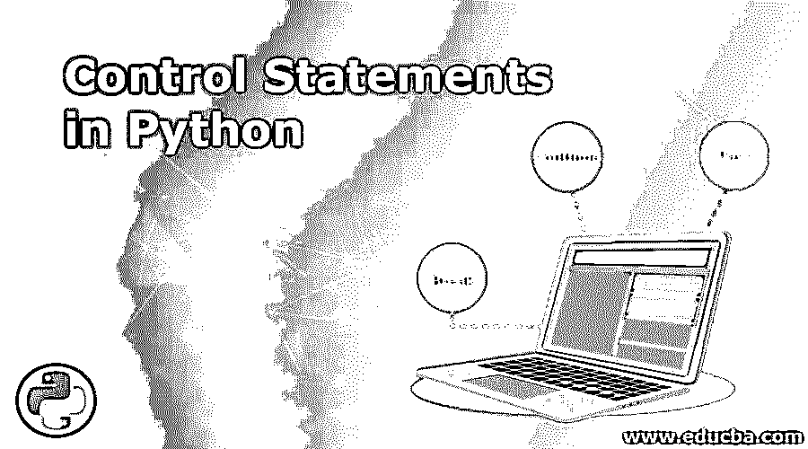

## Python 中控制语句的介绍

控制语句负责管理执行循环的流程。使用这些控制语句可以有效地控制指定语句集的执行顺序。python 编程语言提供了三组主要的语句来控制程序的流程；下面列出了它们

### Python 中的控制语句是如何工作的？

以下是 Python 中的控制语句:

<small>网页开发、编程语言、软件测试&其他</small>

#### 1.对于循环

对于传递一组有序的编程语句，For 循环在 python 中非常有用。循环会一直执行，直到在指定范围内执行完最后一个必需的元素或者满足上述条件。

**代码:**

`fruits = ["jackfruit", "mango", banana"] for x in "banana":
print(x)`

**输出:**

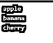

#### 2.While 循环

当需要执行组织良好的编程语句集直到满足条件时，就必须使用 while 循环。在这种情况下，当条件满足时，下一个语句调用发生。就像这里的 for 循环一样，代码体是由代码段的缩进决定的。

**代码:**

`value = 1
while value < 6:
print(value)
value += 1`

**输出:**

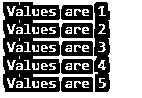

#### 3.破裂

终止循环，并将控制权传递给循环后的语句。如果在嵌套循环中提到 break 语句，那么控件将从嵌套的最内层循环中取出。

**语法:** `break`

**代码:**

`# Note : BeautifulSoup library needs to be installed for this webpage parsing
from bs4 import BeautifulSoup
import requests
total_links = 0
count_check = 10
Input_url = input("Enter the website from which urls need to be extracted: ")
response  = requests.get("http://" + Input_url)
html_bytes = response.text
soup = BeautifulSoup(html_bytes)
for every_link in soup.find_all('a'):
if total_links < count_check:
total_links = total_links + 1
print(every_link.get('href'))
else:
total_links = 1
break
print("Condition check is broken ")`

**BeautifulSoup 库安装:**在 python 中可以用多种技术安装库；我们使用 pip 安装程序来安装它们；使用 pip 安装程序安装 beautiful soup 的命令如下:

`pip install BeautifulSoup`

**输出:**

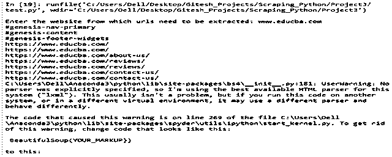

**说明:**

这个程序是一个网页抓取程序；它用于删除任何给定网页的前 10 个链接。这里，beautifulsoup 库用于实现 web 抓取。网络抓取过程包括从网页上抓取每一个 html 标签。在这个程序中，一旦提取了每个标签，就引用该标签，以使用“a”标签检查来验证它是否是引用链接。一旦提取了前 10 个标签，就可以使用 break 标签跳过循环过程。中断发生在计数器重置之后，但是程序中断语句将程序流踢出循环实例。因此，即使发生了循环重置，程序也只打印前十个 url。

#### 4.继续

跳过循环中剩余的句子，并检查循环中发布的条件

**语法:** `Continue`

**代码:**

`# Note : BeautifulSoup library needs to be installed for this webpage parsing
from bs4 import BeautifulSoup
import requests
total_links = 0
count_check = 10
Input_url = input("Enter the website from which urls need to be extracted: ")
response  = requests.get("http://" + Input_url)
html_bytes = response.text
soup = BeautifulSoup(html_bytes)
for every_link in soup.find_all('a'):
if total_links < count_check:
total_links = total_links + 1
print(every_link.get('href'))
else:
total_links = 1
continue
print("Condition check is continued")`

**BeautifulSoup 库安装:**在 python 中可以用多种技术安装库；我们使用 pip 安装程序来安装它们；使用 pip 安装程序安装 beautiful soup 的命令如下:

`pip install BeautifulSoup`

**输出:**

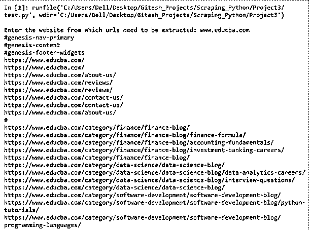

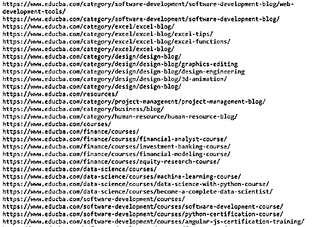

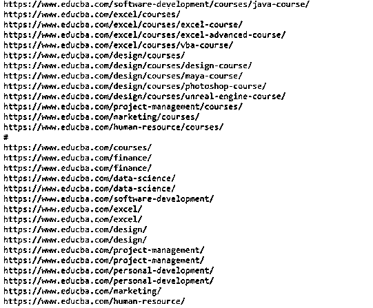

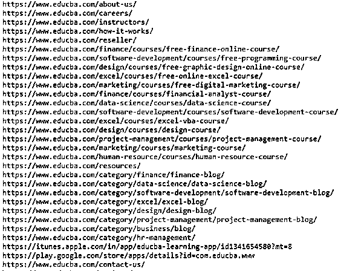

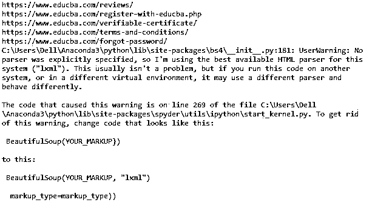

**说明:**

这是另一个网页抓取程序；它用于删除任何给定网页的所有链接。这里，beautifulsoup 库用于实现 web 抓取。网络抓取过程包括从网页上抓取每一个 html 标签。在这个程序中，一旦提取了每个标签，就引用该标签，以使用“a”标签检查来验证它是否是引用链接。与上面的程序相比，循环中断语句被 continue 语句所取代。因此，这使得控制被切换到循环检查一次又一次。因为循环检查之后的循环重置是迭代发生的，所以页面上的所有 URL 都会被打印出来。

#### 5.及格

它只是在到达特定语句时通过执行。pass 将在特定的微秒内发生，然后在 pass 语句之后开始执行该语句。

**语法:** `Pass`

**代码:**

`# Note : BeautifulSoup library needs to be installed for this webpage parsing
from bs4 import BeautifulSoup
import requests
total_links = 0
count_check = 10
Input_url = input("Enter the website from which urls need to be extracted: ")
response  = requests.get("http://" + Input_url)
html_bytes = response.text
soup = BeautifulSoup(html_bytes)
for every_link in soup.find_all('a'):
if total_links < count_check:
total_links = total_links + 1
print(every_link.get('href'))
else:
total_links = 1
pass
print("Condition check is passed")`

**BeautifulSoup 库安装:**在 python 中可以用多种技术安装库；我们使用 pip 安装程序来安装它们；使用 pip 安装程序安装 beautiful soup 的命令如下:

`pip install BeautifulSoup`

**输出:**

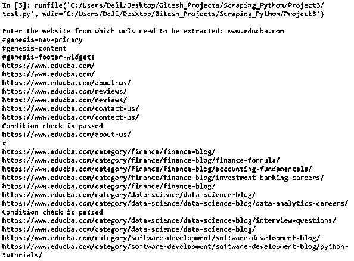

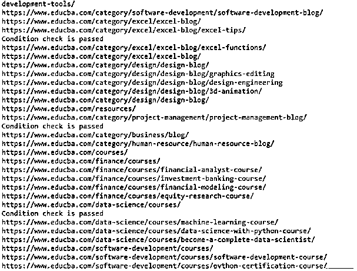

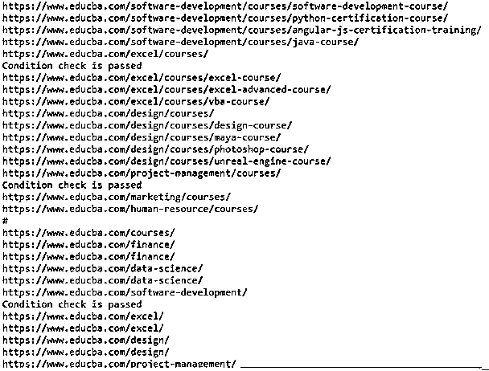

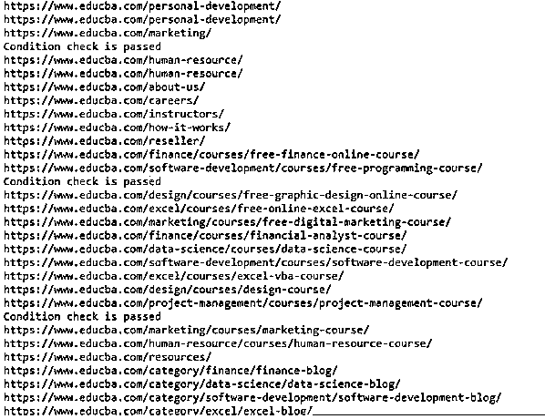

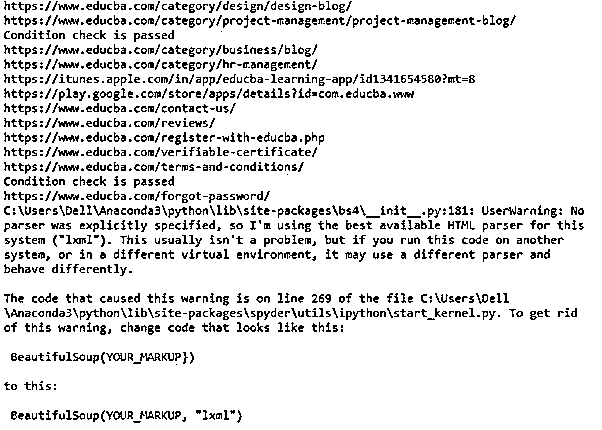

**说明:**

这是另一个网页抓取程序；它用于删除任何给定网页的所有链接。就像上面的程序一样，这个库也是用来抓取网页的。网络抓取过程包括从网页上抓取每一个 html 标签。在这个程序中，一旦提取了每个标签，就引用该标签，以使用“a”标签检查来验证它是否是引用链接。与上面的程序相比，这里放置了 pass 语句。因此，它允许控制停止几微秒，然后，不像中断循环或将控制切换到条件检查，它流向程序中的下一条语句。

### 结论

每一种高级编程语言都依赖于循环和条件语句来优化执行。循环控制语句用于更好地控制循环。python 循环控制语句为循环执行提供了强大的功能。

### 推荐文章

这是 Python 中控制语句的指南。在这里，我们讨论 Python 中控制语句的简要概述，以及它们的例子和代码实现。您也可以浏览我们推荐的其他文章，了解更多信息——

1.  [Python 常量](https://www.educba.com/python-constants/)
2.  [Python 并发](https://www.educba.com/python-concurrency/)
3.  [Python 中嵌套的 IF 语句](https://www.educba.com/nested-if-statement-in-python/)
4.  [Python 中的 else if 语句](https://www.educba.com/else-if-statement-in-python/)

