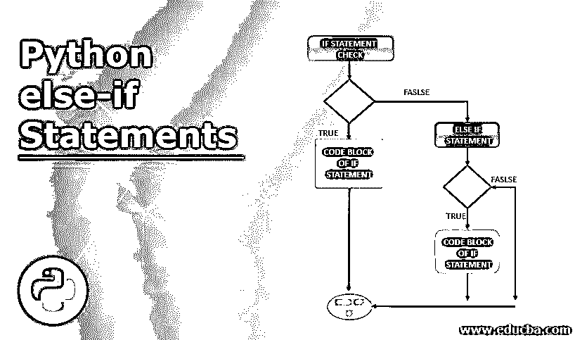
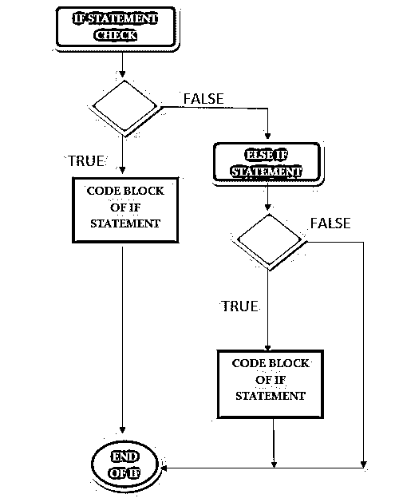
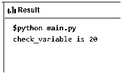
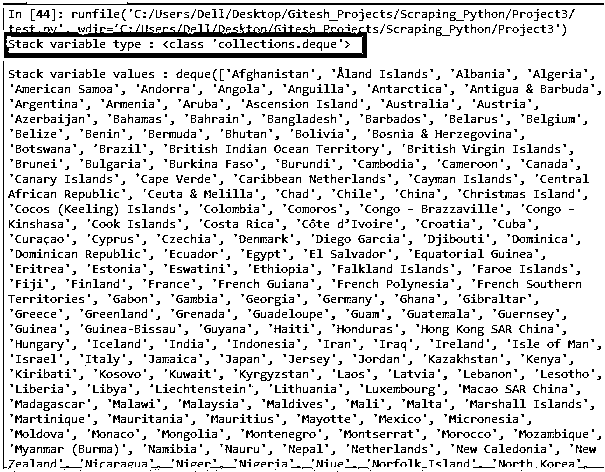
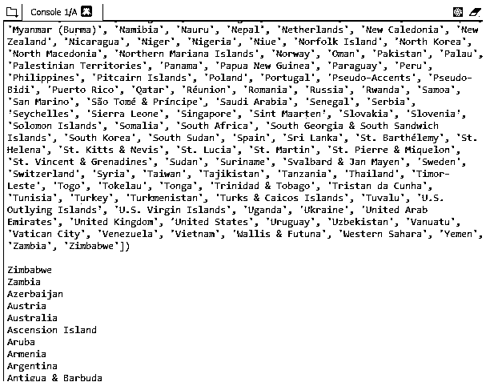
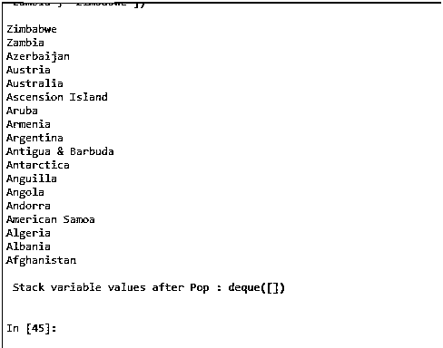
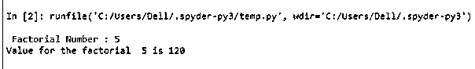

# Python 中的 else if 语句

> 原文：<https://www.educba.com/else-if-statement-in-python/>




## Python 中的 else if 语句简介

“if”条件语句是 python 编程中最常用的条件语句。“if”语句用于评估一组代码是否需要执行。如果该语句为真，流程就像执行下面的代码集一样；如果为 false，则进入下一个代码集。在这里，else 的 if 语句的作用是当条件检查失败时，用一组不同的条件重新计算。

### 句法

以下是 Python 中 else if 语句的语法:

<small>网页开发、编程语言、软件测试&其他</small>

`elif condition statement:
. . .
. . .
else-if Code block`

**解释:**python 中的 else-if 语句表示为 elif。其中“el”缩写为 else,“if”表示正常的 if 语句。将要计算的条件出现在 else-if 语句之后。冒号(“:”)用于表示正在使用的条件语句的结尾。else-if 语句成功时需要执行的代码块放在 else if 条件之后。

### 流程图




**说明:**流程从 if 语句检查开始，如果语句检查失败，则控制流向 else if 语句检查；当 else if 语句检查结果为 true 时，流程转到 else if 语句的主体。

### Python 中的 else if 语句是如何工作的？

else if 语句的工作过程如下:

*   检查初始 if 语句。
*   如果第一个提到的 If 语句被评估为事实，那么直接执行 if 语句。
*   如果第一次提到的 if 语句为假，则控制转到程序的 else 部分。
*   当程序的 else 部分包含一个 if 语句时，它就变成了一个 else-if 语句。
*   当 elif 语句的条件评估为 true 时，将执行 else if 语句的代码块。
*   如果该条件被评估为假，则该条件流到 if 块的末尾，并开始执行 if 块之后的代码段。

### 用 Python 实现 else if 语句的示例

用 Python 实现 else if 语句的例子如下:

#### 示例#1

**代码:**

```
 # Python program to illustrate if-elif-else
#!/usr/bin/python
# Variable Declaration section
check_variable = 20
# Program logic section
if (check_variable == 2):
  print ("check_variable is 2")
elif (check_variable == 4):
  print ("check_variable is 4")
elif (check_variable == 6):
  print ("check_variable is 6")
elif (check_variable == 8):
  print ("check_variable is 8")
elif (check_variable == 10):
  print ("check_variable is 10")
elif (check_variable == 12):
  print("check_variable is 12")
elif (check_variable == 14):
  print ("check_variable is 14")
elif (check_variable == 16):
  print ("check_variable is 16")
elif (check_variable == 18):
  print ("check_variable is 18")
elif (check_variable == 20):
  print ("check_variable is 20")
else:
  print ("check_variable is not present") 
```

**输出:**




**解释:**这个程序是以这样一种方式编码的，来描绘 python 编程中 if 语句的控制流。如前所述，程序由多个 else-if 块组成；程序逻辑解释如下:

*   check 变量被赋值为 20。
*   通过 check，变量值被验证为与所有在 2 到 20 之间的偶数完全匹配。
*   当扣除完全匹配时，该值将打印在控制台中。

#### 实施例 2

**代码:**

```
from country_list import countries_for_language
from collections import deque
# extract all the values of the countries
Nation_dictionary = dict( countries_for_language( 'en' ) )
Nation_values =Nation_dictionary.values()
#Add all the country names to a stack
Nation_stack_variable = deque()
for i in Nation_values:
    Nation_stack_variable.append(i)
print( ' Type of stack variable used : ' , type(Nation_stack_variable),'\n')
print( ' Vales of the stack variable : ' , Nation_stack_variable ,'\n')
while Nation_stack_variable:
     Nation_temp = Nation_stack_variable.pop()
    if Nation_temp[0] == 'A':
      print(Nation_temp)
    elif Nation_temp[0] == 'Z':
        print(Nation_temp)
print( ' \n Stack variable values after Pop : ' , Nation_stack_variable , '\n')
```

**输出**:










**解释:**这里，程序利用集合数据类型来组织堆栈。这个过程引入了 deque 类，它属于集合库。此时,' country_list '库导入负责拖动所有国家的列表。国家列表库中的所有值都被提取到一个字典变量中，因为国家列表库提取是字典格式的。字典的排列方式，其中第一个字母是一个符号，其下是准确的国名。

#### 实施例 3

**代码:**

```
Input_value = int(input(" Factorial Number : "))
factorial = 1
if Input_value  < 0:
   print(" Negative number cannot be placed for factorial determination ")
 elif Input_value  == 0:
  print(" No factorial value for zero ")
else:
  for i in range(1,Input_value + 1):
      factorial = factorial*i
  print("Value for the factorial " , Input_value  , "is" , factorial)
```

**输出:**




**说明:**利用循环技术计算给定数字的阶乘值；“Input_variable”用于表示接受计算阶乘值的整数值。此外，变量“Factorial”被设置为初始值 1。首先，验证键入的值是否为正整数，如果该整数为负值，则使用 print 语句在控制台中通知，将输入值保持为正值的必要性是因为负整数的阶乘值不存在。因此检查意味着键入的值大于零。另外，下一次检查确保键入的值不为零。

### 结论

为了优化执行，每种编程语言都依赖于它的循环和条件语句。这里，这些条件语句和 else if 一样，有助于更好地控制程序逻辑的执行。

### 推荐文章

这是 Python 中 else if 语句的指南。这里我们讨论 Python 中 else if 语句的语法，它是如何工作的，代码和输出的例子。您也可以浏览我们的其他相关文章，了解更多信息——

1.  [Python 多重处理](https://www.educba.com/python-multiprocessing/)
2.  [Python 设置方法](https://www.educba.com/python-set-methods/)
3.  [Python 修剪字符串](https://www.educba.com/python-trim-string/)
4.  [Python 输入字符串](https://www.educba.com/python-input-string/)


