# Python 中的 Break 语句

> 原文：<https://www.educba.com/break-statement-in-python/>

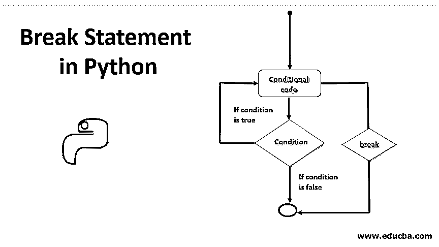

## Python 中 Break 语句的介绍

Python 中的 Break 语句用作循环或控制语句，以便按照执行顺序管理代码控制流方向。python 编程中常用的控制语句有 Break、Continue 和 Pass，其中 Break 用于结束循环，将执行控制移到代码的下一步，Continue 用于跳过特定步骤，继续代码执行，最后 Pass 用于传递一些明确的代码语句。

### 循环控制语句

Python 支持以下循环控制语句:

<small>网页开发、编程语言、软件测试&其他</small>

1.  **Break:** 终止循环语句的流程，执行循环外的下一条语句。
2.  **Continue:** 当我们需要跳过循环中剩余语句的执行，从开始处继续执行时使用。
3.  **Pass** : 当我们在语法上需要一些语句，但又不想放任何语句时使用。

此语句用于终止程序中循环的执行流程。该流也可以转向不同的语句或不同的循环。break 语句可以用在我们需要退出循环(while 和 for 循环)的情况下，当 BREAK 语句在内部循环中被触发时，当执行流转移到外部循环中的下一个语句时，其中一个事件被触发。

以下是分线功能的旧代码样式示例:

**代码:**

`def prod():
for in range(10);
for j in range(10):
print i*j
if i*j>50:
return
# instead we can try below code directly instead of calling function
for in range(10);
for j in range(10):
print i*j
if i*j>50:
break
else:
continue # this will be executed if the loop ended normally (no break)
break # this will be executed if 'continue' was skipped (break)`

**分析:**

在上面的代码中，我们定义了一个返回数字乘积的函数。如果两个数的乘积大于 50，则结束。我们可以使用 [break and continue](https://www.educba.com/break-vs-continue/) 间接代码，而不是定义一个函数并调用它，而不是在以前的旧逻辑中使用 return。感谢 breaking statement 特性，它很容易从循环中取出这个突破性的工作。它终止循环，并继续执行进一步的语句。假设我们考虑一个在数组中搜索元素的例子，我们运行一个循环来解析元素，然后与搜索元素进行匹配。一旦找到元素，我们就可以使用 break 语句退出循环，并显示“找到元素”的消息。此外，在嵌套循环中，我们可以使用 break 语句通过指定任何条件来停止最内层循环的执行，然后继续外层循环的执行。

**语法:**

`break`

我们只需要在应该为真的条件后面写‘break’来终止执行流。

### 如何写分手声明？

Break 语句是一个简单的语句，它拥有终止语句组正常流的能力。让我们想一个简单的游戏场景，比如地铁冲浪者。它的工作并没有那么困难。一个人开始游戏，就进入了一个漫长的永无止境的死循环。循环移动时，显示的对象不断变化。在每一个阶段，它会根据显示的对象接受您的输入，例如，如果当前有一座桥需要您通过。现在你的每一步行动都将被应用于各种条件或检查中。在游戏中。

在所有这些检查中，还有一个关键的检查决定你是否还在游戏中。例如，你需要跳，但你不需要。然后退出条件失败，循环被打破，你退出游戏。这个退出工作是由“break”语句完成的。当提到的检查或条件为真时，它将被激活。

写了一份分手声明。需要做以下事情:

**1。退出或结束条件:**也称为 hault 条件，break 语句的执行必须满足该条件。

**代码:**

`a=[‘a’,’b’,’1’] for I in a;
if (i.is_numeric()):
break
print a
print ‘Found a number in the list’`

**输出:**

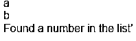

**解释**:上面的代码打印列表中所有的字母。如果在列表中找到第一个数字，则执行 break 语句，中断循环并打印“在列表中找到一个数字”

**2。循环:**break 语句总是在循环中使用。在我们不使用任何循环的情况下，这是没有意义的，因为它意味着打破语句的重复序列，而语句只存在于循环中。

### Python 中 Break 语句的流程图

下面是 break 语句在程序中的工作流程。

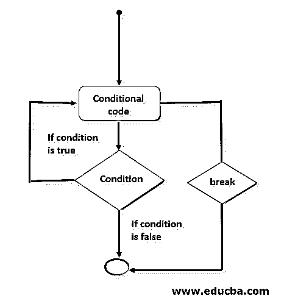

**功能**

下面的 for 循环和 while 循环显示了循环中 break 语句的工作原理:

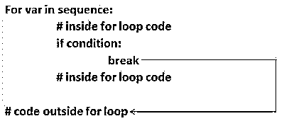

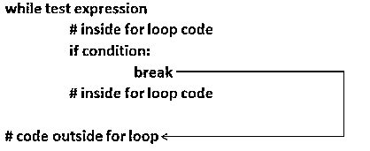

程序继续正常执行程序。如果它在执行循环时面对一个条件代码，并且条件的输出为真，则流程从其正常流程重定向到循环后的第一个 next 语句。如果条件恰好为假，循环将以同样的方式执行。

### 用于执行迭代语句的循环

Python 允许在程序中使用下面的循环来执行迭代语句。

#### 1.WHILE 循环

while 循环连续执行一组语句，直到不满足停止条件。

**语法:**

`While expression(s):
statements`

**例如，**在下面的程序中，有一个无限循环总是被触发，因为 while(1)是一个始终为真的条件。但是我们已经声明了一个 break 语句，当“IF”语句中给出的条件为真时，将执行该语句。之后，循环之后的下一条语句将被执行。

**代码:**

`I=1
While(1):
Print “We are in the loop”
If(i>10):
print ”Here break statement works”
break
I=i+1
print I
print “I am out of the loop”`

**输出:**

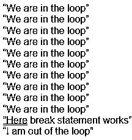

#### 2.FOR 循环

FOR 循环用于迭代范围、列表、元组、字典或字符串等序列。

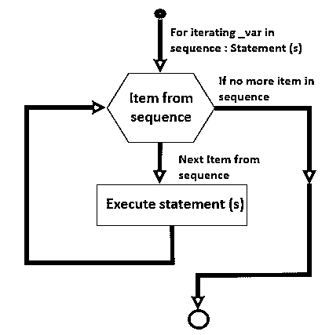

**语法:**

`For I in [sequence]:
Statements.`

**代码:**

`a=[ ‘A’,’B’,’C’,’D’,’E’,’F’,’G’,’H’] for I in a:
print “We are in loop with”
print i
if i==’G’:
print ”Here Break statement is triggered”
break
print ”We are outside the loop”`

**输出:**

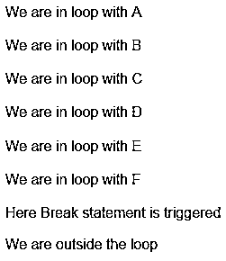

### Break 语句的示例

以下是 break 语句的示例:

#### 示例#1

在下面的例子中，我们试图使用 for 循环从下面定义的数字数组中搜索 8。

**代码:**

`# program to search 8 from array of numbers
for num in [1, 19, 8, 0, 9, 30, 29]:
print(num)
# if number is 8 print message as found and break the loop
if(num==8):
print("number 8 is found")
break`

**输出:**

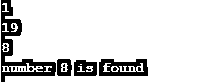

**分析:**

在上面的程序中，我们使用 for 循环解析了一个数字数组。然后，我们加入了一个 if 条件，检查“num”是否为 8，然后中断。否则打印消息，继续循环。当“num”为 8 时，它满足条件，并且执行 break 语句。

#### 实施例 2

在下面的程序中，我们使用 break-in for 循环查找前五个整数的和:

**代码:**

`# Declare the tuple num , sum temporary variable, and the counter
num = (1, 2, 3, 4, 5, 6, 7, 8, 9)
sum = 0
counter = 0
# parsing the tuple
for i in num:
sum = sum + i
counter = counter + 1
if counter == 5:
break
print("Sum of the first",counter)
print("integers is: ",sum)`

**输出:**

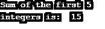

**分析:**

在上面的程序中，我们有一个声明为“num”的元组，一个要求和的变量“sum”，一个计数器变量“counter”。使用 for 循环，我们解析元组，即对于每个元素，我们添加“总和”并递增“计数器”。如果计数器达到 5，我们就打破循环。最后，我们计算前五个整数的和。

#### 实施例 3

在下面的例子中，我们试图使用 while 循环搜索 9。

**代码:**

`# program to search 9
i = 0;
# While condition
while 1:
print(i)
i=i+1;
if i == 9:
# break if 9 is found
break;
print("out of loop");`

**输出:**

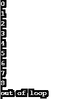

**分析:**

在上面的程序中，我们使用 python 中的 while 循环来执行搜索功能。通过在整数上循环，我们已经声明了一个临时变量 I，我们在每次迭代中递增 1。在循环内部，我们检查“I”值是否为 9，然后执行 break 语句。最后，我们输出从 0 到 8 的整数。

#### 实施例 4

在下面的程序中，我们使用 while 循环查找前五个整数中的一些。

**代码:**

`# Declare the variables sum and the counter
sum = 0
counter = 0
while(counter<10):
sum = sum + counter
counter = counter + 1
if counter == 5:
break
print("Sum of the first ",counter)
print("integers is: ", sum)`

**输出:**

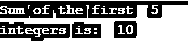

**分析:**

在上面的程序中，我们已经声明了变量“sum”和计数器，用于递增前 10 个整数的循环。我们在计数器应该小于 10 的条件下运行 while 循环。在循环内部，我们计算前五个整数的和。同样，我们声明条件 if "counter==5 "，然后执行 break 语句，结果，我们得到的输出是前五个整数的和。

#### 实施例 5

在下面的程序中，我们在嵌套循环中使用了 break 语句:

**代码:**

`# Array of Number
num = [1, 2, 3] # Array of Character
str = ['y' ,'x', 'z'] # outer loop
for i in num:
print("Number of items: " ,i)
# inner loop
for j in str:
if j == 'z':
break
print(" String of items: " ,j)`

**输出:**

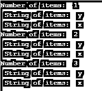

**分析:**

在上面的代码中，我们将数字数组“num”声明为 1，2，3，将字符数组声明为 y，x，z。我们将数字数组解析为我们希望内循环执行的次数。然后在外部循环中，我们在字符数组上循环。其中我们显示了数组中除“z”以外的所有字符。当字符等于“z”时，字符数组上的内部循环中断，流程继续外部循环。再次初始化并执行内部循环逻辑。

#### 实施例 6

**代码:**

`Below example is an use-case of finding first leap year from 2000 to 2005
# parsing through the year from 2000 to 2005
for year in range(2000,2005):
#checking whether the year is leap year or not
if year%4==0 and year%100!=0:
print("year is first leap year" ,year)
break`

**输出:**

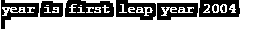

**分析:**

在上面的例子中，我们使用 for 循环使用函数 range 来解析年份，在循环内部，我们检查年份是否是闰年。闰年的条件是年要能被 4 整除，不能被 100 整除。如果这一年满足这个条件，我们使用 break 语句来中断这个循环，并将这一年的消息打印为第一个闰年。

#### 实施例 7

在下面的例子中，我们打印 0 到 20 之间的所有质数:

**代码:**

`for n in range(0, 20):
# Since all the  prime numbers are always greater than 1
if n> 1:
for i in range(2, n):
if (n % i) == 0:
break
else:
print(n)`

**输出:**

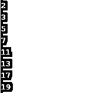

**分析:**

在上面的代码中，我们在从 0 到 20 的范围内运行一个循环。然后，我们知道所有的质数都大于 1，如果 num>1，我们就检查这个数是否有其他因素。通过运行一个从 2 到 num 的循环，我们可以检查 num 是否能被 1 和它本身之外的任何数整除。如果是这样，我们给出 break 语句，它将退出流程。否则它会自己打印号码。

**N****OTE: **Sometimes, we encounter an error saying “ break outside the loop”, which means the break statement is not inside the loop.

### 结论

Python 中的 Break 语句是一个循环控制语句，它终止循环中一系列语句的正常执行，并在当前循环退出后将其传递给下一条语句。这可以在许多循环中使用——for、while 和所有类型的嵌套循环。

### 推荐文章

这是 Python 中 Break 语句的指南。在这里，我们已经讨论了一个基本概念，如何在 python 程序中中断语句，并分别给出了流程图和例子。您也可以浏览我们推荐的其他文章，了解更多信息——

1.  [Python 中的析构函数](https://www.educba.com/destructor-in-python/)
2.  [Python 中的 If 语句](https://www.educba.com/if-statement-in-python/)
3.  [Python 特性](https://www.educba.com/python-features/)
4.  [Python 中的字符串数组](https://www.educba.com/string-array-in-python/)

