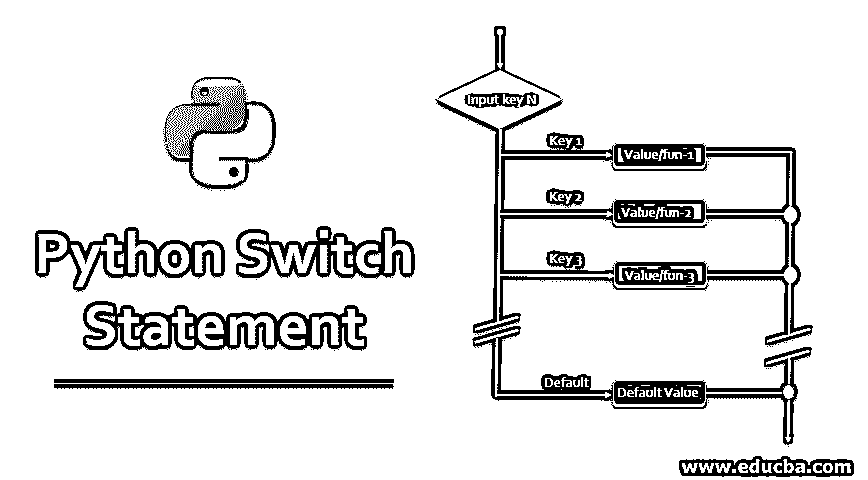
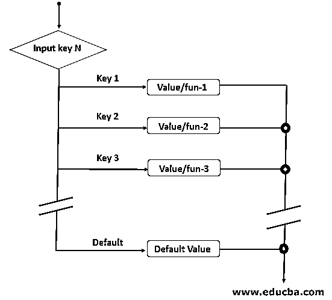
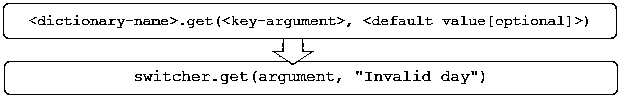

# Python Switch 语句

> 原文：<https://www.educba.com/python-switch-statement/>




## Python Switch 语句简介

switch 语句是一个非常有用和强大的编程特性。它是 if-else-if 梯形语句的替代语句，提供了比 if-else-if 梯形语句更好的性能和更易管理的代码。大多数编程语言(如 Java、C 等。)提供 switch 语句，但是 Python 语言没有任何 switch 语句。然而，如果您喜欢 switch-case 语句，有一种非常有效的方法来用 Python 实现 switch case 语句特性。本教程将帮助您实现它。

### 流程图

每种编程语言中的 switch 语句都具有相同的功能，但语法略有不同。Python 语言不提供任何内置的 switch 语句。我们可以使用相同的流程和功能来实现这个特性，但是使用不同的语法和使用 Python 字典的[实现。](https://www.educba.com/python-dictionary-methods/)

<small>网页开发、编程语言、软件测试&其他</small>




#### 开关语句的语法

下面只看 switch 语句的两种不同语法。第一条语句显示了其他编程语言(如 C、Java 等)中 switch 语句的标准语法。第二个语句是 Switch 语句的 Python 实现[。您可以清楚地描述两者在功能上的相似之处，但在实现上的不同之处。](https://www.educba.com/powershell-switch-statement/)

**1。其他语言(c，Java，..)**

**语法:**

```
switch(N)
{
    case 1: Statement if N = 1;
    break;
    case 2: Statement if N = 2;
    break;
      ::
    case n: Statement if N = n;
    break;
    default: Statement if N doesn't match any
}
```

**2。Python 中的开关实现**

**语法:**

```
switcher = {
    key_1: value_1/method_1(),
    key_2: value_2/method_2(),
    key_3: value_3/method_3(),
    ::
    key_n: value_n/method_n(),
    }
key = N
value = switcher.get(key, "default"
```

### Switch 语句的工作

让我们看看 switch 语句的工作原理，解释如下:

*   任何编程语言中标准 switch 语句的工作方式都是相似的。它由多个案例组成，每个案例都有一个代码块和 break 语句。
*   输入参数与多个案例逐一进行比较。如果参数与任何情况匹配，则执行相应的 block 语句，控制从 break 语句的 switch 语句中出来。
*   如果没有一个大小写与输入参数匹配，则执行默认的 block 语句。
*   在 switch 语句的 Python 实现中，我们将 Python 字典视为开关，将字典的键视为用例。在这里，我们用必需的参数调用字典的 get()函数，即输入键和默认值。
*   如果输入键与字典中的任何键匹配，则返回相应的值。但是，如果输入键与任何字典键都不匹配，那么将返回默认值。

### Python 中 Switch 语句的实现

我们知道，switch case 语句和 if-else-if 梯形语句是相互交替的。两者都可以用来达到相同的目的，但是 switch case 语句比 if-else-if 梯形语句提供了更好的性能和更易管理的代码。Python 语言没有任何 switch 语句，但是我们可以使用 Python 字典实现类似的功能。

在下一节中，我们将通过一个示例来了解每种方法的实现。

#### 示例#1

使用 if-else-if 梯形–switch case 语句的替代方法。在本例中，我们使用了 if-else-if 梯形语句来获取星期几。对于同一个用例，我们还将看到 Python 中开关状态的实现。

**代码:**

```
def get_week_day(argument): 

    if(argument == 0):
        day="Sunday"  
    elif(argument == 1):
        day="Monday"
    elif(argument == 2):
        day="Tuesday"
    elif(argument == 3):
        day="Wednesday"
    elif(argument == 4):
        day="Thursday"
    elif(argument == 5):
        day="Friday"
    elif(argument == 6):
        day="Saturday"
    else:
        day="Invalid day"

    return day 

# Driver program 
if __name__ == "__main__": 

	print (get_week_day(6))
	print (get_week_day(8))
	print (get_week_day(0))
```

**输出:**


#### 实施例 2

使用字符串字典实现 switch 语句。Python 语言没有任何 switch 语句。然而，我们可以使用下面的字典在 Python 中有效地实现 switch 语句特性。

**解释:**Python 中的字典是键和值对的无序集合。在下面的代码片段中，switcher 是一个字典变量，它包含类似于 switch 的 key: value 对。

使用 get()方法，我们可以通过将参数作为键和可选的默认值传递来访问字典的条目。默认值有助于实现 switch 语句的“默认情况”。




**代码:**

```
def get_week_day(argument): 

	switcher = { 
		0: "Sunday", 
		1: "Monday", 
		2: "Tuesday", 
        	3: "Wednesday",
        	4: "Thursday",
        	5: "Friday",
        	6: "Saturday"
	}

	return switcher.get(argument, "Invalid day") 

# Driver program 
if __name__ == "__main__": 

	print (get_week_day(6))
	print (get_week_day(8))
	print (get_week_day(0))
```

**输出:**


在这个例子中，让我们将 6 作为输入参数或输入键进行传递，它将在字典(switcher)的键中进行搜索。当找到 key=6 时，它将返回值为 Saturday。现在传递 8 作为输入键，它将在字典(切换器)的键中被搜索。因为找不到 key=8，所以它将返回默认值作为无效的日期。

#### 实施例 3

利用函数的字典映射实现 switch 语句。在上面的例子中，字典的值是字符串数据类型，即常量。但是有趣的是，Python 字典的值可以是任何数据类型。

Python 字典的值可以是常量(整数、字符串)和函数。在这个例子中，我们将实现 switch 语句，它也将通过使用下面的函数字典来支持每个 switch 用例的函数调用[。](https://www.educba.com/switch-case-in-powershell/)

**代码:**

```
def get_week_day_fun(argument): 

    def zero():
        return "Sunday"

    def one():
        return "Monday"

    def two():
        return "Tuesday"

    def three():
        return "Wednesday"

    def four():
        return "Thursday"

    def five():
        return "Friday"

    def six():
        return "Saturday"

    switcher = { 
            0: zero(), 
            1: one(), 
            2: two(), 
            3: three(),
            4: four(),
            5: five(),
            6: six()
	}

    return switcher.get(argument, "Invalid day")

# Driver program 
if __name__ == "__main__": 

	print (get_week_day(6))
	print (get_week_day(8))
	print (get_week_day(0))
```

**输出:**


### 结论

正如我们在上面看到的，相同的用例可以由 switch case 语句和 if-else-if 梯形语句实现。但是 Switch 的语句提供了比 if-else-if 梯形语句更易管理、可读性更好的代码。我们还看到 Python 语言没有任何 switch 语句，但是我们可以使用 Python 字典以更有效的方式实现它。

### 推荐文章

这是一个 Python Switch 语句的指南。在这里，我们将讨论 python switch 语句的语法、流程图和工作原理，以及示例和实现。你也可以看看下面的文章来了解更多-

1.  [Python 中的继承](https://www.educba.com/inheritance-in-python/)
2.  [Python 重载](https://www.educba.com/python-overloading/)
3.  [Python 中的字典](https://www.educba.com/dictionary-in-python/)
4.  [Python 中的字典](https://www.educba.com/dictionary-in-python/)


