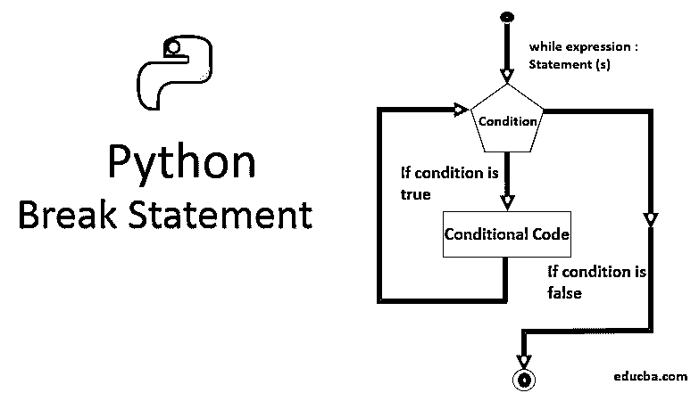
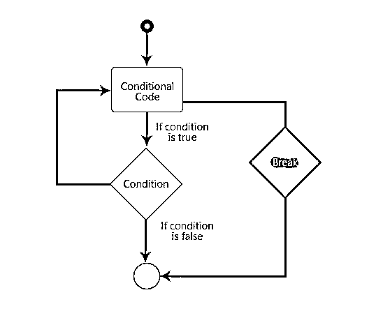

# Python Break 语句

> 原文：<https://www.educba.com/python-break-statement/>

## Python Break 语句简介

**Python Break 语句的语法**

可以用下面的格式写一个分隔符。

<small>网页开发、编程语言、软件测试&其他</small>

`break;` 

### 推荐文章

这是一个 Python Break 语句的指南。在这里，我们讨论了理解，你如何写一个中断语句，两个代码和输出的例子。您也可以浏览我们的文章，了解更多信息——

1.  [Python 中的 If Else 语句](https://www.educba.com/if-else-statement-in-python/)
2.  [Python 中的循环](https://www.educba.com/loops-in-python/)
3.  [Python 集](https://www.educba.com/python-sets/)
4.  [中断 C 语言中的语句](https://www.educba.com/break-statement-in-c/)

