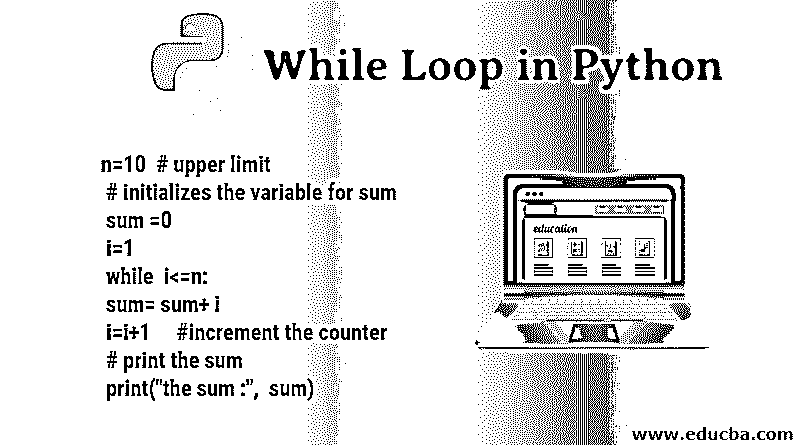
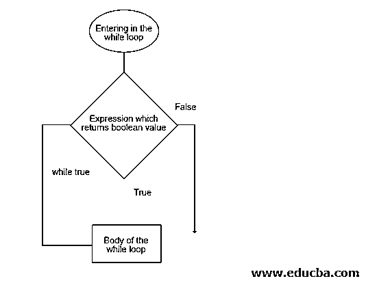
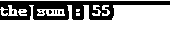
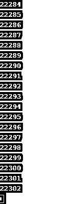
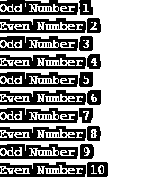

# Python 中的 While 循环

> 原文：<https://www.educba.com/while-loop-in-python/>




## Python 中 While 循环概述

While 循环是一种入门级控制语句，可用于根据为循环设置的条件重复执行一组程序代码。该条件语句以“While”关键字及其旁边的条件开始，后面是代码块片段。这指示执行控制获取 while 语句，读取为循环设置的条件，然后继续执行即将到来的代码逻辑，直到满足 while 条件。这是 Python 编程语言中基于 web 的应用程序开发中最常用的无限循环语句之一。

****语法**** :

<small>网页开发、编程语言、软件测试&其他</small>

```
while expression:
	body of the loop 
```

### 流程图

while 循环的执行流程如下所示。这个流程图告诉我们在 while 循环中指令是如何执行的。




### Python 中 While 循环是如何工作的？

在浏览了语法和流程之后，我们现在将理解流程实际上是如何工作的。在我们进入 while 循环之前，有一个条件检查；基本上，它是一个返回布尔结果的表达式，这意味着表达式的输出要么为真，要么为假。当且仅当表达式返回 true 时，控件可以进入循环内部并执行循环内部的指令。一旦循环体中的指令第一次被执行，控制再次转到循环的顶部，在那里出现输入表达式或条件；如果表达式返回 true，控件将再次执行循环体中存在的相同指令，如果表达式返回 false，控件将退出循环。while 循环也称为入口控制循环，因为控制在循环中的入口完全取决于表达式返回 true 还是 false。

既然我们已经讨论了控制在 while 循环中是如何流动的，那么让我们来看一些例子。

#### 示例#1

第一个例子很简单。这里的问题陈述是将前 10 个自然数相加。这意味着我们将添加从 1 开始到 10 结束的数字，因为我们将使用 while 循环，所以我们将提供一个条件，并且还必须保留一个变量作为计数器，因为我们必须在每次添加后将计数器增加 1。

**代码:**

```
n=10  # upper limit
# initializes the variable for sum
sum =0
i=1
while  i<=n:
         sum= sum+ i
         i=i+1     #increment the counter
# print the sum
print("the sum :",  sum)
```

所以，现在你可以看到，首先，表达式检查条件是真还是假。在我们的例子中，当 1 小于 10 时，第一次为真。所以它进入内部，将 0 加 1，并将值存储在 sum 变量中。然后，它将计数器加 1。这个过程一直持续到计数器增加到 11，此时，表达式返回 false，控件退出循环并打印总和。

**输出:**




#### 实施例 2

下一个例子是关于无限 while 循环，这意味着它将无限地继续执行循环。我们应该尽量避免这种情况，因为这种情况不允许程序终止。这通常是因为表达式语句，在这种情况下，总是返回 true。

**代码:**

```
n=1
print("Infinite loop starts")
while n>0:
    n=n+1	
    print(n)
```

如果我们仔细看看上面的例子，我们会看到条件表达式 n>0 是真正的第一次，因为 n 的初始值是 1。然后，控件进入循环，将 n 增加 1，然后执行两条打印语句。在执行时，它再次转到循环的顶部并检查表达式，这再次为真，因为 n 的值现在是 2。这个流程不断重复，因为起始表达式始终为真，并且 n 的值每次都递增 1。这将我们引向一个无限循环的场景，因为它永远不会终止。

现在让我们看一个不同的例子，在这个例子中，我们也将使用 if-else 这样的条件语句以及 while 循环。下面的截图显示了一个无限循环。

**输出:**




#### 实施例 3

让我们打印 1 到 10 之间的偶数和奇数。这意味着下限是 1，上限是 10。计数器的初始值为 1，因为我们将从 1 开始，然后继续将计数器递增 1。

**代码:**

```
n=10
i=1
while i<=n:
    if  i%2==0:
        print("Even Number" , i)
        i= i+1
    else:
        print("Odd Number" , i)
        i=i+1
```

所以，你可以在上面的代码中看到，我们有表达式来检查数字是否小于 10。在第一种情况下，表达式将返回 true，因此控制将在包含条件语句 if-else 的循环体内流动。在第一种情况下，I 的值是 1，所以模数不会是 0；因此，如果条件失败，将执行 else 条件语句。此后，计数器的值将增加 1。假设条件在第二种情况下为真，if 条件下的语句将被执行。计数器的值将再次增加 1。这将一直持续到 I 的值变为 11。在这种情况下，while 表达式将失败并返回 false。控制立即脱离循环。

**输出:**




### 推荐文章

这是 Python 中 While 循环的指南。在这里，我们讨论 python 中 while 循环的概述，以及 while 循环在 python 中的工作方式及其示例。你也可以看看下面的文章来了解更多-

1.  [Python 中的字符串数组](https://www.educba.com/string-array-in-python/)
2.  [Python 中的模式](https://www.educba.com/patterns-in-python/)
3.  [换入 Python](https://www.educba.com/swapping-in-python/)
4.  [PHP 中的 While 循环](https://www.educba.com/while-loop-in-php/)


