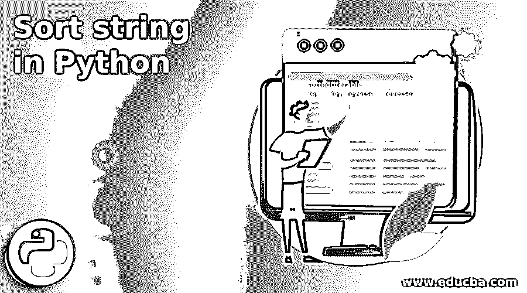
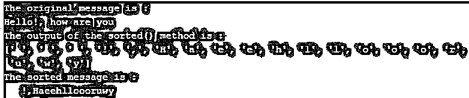
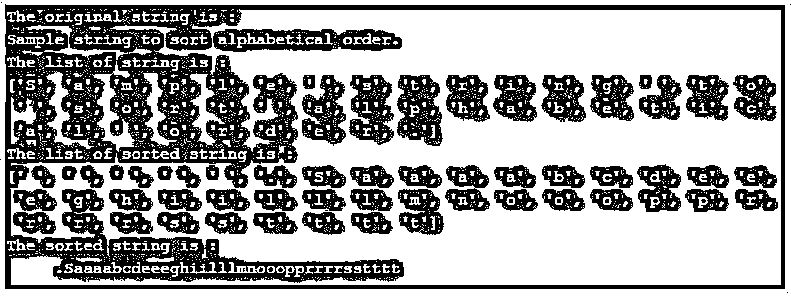
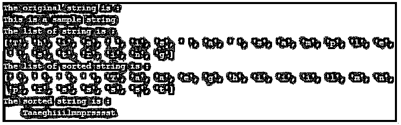

# Python 中的字符串排序

> 原文：<https://www.educba.com/sort-string-in-python/>




## Python 中的字符串排序简介

python 中的排序字符串用于按字母顺序对字符串中的字符进行排序。python 提供了对字符串进行排序的内置方法。对字符串进行排序一直是一个受欢迎的实用程序，在任何地方都有很多应用程序，因为有时我们需要根据客户姓名对数据进行升序或降序排序，所以 python 为此提供了排序方法。python 中有两种方法 sort()和 sorted()用于对容器进行排序。

sort()方法就地修改列表，而 sorted()方法从原始列表创建一个新的排序列表。python 中的所有容器都不像 string 那样是可变的，所以 sort()方法不能使用它，因为 sort 函数试图排序和改变顺序，由于不变性，这是不允许的。因为 sorted()创建了一个新的排序列表，所以它必须对字符串进行排序。

<small>网页开发、编程语言、软件测试&其他</small>

**python sort string sorted()方法的语法:**

```
sorted(iterable, key = key, reverse = reverse)
```

**参数:**

*   **iterable:** 这不是一个可选参数，它是一个要排序的字符串序列。
*   **key:** 这是一个可选参数，指定要执行的函数，以指定排序的顺序。默认值为无。
*   **reverse:** 布尔型可选参数，指定顺序是升序还是降序。False 指定升序，True 指定降序。默认值为 False。

**返回值:**

该方法的返回值是排序后的字符串。

### 在 Python 中处理排序字符串

python 中的排序字符串接受一个字符串作为参数，然后根据字符的 ASCII 值比较字符串中的每个字符，然后返回字符串中已排序字符的列表。

### Python 中排序字符串的示例

下面是提到的例子:

#### 示例#1

使用 python 内置的 sorted()方法对字符串进行排序的示例。

**代码:**

```
# creating string
msg = "Hello!, how are you"
print("The original message is : ")
print(msg)
# using sorted() method to get list of sorted characters
alt_msg = sorted(msg)
print( "The output of the sorted() method is :  " )
print( alt_msg )
# using join() method to join list of sorted characters
sort_msg = "".join(alt_msg)
print( "The sorted message is :  " )
print( sort_msg )
```

**输出:**




在上面的程序中，创建了一个字符串变量来存储字符串“Hello！，你好”。接下来，在程序中使用 sorted()方法，该方法返回字符串字符的排序列表(也显示在输出中)。然后，在 join()方法的帮助下连接排序后的字符列表，join()方法返回排序后的字符列表的字符串。因此，最终排序后的字符串包含了原始字符串中的所有字符，但是按照字符的排序顺序排列。排序后的字符串以空格作为第一个字符，因为它的 ASCII 值低于字符串中的所有其他字符。

#### 实施例 2

python 中使用 while 循环对字符串进行排序的示例。

**代码:**

```
# creating string
string = "Sample string to sort alphabetical order."
print( "The original string is : " )
print( string )
# using sorted() method to get list of sorted characters with ascending order
list_string=list( string )
print( "The list of string is : " )
print( list_string )
list_string = list(string)
i = 0
while i < len( list_string ):
key = i
j = i+1
while j < len( list_string ):
if list_string[key] > list_string[j]:
key = j
j += 1
list_string[i],list_string[key] = list_string[key],list_string[i]
i += 1
print( "The list of sorted string is : " )
print( list_string )
new_string = "".join(list_string )
print( "The sorted string is : " )
print(new_string)
```

**输出:**




如上面程序中的字符串“按字母顺序排序的示例字符串”没有使用 sorted()方法进行排序。与上面的程序一样，在 while 循环的帮助下，每个字符都在进行比较，第一个 while 循环检查循环迭代应该小于字符串的长度，并按顺序逐个接受元素，这些元素在第二个 while 循环中进行比较和交换。因此，它返回字符串字符的排序列表。然后通过 join()方法将排序后的字符列表连接起来。因此，最终排序后的字符串包含了原始字符串中的所有字符，但是按照字符的排序顺序排列。

#### 实施例 3

python 中使用 for 循环对字符串进行排序的示例，这也是冒泡排序的一个实现。

**代码:**

```
# creating string
string = "This is a sample string"
new_string = []
print( "The original string is : " )
print( string )
# woith out using sorted() method to get list of sorted characters
list_string=list(string)
print( "The list of string is : " )
print(list_string)
list_string=list(string)
len_s=len(list_string)
for i in range(len_s-1):
for j in range(len_s-i-1):
if list_string[j]>list_string[j+1]:
list_string[j],list_string[j+1]=list_string[j+1],list_string[j]
for m in list_string:
new_string+=m
print( "The list of sorted string is : " )
print(new_string)
sort_string = "".join(new_string)
print( "The sorted string is : " )
print(sort_string)
```

**输出:**




在上面的程序中，字符串“This is a sample string”是在没有使用 sorted()方法的情况下进行排序的。在程序中，在 for 循环的帮助下，每个字符进行比较，如果前一个字符大于下一个字符，则交换执行，否则不交换。因此，它返回字符串字符的排序列表(也显示在输出中)。然后通过 join()方法将排序后的字符列表连接起来，返回升序的字符串。因此，最终排序后的字符串包含了原始字符串中的所有字符，但是按照字符的排序顺序排列。

### 结论

Python 中的 Sort string 用于将字符串中的字符按字母顺序排序，可以通过 sorted()和 join()方法来实现。

### 推荐文章

这是一个在 Python 中对字符串进行排序的指南。这里我们分别讨论 python 中排序字符串的介绍、工作原理和例子。您也可以看看以下文章，了解更多信息–

1.  [Python mkdir](https://www.educba.com/python-mkdir/)
2.  [Python Virtualenv](https://www.educba.com/python-virtualenv/)
3.  [Python IOError](https://www.educba.com/python-ioerror/)
4.  [Python 系统模块](https://www.educba.com/python-sys-module/)


