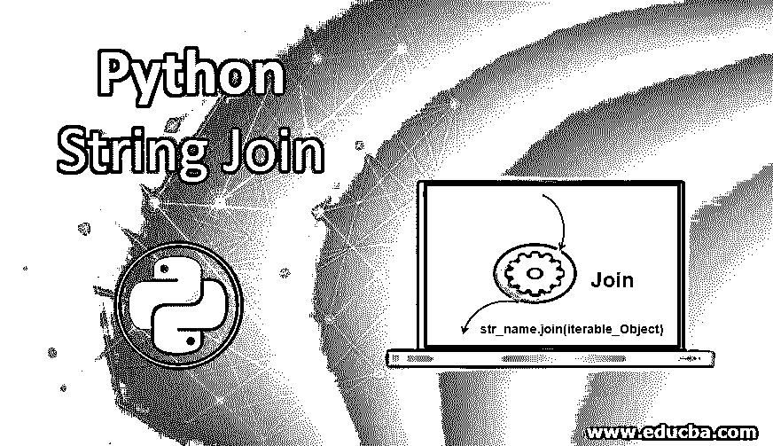
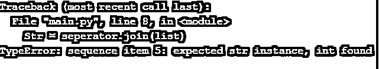

# Python 字符串连接

> 原文：<https://www.educba.com/python-string-join/>




## Python 字符串连接简介

有时，在数据探索和准备阶段，我们会遇到大量可迭代列表形式的数据。如果我们需要逗号分隔的字符串形式的相同内容，以使整个数据准备过程更加高效，那该怎么办？Python [编程语言有一个名为 join()的内置](https://www.educba.com/what-is-a-programming-language/)函数，它确实有助于连接可迭代对象(如 list、dict、tuple、string、set 等)。)–通常一次返回一个元素。

join()函数最终是一个基于字符串的函数，它通过组合作为参数传递给它的 iterable 对象来返回一个字符串。

<small>网页开发、编程语言、软件测试&其他</small>

**语法:**

```
str_name.join(iterable_Object)
```

**语法定义如下:**

*   **str_name:** 它是存储 iterable 对象的串联元素的字符串名称。
*   **iterable _ Object:**join()函数接受一个 iterable 对象作为它的参数。
*   **返回值:**join()函数返回一个字符串，该字符串是通过将 iterable 对象中的元素连接起来而形成的，并作为参数传递给它。
*   **类型错误:** Join()函数只支持 iterable 对象中的字符串值。如果 iterable 对象包含任何非字符串值，那么 join()函数将引发一个类型异常。

### Python 字符串连接的示例

让我们举一个例子来了解更多关于 Python String join()函数的内容:

#### 示例#1

**代码:**

```
# Python program to demonstrate the usage of join() function to concatenate the elements of an iterable object passed as an argument
list = ['Sugar', 'Salt', 'Pepper', 'Pots', 'loves', 'the', 'Iron-Man']
# This seperator is used to seperate each object of the iterable element when concatenated by the join() function
seperator = "-"
# Using join() function to concatenate the elements of list and store the returned string in the variable "Str"
Str = seperator.join(list)
#Prints the string "Str" using the Python Print function
print(Str)
```

**输出:**


**Note:** Each element of the iterable object is separated by the separator ‘-‘ in the output seen over here.

如果您根本不希望 join()函数返回的字符串中出现分隔符&要求它返回一个句子行结构，每个单词/字符串用空格分隔，该怎么办？我们需要做的就是把隔板改成这里的空间。

让我们试试同样的方法。

#### 实施例 2

**代码:**

```
# Space as a seperator in join function
list = ['Sugar', 'Salt', 'Pepper', 'Pots', 'loves', 'the', 'Iron-Man']
seperator = " "
Str = seperator.join(list)
print(Str)
```

**输出:**


#### 实施例 3

假设当我们使用 join 函数连接 iterable 对象的元素时，我们根本不想要任何分隔符。

这可以通过两种方式解决:

**案例 1:** 将分隔符指定为空字符串，并在 Python join()函数中使用。

**代码:**

```
# Using a blank string as a seperator in join function
list = ['S', 'u', 'g', 'a', 'r'] 
seperator = ""
Str = seperator.join(list)
print(Str)
```

**输出:**


**情况二:**而不是将变量显式声明为空字符串。在 join()函数中直接使用一个空字符串，语法为"。联接(可迭代对象)

```
# Using a blank string as a seperator in join function
list = ['S', 'u', 'g', 'a', 'r']
Str = "".join(list)
print(Str)
```

**输出:**


如果任何非字符串值作为 iterable 对象的元素出现，会发生什么？join()函数对此会有什么反应呢？

它会自己把它转换成一个字符串并提供给我们预期的输出，还是会抛出一个错误？

#### 实施例 4

**代码:**

```
# Python program to demonstrate the usage of join() function with iterable objects having non-string values
list = ['Sugar', 'Salt', 'Pepper', 'Pots', 'loves', 9 , 'Iron-Man']
# This seperator is used to seperate each object of the iterable element when concatenated by the join() function
seperator = "-"
# Using join() function to concatenate the elements of list and store the returned string in the variable "Str"
Str = seperator.join(list)
#Prints the string "Str" using the Python Print function
print(Str)
```

这里我们在列表中有一个非字符串元素。

**输出:**




### 结论

是的，如果 iterable 对象包含非字符串值，Python join()函数会抛出错误。简而言之，它只处理作为参数传递给它的 iterable 对象的一部分的字符串值。

### 推荐文章

这是一个 Python 字符串连接的指南。这里我们讨论 Python 字符串连接的介绍以及相应的语法和例子。您也可以浏览我们的其他相关文章，了解更多信息——

1.  [Python 中的字符串运算符](https://www.educba.com/string-operators-in-python/)
2.  [Python if main](https://www.educba.com/python-if-main/)
3.  [Python 列表函数](https://www.educba.com/python-list-functions/)
4.  [Python 返回值](https://www.educba.com/python-return-value/)


