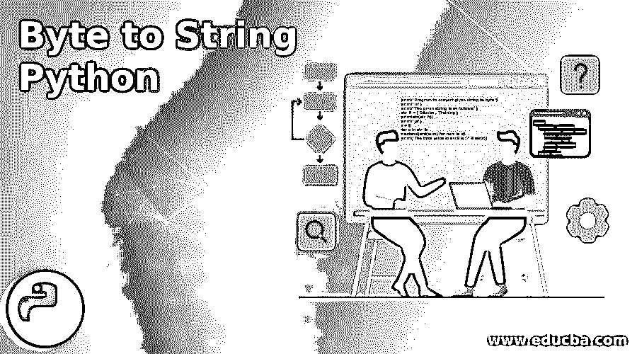
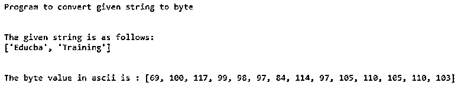
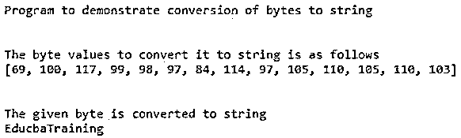
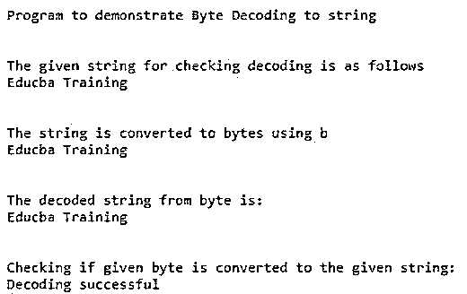

# 字节到字符串 Python

> 原文：<https://www.educba.com/byte-to-string-python/>

## 字节到字符串 Python 简介

在本文中，我们将看到如何在 Python 中将字节转换成字符串。一般来说，一个字节被定义为可以容纳 8 位大小的内存位置的一部分，Python 中的字符串被定义为表示 Unicode 字符的字节序列。因为所有编程语言都考虑到了字节到字符串的转换，反之亦然。在 Python 编程语言中也提供 encode()和 decode()方法。要将字节转换为字符串，我们必须使用 decode()方法并从字符串转换为字节；我们必须使用 encode()。因此，编码过程和解码过程都是逆过程。

### 用 Python 实现字节到字符串的转换及实例

在本文中，我们将看到如何使用 Python 将字节转换成字符串。字节对象通常不是人类可读的，但它们是机器可读的，并且这些字节对象包含一个字节数组。一般来说，我们可以说字符串是一个字符数组，它们是人类可读的形式。因此，每当我们需要在磁盘或内存中存储一个字节时，我们可以直接存储它，因为它是机器可读的，但我们需要以字符串的形式存储它，在存储到磁盘之前需要对它进行解码。

<small>网页开发、编程语言、软件测试&其他</small>

总的来说，我们可以将机器可读的对象直接存储在磁盘上，当我们需要将其作为人类可读的字符串存储在磁盘上时，字节对象必须解码为字符串才能直接存储在磁盘上。所以从字节到字符串的转换，使用 decode()函数，从字符串到字节的转换，需要使用 encode()函数。这两个函数都接受对 Unicode 字符进行编码的参数，并且这两个函数的默认值都是 UTF-8。

首先，我们将通过下面的例子来看看如何将给定的字符串转换成字节，以及如何将字节转换成字符串。

**代码:**

`print("Program to convert given string to byte")
print("\n")
print("The given string is as follows:")
str_lt = ['Educba', 'Training'] print(str(str_lt))
print("\n")
r = [] for e in str_lt:
r.extend(ord(num) for num in e)
print("The byte value in ascii is : " + str(r))`

**输出:**

在上面的程序中，我们可以看到给定的字符串被转换成字节中编码的 Unicode 字符 ASCII 值。

现在让我们看看如何将它从这些字节转换回字符串。

**代码:**

`print("Program to demonstrate conversion of bytes to string ")
print("\n")
bt_lt = [69, 100, 117, 99, 98, 97, 84, 114, 97, 105, 110, 105, 110, 103] print("The byte values to convert it to string is as follows")
print (bt_lt)
print('\n')
r = ""
for v in bt_lt:
r = r + chr(v)
print ("The given byte is converted to string")
print(str(r))`

**输出:**

所以现在，在上面的例子中，我们可以看到我们在上面的程序中获得的相同字节将被转换回字符串。

现在让我们在下面的例子中演示如何检查字节到字符串的转换是否是在 Python 中完成的:

**代码:**

`print("Program to demonstrate Byte Decoding to string")
print("\n")
print("The given string for checking decoding is as follows")
st = 'Educba Training'
print(st)
print("\n")
print("The string is converted to bytes using b")
bt = b'Educba Training'
print(bt)
print("\n")
print("The decoded string from byte is:")
ot = bt.decode('utf-8')
print(ot)
print("\n")
print("Checking if given byte is converted to the given string:")
if (ot==st):
print ("Decoding successful")
else : print ("Decoding Unsuccessful")`

**输出:**

在上面的程序中，我们可以看到给定的字符串是“Educba Training”，我们将给定字符串的字节值存储在另一个变量“bt”中，该变量稍后使用 decode()函数解码为字符串，我们使用编码 Unicode 字符规范“UTF-8”，解码后的值存储在另一个变量“ot”中，该变量将为字符串格式。因此，为了检查解码值是否与给定的字符串值相似，它将打印解码成功，正如我们在上面的屏幕截图中看到的那样，我们可以确保字节被转换为字符串。

### 结论

在本文中，我们的结论是，字节到字符串的转换，反之亦然。在本文中，我们看到 Python 提供了两种方法:encode()函数将字符串转换为字节，decode()函数将字节转换为字符串。我们首先看到了如何在 python 中将字符串转换成字节，以及如何用一个简单的 Python 程序将字节转换成字符串。然后我们看到了真正的 python 程序，我们使用 decode()函数将一个字节转换为字符串，使用编码 Unicode 字符“UTF-8”有许多 Unicode 字符，如 ASCII、utf-8、WAV 等。

### 推荐文章

这是一个字节到字符串 Python 的指南。在这里，我们用例子来讨论 python 中字节到字符串转换的介绍和工作原理。您也可以看看以下文章，了解更多信息–

1.  [Python 缓冲器](https://www.educba.com/python-bufferedreader/)
2.  [Python 异步](https://www.educba.com/python-async/)
3.  [Python 解析器](https://www.educba.com/python-parser/)
4.  [Python 转储](https://www.educba.com/python-dump/)