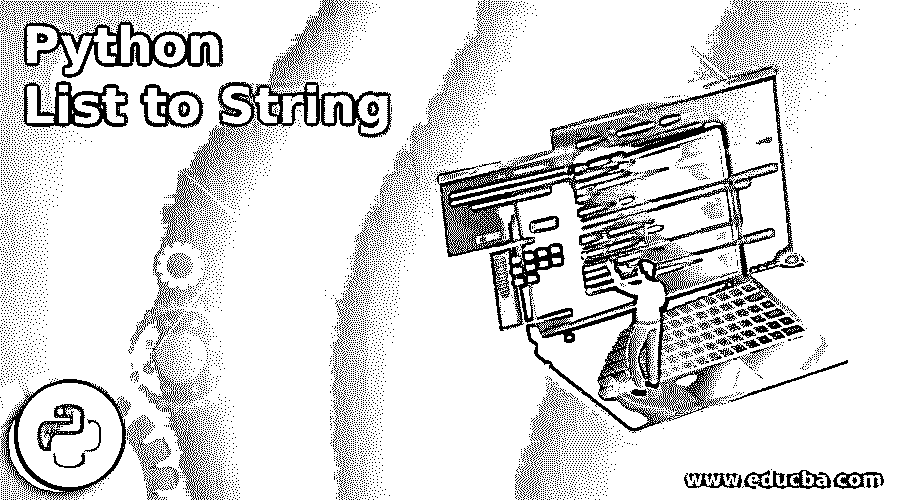
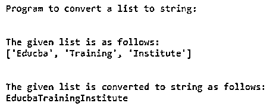
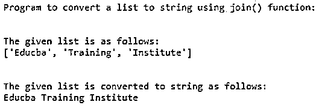
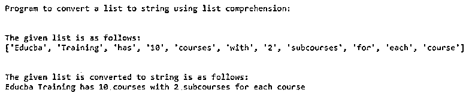
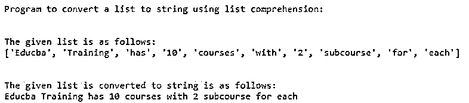

# Python 列表到字符串

> 原文：<https://www.educba.com/python-list-to-string/>




## Python 列表到字符串的介绍

在 Python 中，列表类似于数组，可以包含任何数据类型的元素。简单来说，List 是按顺序排列的元素的集合，每个元素都有索引。Python 中的字符串是像 int、char 等其他数据类型一样的数据类型。，而字符串，一般来说，可以定义为一个字符序列。因此，在本文中，我们将看到如何在 Python 编程语言中将列表转换为字符串，还有其他几种方法可以做到这一点。

### 如何将列表转换为字符串并举例说明

在本文中，我们介绍了 Python 中的列表和字符串。现在让我们看看如何在 Python 中将列表转换成字符串。在 Python 中有不同的方法将列表转换成字符串。

<small>网页开发、编程语言、软件测试&其他</small>

让我们用下面的例子来看看每种方法:

#### 1.列表到字符串

顾名思义，当我们已经创建了一个空字符串时，就使用这个方法，然后我们可以通过遍历列表，并在这个空字符串中添加相应于索引的元素，将列表转换为字符串，这可以在下面的示例中显示。

**举例:**

**代码:**

```
print("Program to convert a list to string:")
print("\n")
def func(s):
str1 = ""
for e in s:
str1 += e
return str1
s = ['Educba', 'Training', 'Institute']
print("The given list is as follows:")
print(s)
print("\n")
print("The given list is converted to string as follows:")
print(func(s))
```

**输出:**




在上面的程序中，我们可以看到我们已经定义了一个函数 func()，其中我们传递了一个名为“s”的列表。在函数内部，我们初始化了一个空字符串“str1 ”,然后使用“for”循环，遍历字符串并通过转换传递给此函数的列表返回字符串，然后输出通过组合给定列表的所有元素给出字符串。

#### 2.通过使用。join()方法

在 Python 中，有一种用于字符串的方法称为 join()方法，该方法也可以用于将给定的列表转换为字符串。

**语法:**

`str.join(iterable)`

这里 iterable 可以是列表、集合、元组等。

**举例:**

**代码:**

`print("Program to convert a list to string using join() function:")
print("\n")
def func(s):
str1 = " "
return (str1.join(s))
s = ['Educba', 'Training', 'Institute'] print("The given list is as follows:")
print(s)
print("\n")
print("The given list is converted to string as follows:")
print(func(s))`

**输出:**




在上面的程序中，我们可以看到一个定义的函数“func()”，其中我们传递了一个列表“s”；该函数用于转换。首先在这个函数中，我们初始化一个空字符串，然后使用 join()方法，我们将给定的列表转换成一个字符串。需要注意的一点是，使用 join()方法会在列表的每个元素后添加空格，然后将列表元素连接成一个字符串。

#### 3.使用列表理解

可能会出现一个列表可以包含字符串和整数的情况，那么如何将这样的列表转换成字符串呢？所以我们需要在添加字符串的同时添加字符串。这可以用这种方法来完成。

**举例:**

**代码:**

`print("Program to convert a list to string using list comprehension:")
print("\n")
s = ['Educba', 'Training', 'has', '10', 'courses', 'with', '2', 'subcourses', 'for', 'each', 'course'] print("The given list is as follows:")
print(s)
print("\n")
listToString = ' '.join([str(e) for e in s])
print("The given list is converted to string is as follows:")
print(listToString)`

**输出:**




在上面的程序中，我们可以看到我们定义了一个既有字符串元素又有整数元素的列表。因此，为了转换这些类型的列表，我们使用这种理解方法，在一个语句中同时使用 join()方法和“for”循环，并将列表的所有元素打印为一个字符串。输出如截图所示。

#### 4.使用 map()方法

此方法用于将列表转换为字符串，以便将字符串映射到给定的列表。当列表中有非字符串元素时使用此方法，这些元素首先被转换为字符串。我们已经看到上面的例子也在做同样的工作，但是使用了 map()方法。

**举例:**

**代码:**

`print("Program to convert a list to string using list comprehension:")
print("\n")
s = ['Educba', 'Training', 'has', '10', 'courses', 'with', '2', 'subcourse','for', 'each'] print("The given list is as follows:")
print(s)
print("\n")
listToString = ' '.join(map(str, s))
print("The given list is converted to string is as follows:")
print(listToString)`

**输出:**




在上面的程序中，我们可以看到与使用理解方法的程序相同的工作方式，但这里我们使用 map()函数将列表转换为字符串，结果如上面的截图所示。

### 结论

在本文中，我们得出结论，在 Python 中，列表到字符串的转换很简单。在本文中，我们看到了将给定列表转换为字符串的各种方法。起初，我们看到通过从给定的列表中向空字符串添加元素；第二，我们看到了使用 join 方法进行转换；第三，我们看到了使用 join()的理解方法，最后，我们看到了使用相同理解 map()方法的相同理解方法。

### 推荐文章

这是一个 Python 列表到字符串的指南。在这里，我们讨论了如何通过例子将列表转换成字符串。您也可以看看以下文章，了解更多信息–

1.  [Python pip](https://www.educba.com/python-pip/)
2.  [Python json.dumps](https://www.educba.com/python-json-dumps/)
3.  [Python 解析器](https://www.educba.com/python-parser/)
4.  [Python Unicode Error](https://www.educba.com/python-unicode-error/)