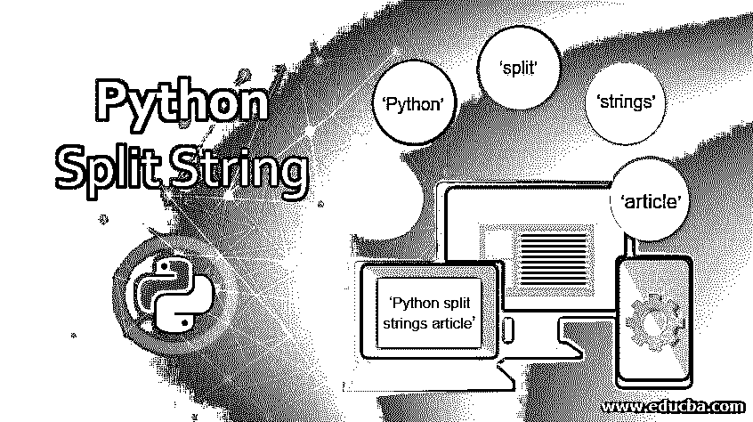

# Python 拆分字符串

> 原文：<https://www.educba.com/python-split-string/>




## Python 拆分字符串简介

在 Python 中，字符串可以定义为由 Unicode 字符表示的字符数组。因为 Python 不支持 char 数据类型，所以 Python 有一个字符和一个字符串。字符串要么用单引号声明，要么用双引号声明。字符串中最重要的函数是 split()方法。split()函数是一个应用于任何字符串的函数，它在识别分隔符后返回字符串列表，并将字符串分解成子字符串。此方法用于将字符串拆分成字符。有时需要将大的字符串分割成小的字符块或子串。Spit()函数的工作与串联相反。当 split 函数返回字符串列表时，可以使用索引方法对其进行访问，在该方法中，给定字符串的每个字符串或字符都指定了从数字 0 开始的索引号，依此类推。在本主题中，我们将学习 Python 拆分字符串。

### Python 的 split 函数是如何工作的？

在 python 中，split()函数是一个使用分隔符空白作为默认分隔符来拆分字符串的函数。正如我们所知，在 Python 中，我们有一个字符串串联，这意味着组合字符串，而 split function 是串联的反义词。因此 Python 使用一个名为 split()的内置函数，将字符串分解成其他字符串。

<small>网页开发、编程语言、软件测试&其他</small>

每当我们在 Python 中拆分字符串时，使用 split()函数总是会被转换成列表。在 Python 中，数据类型不在任何变量之前声明；因此，每当使用 split()函数时，我们需要将它赋给某个变量。然后，使用高级 for 循环可以轻松访问它。因此，当一个字符串被赋给任何变量，并对该变量应用 split()函数后，它将被转换为数组或列表，并且可以使用索引来访问这个字符串数组。

**语法:**

```
Str.split(separator, maxsplit)
```

split()方法有两个参数，如 separator 和 maxsplit 上面的语法所示。

separator 参数是可选的，因为默认情况下，如果没有指定，空白将被视为分隔符。

Maxsplit 也是 split()函数的可选参数；此参数定义给定字符串的最大拆分次数。默认情况下，如果没有指定，它将把-1 作为 maxsplit 的值。

### Python 拆分字符串的示例

以下是下面提到的例子:

#### 示例#1

下面的代码显示了一个简单的程序，它使用了一个没有 maxsplit 参数的 split()函数。

**代码:**

```
str = 'Python split strings article'
print(str.split())
```

**输出:**


上面的程序在没有指定参数的地方使用了 split 函数，所以默认情况下，它将使用空格作为分隔符来分割 str 中给出的句子。

现在让我们看看使用带 maxsplit 参数的 split 函数的代码示例。

**代码:**

```
items = 'Cheese, Curd, Butter, Milk '
print(items.split(', ', 2))
print(items.split(', ', 1))
```

**输出:**


在上面的程序中，我们在程序中将 maxsplit 参数指定为 2 和 1。这些项目被分成 3 个字符串和 2 个字符串，从上面的第 0 个字符串，凝乳作为第一个字符串，黄油和牛奶作为第二个字符串。

还有一个函数 reverse split，在 Python 中定义为 rsplit()，它以逆序返回字符串的列表，也就是说它从字符串的末尾开始，用指定的分隔符反向返回一个字符串。

**语法:**

```
Text.rsplit (delimiter, maxsplit)
```

语法类似于 split()函数，工作原理也类似，但它以相反的顺序返回带有指定分隔符的字符串。

如果没有参数传递给 rsplit()函数，那么它将返回与 split()函数相同的结果。

#### 实施例 2

**代码:**

```
txt = "apple, pineapple, custardapple"
print(txt.rsplit())
```

**输出:**


使用带有 maxsplit 参数的 rsplit 函数。这将从给定字符串的右侧吐出一组字符串中的字符串。

#### 实施例 3

**代码:**

```
txt = "apple, pineapple, custardapple"
print(txt.rsplit(',', 1))
```

**输出:**


上面的屏幕截图是上面的程序，maxsplit 参数为 1，它将从后向前拆分字符串，并返回两个字符串，如图所示，它将首先返回“custardapple”，然后它将第二个字符串作为“apple，菠萝”。

rsplit()函数的另一个示例在字母 t 处拆分，提供的 maxsplit 为 1，因此它首先将字符串拆分为两个字符串，它在 t 处拆分，因此“rings”是一个字符串，第二个字符串将是“Python，split，s”是另一个字符串。下面给出了代码输出和截图。

#### 实施例 4

**代码:**

```
txt = 'Python, split, strings'
print(txt.rsplit('t', 1))
```

**输出:**


还有一个类似于 split()函数的函数叫做 splitfields()。早期的 split()函数只使用一个参数，splitfields()函数使用两个参数。现在 split()也使用了两个参数；如果没有参数，它将把空白作为默认分隔符，分割字符串并返回字符串列表。

### 结论

在 Python 中，可以使用 split()函数拆分和访问字符串，该函数根据指定的分隔符或默认分隔符将给定的字符串拆分为空白。这个函数返回字符串的数组，所以像以前在 Python 中一样可以使用索引来访问数组。类似地，split()函数返回的这些字符串集可以使用索引来访问。在这种情况下，每个字符串或字符都被赋予一个从 0 开始的相应的索引号，并且可以使用该索引号进行访问。

### 推荐文章

这是一个 Python 拆分字符串的指南。在这里，我们将讨论 Python split 函数是如何工作的，并给出示例和适当的语法。您也可以看看以下文章，了解更多信息–

1.  [Python 切片字符串](https://www.educba.com/python-slice-string/)
2.  [Python 查找字符串](https://www.educba.com/python-find-string/)
3.  [Python 开关案例](https://www.educba.com/python-switch-case/)
4.  [Python 线程池](https://www.educba.com/python-threadpool/)