# Python 读取 CSV 文件

> 原文：<https://www.educba.com/python-read-csv-file/>


## Python Read CSV 文件简介

在本文中，我们将学习 Python 读取 CSV 文件。CSV 模块是 Python 中的内置模块。为了使用它，只需要在 python 环境中导入它。比如:

```
import csv
```

由于“csv”模块是标准库的一部分，所以不需要安装。这里 csv 代表逗号分隔值格式文件(它是一种存储数据的表格形式，易于人们阅读和理解)。

<small>网页开发、编程语言、软件测试&其他</small>

csv 文件如下所示:

Sr_No，Emp_Name，Emp_City
1，英国奥巴马
2，加州杰克逊

可以注意到，csv 文件中的元素用逗号分隔。有许多功能的 csv 模块，这有助于在阅读，写作和许多其他功能，以处理 csv 文件。

### 实现 Python 读取 CSV 文件的示例

让我们通过一些示例来深入了解 csv:

#### 阅读 CSV 文件

##### 示例#1

需要设置保存 csv 文件的目录。

**代码:**

```
import os
os.chdir("My Folder/Personnel/EDUCBA/Jan")
```

**代码:**

```
import csv
with open('Emp_Info.csv', 'r') as file:
    reader = csv.reader(file)
    for each_row in reader:
        print(each_row)
```

**输出:**

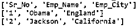


**以上代码解释:**可以看到，“open('Emp_Info.csv ')”是作为文件打开的。“csv.reader()”用于读取文件，该文件返回一个可迭代的 reader 对象。这里，csv.reader()用于读取 csv 文件，但是该功能是可定制的。

##### 实施例 2

比如，如果文件是分号分隔的文件。

**代码:**

```
import csv
with open('Emp_Info.csv', 'r') as file:
    reader = csv.reader(file,delimiter  = ';')
    for each_row in reader:
        print(each_row)
```

一旦 reader 对象准备就绪，它就会循环逐行打印内容。分隔符有助于指定文件的分隔符。

**Try-Finally in CSV . reader()**

**代码:**

```
import csv
file = open('Emp_Info.csv', 'r')
try:    
    reader = csv.reader(file)
    for each_row in reader:
        print(each_row)
finally:
    file.close()
```

**输出:**

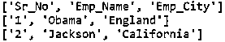


##### 实施例 3

现在，假设我们有一个如下所示的 csv 文件:

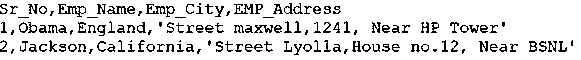


**代码:**

```
import csv
with open('Emp_Info.csv', 'r') as file:
    reader = csv.reader(file)
    for each_row in reader:
        print(each_row)
```

**输出:**

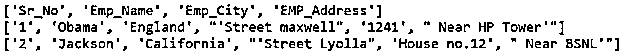


*   可以注意到,“EMP_Address”中的逗号会将它分成不同的列。
*   为了解决这个问题，我们可以在 csv.reader 中使用一个参数，即 quote char。

**代码:**

```
import csv
with open('Emp_Info.csv', 'r') as file:
    reader = csv.reader(file,quotechar="'")
    for each_row in reader:
        print(each_row)
```

**输出:**

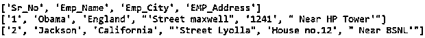


这个引用字符有助于用特殊值/字符包围文件的值。像这里一样，我们用一个反逗号引用了单元格的所有值。

##### 实施例 4

现在假设我们的文件看起来像这样:

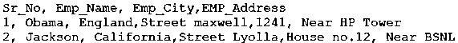


人们可以注意到在第 2 列<sup>和第 3 列<sup>之前的“空白”。当这将通过我们的代码读取时:</sup></sup>

**代码:**

```
import csv
with open('Emp_Info.csv', 'r') as file:
    reader = csv.reader(file)
    for each_row in reader:
        print(each_row)
```

**输出:**

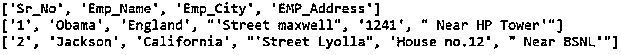


*   这种结果是不期望的，因此我们希望跳过这些空白。
*   因此，需要在 csv.reader()中使用参数“skipinitialspace”:

**代码:**

```
import csv
with open('Emp_Info.csv', 'r') as file:
    reader = csv.reader(file,skipinitialspace=True)
    for each_row in reader:
        print(each_row)
```

**输出:**


##### 实施例 5

现在假设我们的单元格中有双引号。

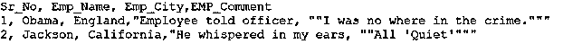


**代码:**

```
import csv
with open('Emp_Info.csv', 'r') as file:
    #reader = csv.reader(file,quoting=csv.QUOTE_NONE)
    reader = csv.reader(file,doublequote=True)
    for each_row in reader:
        print(each_row)
```

**输出:**

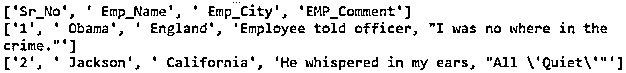


*   这里，当 doublequote = True 时，连续的双引号将被转换为单引号。
*   因此使双引号= False。

**代码:**

```
import csv
with open('Emp_Info.csv', 'r') as file:
    reader = csv.reader(file,doublequote=False)
    for each_row in reader:
        print(each_row)
```

**输出:**

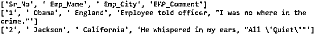


这里，连续的双引号将按原样显示。

#### 使用 csv 读取 CSV 文件。字典阅读器()

**代码:**

```
import csv
with open("Emp_Info.csv", 'r') as file:
    csv_reader = csv.DictReader(file)
    for each_row in csv_reader:
        print(dict(each_row))
```

**输出:**

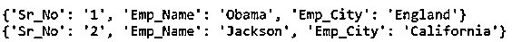


*   这里 csv_reader 是 csv。DictReader()对象。这里 csv。DictReader()以字典的形式帮助读取 csv 文件，其中文件的第一行成为“键”，其余所有行成为“值”。
*   第一行有“Sr_No”、“Emp_Name”和“Emp_City”，所以这些成为键，而其余行成为它们的值。
*   Csv。DictReader()本身返回每一行的字典，这在按照您的要求显式执行 dict()时是无用的。

**Note: **One important concept of “dialect” comes into the picture while using the csv module. Dialect helps in defining a set of parameters, particularly to csv format to be used while reading a set of csv files. One has the flexibility to define its own set of the parameter using “register_dialect”.

**代码:**

```
csv.register_dialect(
    'mydialect',
    delimiter = ';',
    skipinitialspace = True,
    quotechar = '"',
    doublequote = True, 
)
```

现在，在读取或写入 csv 文件时，可以直接使用这种定义的方言。

```
reader = csv.reader(csv_file, dialect='mydialect')
```

### 结论

正如我们上面看到的，csv 读取的概念在 Python 中有多重要？有各种与之相关的方法和参数。在处理 csv 读取和写入文件时，每个参数都有其重要性。一个人需要熟悉它，练习它，才能很好地掌握它。

### 推荐文章

这是一个用 Python 读取 CSV 文件的指南。在这里，我们讨论一个介绍，csv 通过一些例子与适当的代码和输出。您也可以浏览我们的其他相关文章，了解更多信息——

1.  [Python 中的小写](https://www.educba.com/lowercase-in-python/)
2.  [Python 全局变量](https://www.educba.com/python-global-variable/)
3.  [Python if main](https://www.educba.com/python-if-main/)
4.  [Python 列表函数](https://www.educba.com/python-list-functions/)