# Python 文件读取线

> 原文：<https://www.educba.com/python-file-readline/>

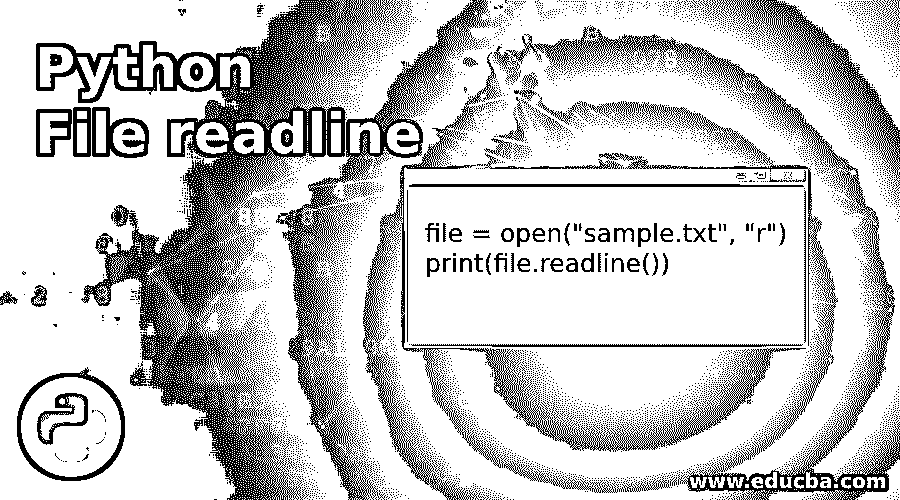

## Python 文件读取线介绍

Python readline 函数是 Python 的文件处理方法。此方法用于从文件中读取一行，并将其作为字符串返回。默认情况下，它将返回完整的一行，但是我们也可以定义可以返回的字节大小。如果文件没有数据并且已经到达 EOF，那么返回这个空字符串。Python 可以读取两种类型的文件文本文件和一个只包含 0 和 1 的二进制文件。

**语法:**

<small>网页开发、编程语言、软件测试&其他</small>

`file = open("sample.txt", "r")
print(file.readline())`

open 方法用于打开文件，第二个参数是模式，r 表示读取模式。所以我们只能以只读模式打开文件。

### Python 文件读取线示例

下面是提到的例子:

#### 示例#1

**代码:**

`file = open("sample.txt", "r")
print(file.read())`

**输出:**

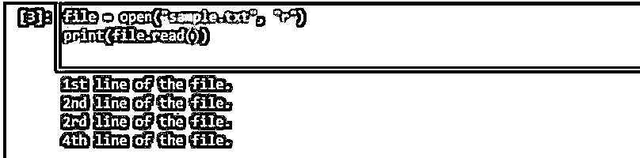

我们已经创建了 sample.txt 文件，其中包含这 4 行代码。我们已经从 open 方法创建了一个 file 对象，它将以读取模式打开文件；我们已经在 open 方法中指定了读取模式作为第二个参数。我们使用了 print 方法，在 print 方法中，我们使用了 read 方法来返回文件中的所有行。

#### 实施例 2

**代码:**

`file = open("sample.txt", "r")
print(file.readline())`

**输出:**

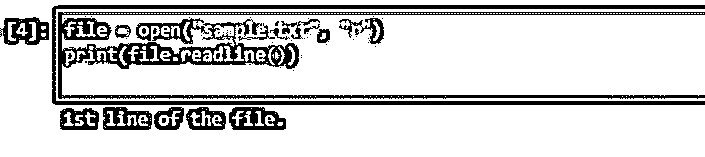

在上面的程序中，我们使用了 readline 方法，它只从 txt 文件中返回了一行。一旦该方法读取了该行，它还会捕获下一行字符，这样它就可以记住它已经返回了哪一行，所以下次当我们再次执行相同的方法时，它将返回下一行。

#### 实施例 3

**代码:**

`print(file.readline())`

**输出:**

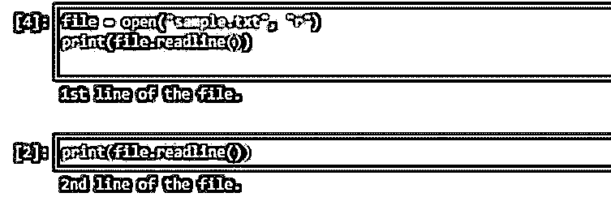

如您所见，这一次，它返回了文件的第 2 行。

#### 实施例 4

**代码:**

`file = open("sample.txt", "r")
print(file.readline(11))`

**输出:**

在上面的例子中，你可以看到我们在 readline 方法中指定了大小，它将返回该大小的字符串，不会超过这个大小。如果我们指定的大小超过了字符串的一行，不管大小如何，它仍然只返回一行。

#### 实施例 5

**代码:**

`file = open("sample.txt", "r")
print(file.readlines())`

**输出:**

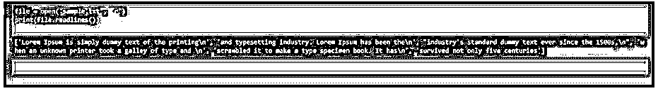

在上面的程序中，可以看到 readlines 方法已经返回了文件中的所有文本。

**代码:**

`print(file.readline())`

**输出:**

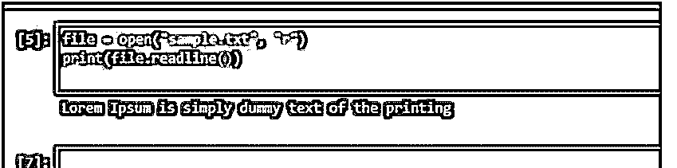

在上面的程序中，您可以看到这个 time readline 函数只返回了文本文件中的这一行。我们得到一个完整的行作为输出。

**代码:**

`print(file.readline())`

**输出:**

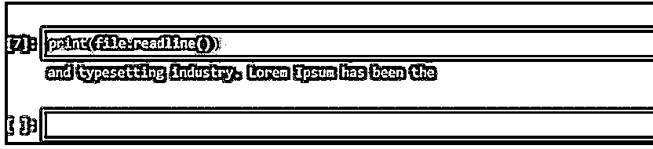

在上面的程序中，可以看到这个 time readline 函数已经从上一行返回了下一行。

**代码:**

`print(file.readline(15))`

**输出:**

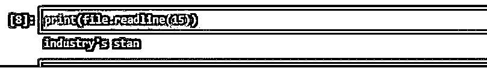

在上面的程序中，您可以看到这个时间函数根据我们在方法中提到的大小只返回了有限的数据。

#### 实施例 6

**代码:**

`file = open("sample.txt", "r")
print(file.read())`

**输出:**

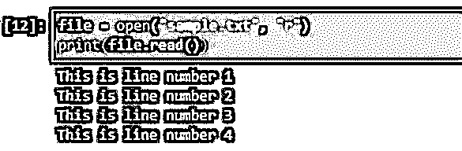

在上面的程序中，你可以看到我们的文件有 4 行。我们使用 read 方法一次性读取整个文件。我们还可以使用 read 方法来读取几个特定的字符；此外，我们只需要将大小传递给方法。

**代码:**

`print(file.read(10))`

**输出:**

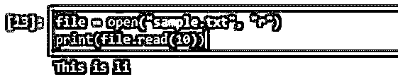

如您所见，我们得到了与字符数匹配的字符串；在这里，重要的是空格也算一个字符。

**代码:**

`print(file.readlines())`

**输出:**

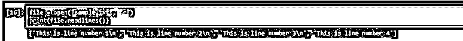

Readlines 方法也用于读取完整的文件，但是正如您所看到的，它将每一行都返回到一个字符串数组中，并将' \n '作为行终止符。

**代码:**

`file = open("sample.txt", "r")
print(file.readline())`

**输出:**

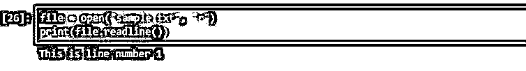

在上面的程序中，我们使用了 readline 方法。它将只从文本文件中返回一个。在找到下一行字符之前，一行被视为一行。

**输出:**

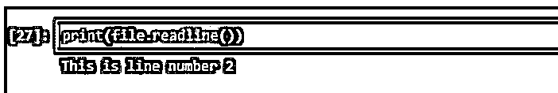

如果我们尝试在没有任何大小的情况下再次执行相同的方法，它将从文件中返回下一行。如果我们在方法中没有指定任何大小，那么方法将返回整行。大小是根据字符数指定的，空格也算作一个字符。

**代码:**

`print(file.readline(10))`

**输出:**

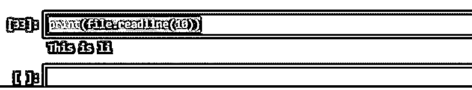

在上面的程序中，您可以看到我们的大小为 10，这意味着该方法将返回 10 个字符。

**代码:**

`print(file.readline(10))`

**输出:**

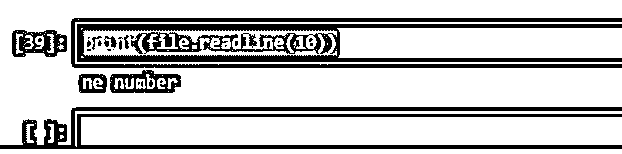

如果我们再次执行相同的方法，它将根据指定的大小从文本文件中返回下一组字符。它会一直记住，直到打印出该字符，并将其保存到内存中，以便下一次执行相同的命令时，它会从下一个字符返回该字符。

### 结论

readline 方法是 python 的一个漂亮的方法，用于读取文件，文件可以是 txt 文件，也可以是二进制文件，它逐行读取文件，只返回一行作为输出。我们可以输出整行或有限的数据，这取决于我们传递给 readline 方法的大小。有时文件很重，一次读取整个文件并不是好的做法。

### 推荐文章

这是一个 Python 文件 readline 的指南。这里我们讨论 Python 文件 readline 的介绍以及编程示例。您也可以看看以下文章，了解更多信息–

1.  [Python 计数器](https://www.educba.com/python-counter/)
2.  [Python 排序数组](https://www.educba.com/python-sort-array/)
3.  [Python 中的控制语句](https://www.educba.com/control-statements-in-python/)
4.  [Python 中的 pop()](https://www.educba.com/pop-in-python/)