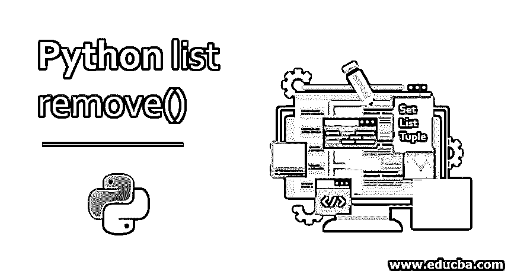
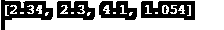
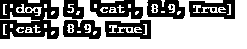
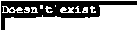
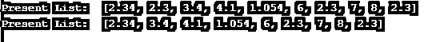

# Python 列表移除()

> 原文：<https://www.educba.com/python-list-remove/>




## Python 列表移除概述()

python 中的 List 是一种预定义的方法，用于对一组/一组项目执行操作。虽然它是一个类似于数组的构造，但是列表函数是异构的，不像数组函数，这使得它在 python 中具有强大的可访问性。这个列表函数允许许多操作，如插入、追加、求和、计数、扩展、索引等。remove()就是这样一个操作，它用于从列表中移除或删除一个项目。

### 目录

列表是一个类似于数组的概念。然而，两者之间唯一的区别是,[数组](https://www.educba.com/arrays-in-python/)总是同构的，而列表可以是异构的。列表的这个特性使得它在 Python 中非常强大。

<small>网页开发、编程语言、软件测试&其他</small>

**举例:**

```
List_example = ['Mathematics', 'biology', 1997,'Hello123'] 
print(List_example)
```

**输出:**


列表总是从索引 0 开始。列表中的每个元素都有自己的空间。列表中可以有重复的值，因为两者的索引是不同的。该列表有许多方法来执行与其相关的各种操作。比如:

插入、扩展、追加、求和、计数、索引、删除等。

让我们在这里讨论一个重要的方法:

**remove():** 方法 remove()是从一个列表中删除元素。

**语法:**

```
remove()
```

### Python 列表 remove()示例

让我们通过一些例子把概念搞清楚:

#### 示例#1

**代码:**

```
List_example = [2.34, 2.3, 3.4, 4.1, 1.054]
List_example.remove(3.4)
print(List_example)
```

**输出:**




可以注意到，我们定义了一个列表，然后在 remove()方法的帮助下，我们从列表中删除了元素 3.4。需要移除的元素必须作为参数传递给这些方法。这里我们只删除了一个元素。然而，人们一定想知道:如果我们需要删除不止一个元素呢？

在这种情况下，remove()不能一蹴而就。另一种方法可以是:

**代码:**

```
List_example = [2.34, 2.3, 3.4, 4.1, 1.054,6,7,8]
List_example.remove(6)
List_example.remove(7)
List_example.remove(8)
print(List_example)
```

**输出:**


如果要从列表中删除的元素很少，可以一个接一个地删除(如上所示)。但是如果它包含更多的元素，那么这种方式可能会很乏味而且不专业。

**代码:**

```
item_list_ex = ['dog', 5, 'cat', 8.9, True]
print(item_list_ex)
item_list_ex = [x for x in item_list_ex if x not in ('dog', 5)]
print(item_list_ex)
```

**输出:**




这种方式最适合移除元素，因为您需要一次性提及所有要移除的元素(如上面的逻辑所示)。

#### 实施例 2

让我们看一个 try and catch 块的例子。

**代码:**

```
a = ['Heena', 10, 'Rohit', 80, True]
try:
    a.remove(90)
except ValueError:
    print("Doesn't exist")
    pass  # do nothing!
```

**输出:**




可以注意到，元素 90 不是列表的一部分。因此，在执行 a.remove(90)时，它抛出了 ValueError。从今以后，“不存在”被打印出来。

#### 实施例 3

如果有一个数字序列，而你想从中删除元素的范围。可以借助 for 循环来完成。请参见下面的示例:

**代码:**

```
List_example = [1, 2, 3, 4, 5, 6,7, 8, 9, 10, 11, 12]
print("Present List: ") 
print(List_example)
for i in range(5, 8): 
    print(i)
    List_example.remove(i) 
print("\nList after Removing a range of elements: ") 
print(List_example)
```

**输出:**


从 1 到 12 的列表中可以看到，在 range、for 循环和 remove 函数的帮助下，已经删除了三个元素。

一个列表可以保存重复的值，那么在这种情况下它如何移除()呢？让我们探索一下这个问题的答案。

#### 实施例 4

**代码:**

```
List_example = [2.34, 2.3, 3.4, 4.1, 1.054,6,2.3,7,8,2.3]
print("Present List: ",List_example)
List_example.remove(2.3)
print("Present List: ",List_example)
```

**输出:**




方法 remove()只从列表中移除第一个匹配的元素。如示例所示，2.3 有三个值。当我们删除它时，列表上仍然有两个相同的。

**Note:** One major challenge is that people usually get confused over remove() and pop()?

简单的回答是，remove()是一个基于值的方法，因此可以通过指定它的值从列表的任何位置删除元素。它可能是第一次，最后一次或介于两者之间。然而，pop()方法删除了最后一个元素(这是默认的)。但是如果需要从任何位置删除元素，就必须指定它的索引。换句话说，pop()是基于索引从列表中删除元素。

#### 实施例 5

突出显示 remove()和 pop()之间的区别:

**代码:**

```
List_example = [1, 2, 3, 4, 5, 6,7, 8, 9, 10, 11, 12]
print("Present List: ",List_example)
List_example.remove(3)
print("Present List: ",List_example)
List_example.pop(3)
print("Present List: ",List_example)
```

**输出:**


可以注意到，remove(3)从列表中删除了值 3。但是，pop(3)删除了第 3 个<sup>到第 1 个</sup>位置的元素，即 5。列表总是从索引 0 开始；因此，列表的第 3 个 <sup>rd</sup> 元素的值为 5。

使用列表的优点在于可以很容易地对其进行迭代。因为元素的顺序在这里很容易处理。

### 结论–Python 列表删除()

上面提到的是在 python 中处理列表时广泛使用的最重要和最基本的方法之一。然后我们看到了 pop 和 remove 之间的区别，这是一个在处理列表时经常混淆的参数。关于 list remove()，本主题已经给出了足够多的亮点。人们可以通过 list 的其他方法来熟悉 list 的概念。别忘了，集合是 python 中广泛使用的概念之一。对这些方法了解得越多，编写和理解 python 代码就变得越容易。

### 推荐文章

这是 Python 列表 remove()的指南。在这里，我们将讨论 Python list remove()的概述、示例以及代码和输出。您也可以阅读以下文章，了解更多信息——

1.  [Python 中的列表方法](https://www.educba.com/list-method-in-python/)
2.  [Python 列表理解](https://www.educba.com/list-comprehensions-python/)
3.  [用 Python 发送邮件](https://www.educba.com/send-mail-in-python/)
4.  [Python 空列表](https://www.educba.com/python-empty-list/)