# Python 内置函数

> 原文：<https://www.educba.com/python-built-in-functions/>

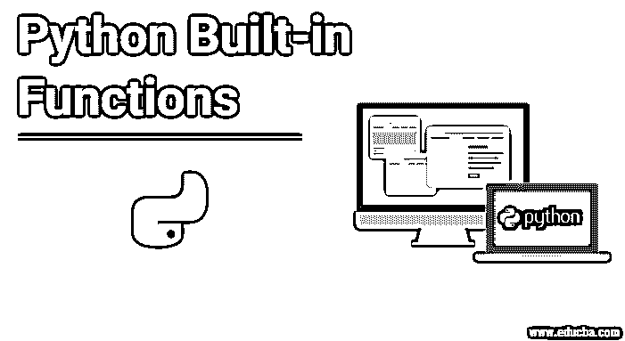


## Python 内置函数简介

内置函数是在编程语言的库中预先定义的，供编程直接调用程序中任何需要的函数，以实现某些功能操作。Python 程序中一些常用的内置函数有:用于获取 x 的绝对值的 abs(x)、用于获取二进制值的 bin()、用于检索对象布尔值的 bool()、用于列表的 list()、用于获取值长度的 len()、用于打开文件的 open()、用于返回数字幂的 pow()、用于获取元素和的 sum()、用于反转顺序的 reversed ()等等。

### Python 内置函数的示例

下面是 python 内置函数的例子

<small>网页开发、编程语言、软件测试&其他</small>

#### 1.abs(x)

返回一个数字的绝对值。如果传递的是一个复数，则返回该数字的大小。它与 x-y 图上一个点离原点的距离相同。对于例如

Abs(-3) =3

abs(3+4i) = 5

**代码:**

```
a = 12
b = -4
c = 3+4j
d = 7.90
print(abs(a))
print(abs(b))
print(abs(c))
print(abs(d))
```

**输出:**

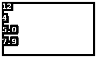


#### 2.全部(x)

与逻辑“与”运算符相同。这意味着如果迭代器中的所有变量都为真，它将返回真。这里，可迭代对象被称为元组、列表、字典。

在 python 中，如果一个变量非零且不为零，则称该变量为真。这里，NONE 是 python 中定义的被视为 null 的关键字。

For eg=如果 iterable 'item '包含值' 2，4，5，6，1 '–结果将为真。

如果 item1= '2，0，4，5 '–结果将为假

**代码:**

```
tuple = (0, True, False)
x = all(tuple)
print(x)
```

**输出:**


**解释**–这里，all()返回 false，因为元组中的第一个和第三个值都是 False。

**代码:**

```
sampledict = {0 : "Apple", 1 : "Orange"}
x = all(sampledict)
print(x)
```

**输出:**


**解释-** 这里，all()返回 false，因为其中一个键为 False，在字典的情况下，只检查键，不检查值。

#### 3.任何(x)

此函数与逻辑“OR”运算符相同，后者仅在 iterable 中的所有变量都为 false 时才返回 False。这里 iterable 指的是元组、字典和列表。

**注意-** 对于空的可迭代对象，any()返回 False。

例如- any(2，3，4，5，9)-True

Any(2，0，9，1，8)-返回 False

**代码:**

```
myset = {0, 1, 0}
x = any(myset)
print(x)
```

**输出:**


**解释-** 在上面的程序中，任何函数都返回 True，给定的集合至少有一个 True 值。

#### 4.bin()

这个函数返回一个数的二进制值。

**代码:**

```
a=5
print(bin(a))
```

**输出:**


#### 5.圆形()

它给出一个数字的舍入值，即给出一个数字的最接近的整数值。该函数接受一个参数，可以是小数、浮点数或整数，并给出舍入输出。

**代码:**

```
print(round(4.5))
print(round(-7.7))
```

**输出:**

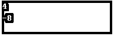


#### 6.bin()

它返回参数中传递的数字的二进制值。唯一的整数可以作为参数传递给函数。

**代码:**

```
print(bin(4))
print(bin(9))
```

**输出:**

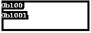


#### 7.布尔()

这个函数返回一个对象的布尔值。

**代码:**

```
print(bool(0))
print(bool(-4.5))
print(bool(None))
print(bool("False"))
```

**输出:**

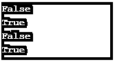


#### 8\. bytearray()

这个函数返回一个新的字节数组，即一个从 0 到 256 的可变整数序列。

**语法—**

```
bytearray(source,encoding,errors)
```

**注-**

1.  函数的值是可选的。
2.  如果将任何非 ascii 值赋予该函数，它将给出没有编码的 error -TypeError: string 参数。

**代码:**

```
print(bytearray())
print(bytearray('Python','utf-8'))
```

**输出:**

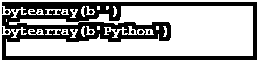


#### **9。**编译()

它用于从字符串或 AST 对象生成 Python 代码对象。

以下是函数的语法–

```
Compile(source,filename,mode,flags=0,dont_inherit=False,optimize=-1)
```

该函数的输出作为 evaluate()和 exec()函数的参数给出。

**代码:**

```
myCode = 'a = 7\nb=9\nresult=a*b\nprint("result =",result)'
codeObject = compile(myCode, 'resultstring', 'exec')
exec(codeObject)
```

**输出:**


#### 10.列表()

这个函数用于将一个对象转换成一个列表对象。

**语法—**

```
list([iterable])
```

这里的 iterable 指的是任何序列，例如字符串、元组，以及 iterable 对象或集合对象，例如集合或字典。

元素列表的可变序列作为该函数的输出返回。

**代码:**

```
print(list()) #returns empty list
stringobj = 'PALINDROME'
print(list(stringobj))
tupleobj = ('a', 'e', 'i', 'o', 'u')
print(list(tupleobj))
listobj = ['1', '2', '3', 'o', '10u']
print(list(listobj))
```

**输出:**

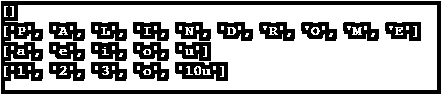


#### 11.len()

这个函数输出物体的长度。

**语法—**

```
len([object])
```

这里的对象必须是序列或集合。

**注意-** 解释器在遇到没有给函数参数的情况下抛出一个错误。

**代码:**

```
stringobj = 'PALINDROME'
print(len(stringobj))
tupleobj = ('a', 'e', 'i', 'o', 'u')
print(len(tupleobj))
listobj = ['1', '2', '3', 'o', '10u']
print(len(listobj))
```

**输出:**


#### 12.最大()

该函数返回给定 iterable 对象中的最大数字，或者作为参数给出的两个或多个数字中的最大值。

**语法—**

```
max(iterable) or max(num1,num2…)
```

这里 iterable 可以是列表、元组、字典或任何序列或集合。

**代码:**

```
num = [11, 13, 12, 15, 14]
print('Maximum is:', max(num))
```

**输出:**


注意——如果函数没有参数，那么解释器就会抛出 ValueError。

#### 13.最小值()

该函数返回集合对象的最小值或定义为参数的值。

**语法**–

```
min([iterable])
```

**代码:**

```
print(min(2,5,3,1,0,99))
sampleObj = ['B','a','t','A']
print(min(sampleObj))
```

**输出:**


**注意**–如果函数没有参数，那么解释器会抛出 ValueError。

#### **14。map()**

该函数有助于调试，因为它在对 iterable 对象中的每个项目应用操作后提供结果。

**语法—**

```
map(fun,[Iterable])
```

其中 iterable 可以是列表、元组等…

**代码:**

```
numList = (11, 21, 13, 41)
res = map(lambda x: x + x, numList)
print(list(res))
```

**输出:**


#### 15.打开()

打开一个特定的文件后，这个函数返回一个 file 对象，帮助读取或写入该文件。

**语法—**

```
open(file, mode)
```

file——是指包含要读取或写入的文件的完整路径的名称。\

模式——指我们需要对文件执行的方式或工作。它的值可以是“r”、“a”、“x”等。

**代码:**

```
f = open("myFile.txt", "r")#read mode
print(f.read())
```

**输出:**


#### 16.功率()

此函数将一个数字的幂的值返回给另一个数字。

**语法—**

```
pow(num1,num2)
```

其中 num1、num2 必须是整数、浮点数或双精度数。

**代码:**

```
print(pow(2,-3))
print(pow(2,4.5))
print(pow(3,0))
```

**输出:**

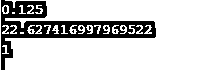


#### 17.十月()

这个函数帮助生成一个数的八进制表示。

**语法—**

```
oct(number)
```

其中数字可以是整数、十六进制或二进制数。

**代码:**

```
print("The octal representation of 32 is " + oct(32)) 
print("The octal representation of the"
    " ascii value of 'A' is " + oct(ord('A'))) 
print("The octal representation of the binary" " of 32 is " + oct(100000)) 
print("The octal representation of the binary"
                " of 23 is " + oct(0x17))
```

**输出:**

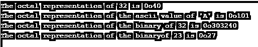


#### 18.已排序()

这个功能使得数字的排序变得非常容易。

**语法—**

```
sorted(iterable,key,reverse)
```

这里，iterable 指的是列表、元组或任何需要排序的对象集合。

key–指对值进行排序时必须依据的键。

Reverse-可以设置为 true 以降序生成列表。

这个函数的输出总是一个列表。

**代码:**

```
sampleObj = (3,6,8,2,5,8,10)
print(sorted(sampleObj,reverse=True))
sampledict = {'a':'sss','g':'wq','t':2}
print(sorted(sampledict,key= len))
```

**输出:**

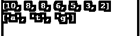


#### 19.总和()

这个函数有助于对 iterable 对象的成员求和。

**语法—**

```
sum([iterable],start)
```

Iterable 是指任何可迭代的对象列表、元组或字典或数字序列。

start–这标志着需要添加到最终结果中的求和结果的初始化。这是一个可选参数。

**代码:**

```
num = [2.5, 3, 4, -5]
numSum = sum(num)
print(numSum)
numSum = sum(num, 20)
print(numSum)
```

**输出:**

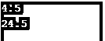


#### 20.str()

该函数有助于生成对象的可打印表示。

**语法—**

```
str(object,encoding,errors)
```

其中编码和错误是可选的。

**代码:**

```
print(str('A1323'))
b = bytes('pythön', encoding='utf-8')
print(str(b, encoding='ascii', errors='ignore'))
#errors='ignore' helps interpreter to ignore when it found a non Ascii character
```

**输出:**

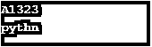


#### 21.类型()

此函数用于打印作为参数传递的对象所属的类型或类。该函数用于调试目的。

**语法—**

```
type(Object)
```

它有时也用于创建新对象

**语法-**

```
type(name,bases,dict)
```

**代码:**

```
tupleObj=(3,4,6,7,9)
print(type(tupleObj))
new1 = type('New', (object, ),
dict(var1 ='LetsLearn', b = 2029))
print(type(new1))
```

**输出:**


#### 22.可调用()

如果作为参数传递的对象是可调用的，则该函数返回 True。

**语法—**

```
callable(Object)
```

**代码:**

```
def myFun(): 
    return 5
res = myFun 
print(callable(res)) #function is called to get this value
num1 = 15 * 5
print(callable(num1))#no function is called 
```

**输出:**


#### 23.输入()

这个函数帮助 python 接受用户的输入。在 python 2.7 中，它的名字是 raw_input()，现已改为 input()。一旦进入，或按下 esc 键，系统将再次恢复。

**语法—**

```
input()
```

#### 24.范围()

该函数返回两个特定数字之间的数字序列。这在处理程序中的循环时非常有用，因为它有助于循环运行特定的次数。在 python 3.6 中，xrange()已被重命名为 range()。

**语法—**

```
range(start,stop,step)
```

这里，start——一个整数，它标志着系列的开始。

一个 stop——一个标记系列最后一个数字的整数。范围内的最后一个数字是 stop-1。

**Step–**一个整数，让用一个特定的数字来递增循环。默认情况下，它是+1。

**代码:**

```
res = 1
for i in range(1, 10,2): 
       res = res * i 
print("multiplication of first 10 natural number :", res)
```

**输出:**

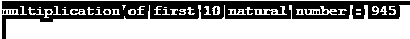


**注意-** 浮点数作为参数会抛出错误。

#### 25.反转()

这个函数返回一个[迭代器，以逆序访问集合](https://www.educba.com/iterators-in-python/)。

**语法**–

```
reversed([sequence] or [collection])
```

**代码:**

```
tupleObj=(3,4,6,7,9)
for i in reversed(tupleObj): 
       print(i,end=' ')
```

**输出:**

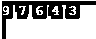


### 结论

Python 有一个包含许多函数的庞大库，定义这些函数只是为了减轻开发人员的工作。这些函数称为内置函数。必须按照定义的方式使用它们，不建议覆盖它们，因为这会对工作产生副作用，并导致错误的输出。

### 推荐文章

这是 Python 内置函数的指南。在这里，我们讨论 Python 内置函数的基本概念和例子，以及代码和输出。你也可以看看下面这篇文章

1.  [Python 数据类型](https://www.educba.com/python-data-types/)
2.  [Python 特性](https://www.educba.com/python-features/)
3.  [Python 集](https://www.educba.com/python-sets/)
4.  [Python 中的斐波那契数列](https://www.educba.com/fibonacci-series-in-python/)


