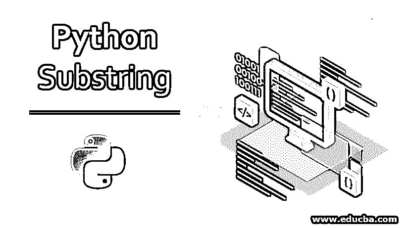
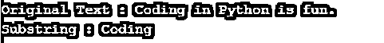
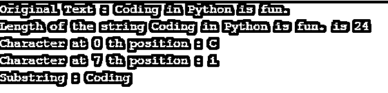
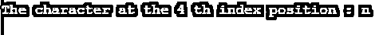
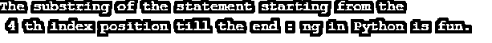
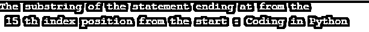
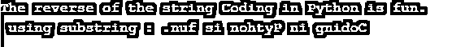

# Python 子串

> 原文：<https://www.educba.com/python-substring/>




## Python 子串简介

Substring 是一个术语，用于描述可以从主字符串中提取的字符串的一部分或一部分。例如，“stand”是“understand”的子串。在 python 中，切片操作用于从程序中声明的主字符串中挑选所需的子字符串。substring 的语法类似于“string_var[start _ index:end _ index]”，其中 string _ var 是用于声明字符串值的变量，开始和结束索引值是指字符串的字符位置计数。

### Python 中的子串是什么？

子字符串基本上是字符串的一部分。很多时候，我们需要从字符串中提取一部分，并对其进行一些操作。让我们举个例子来说明这一点。

<small>网页开发、编程语言、软件测试&其他</small>

**举例:**“用 Python 编码很好玩。”

### Python 中的子字符串

为了有一个子串，我们首先需要有一个字符串。让我们看一个例子，首先声明一个字符串，然后从中创建一个子字符串。

**代码:**

```
statement = "Coding in Python is fun."
substring = statement[0:7]
print("Original Text :",statement)
print("Substring :",substring)
```

**输出:**




在上面的例子中，我们定义了一个名为 statement 的变量，它的数据类型为 str，值为“用 Python 编码很有趣”双引号中的文本表示存储在变量中的值。

在 Python 中，字符串被存储为一个字符序列，我们可以使用如上所示的切片操作对其进行迭代或选择。在详细介绍 Substring 之前，让我们先来看看创建子字符串的语法。

**子串语法:**

```
string_var[start_index : end_index]
string_var is the variable having data type as a string
start_index indicates the index value of the character in the string from which we want the substring to start
end_index indicates the index value of the character in the string until which we want the substring to be. The end_index is exclusive and is not taken into account while displaying the substring. So, the substring will not end at the character at the end_index position but at the character which is prior to the end_index position
```

让我们借助一个例子来阐述它:

**代码:**

```
statement = "Coding in Python is fun."
start_index = 0
end_index = 7
print("Original Text :",statement)
length_statement = len(statement)
print("Length of the string",statement,"is",length_statement)
print("Character at",start_index,"th position :",statement[start_index])
print("Character at",end_index,"th position :",statement[end_index])
substring = statement[start_index:end_index]
print("Substring :",substring)
```

**输出:**




子串从编码的“C”开始，刚好在 in 的“I”之前结束。在编码和 in 之间有一个空格，那是子串结束的地方。

现在让我们看一个相同功能的简单方法。

**代码:**

```
statement = "Coding in Python is fun."
length_statement = len(statement)
for i in range(length_statement-1):
  if(i<7):
    print(statement[i], end="")
```

**输出:**


通过查看上面的代码，很明显我们正在从 0 迭代到 length_statement-1，即(24-1) = 23，对于条件 I <7，我们正在打印每个字符。

如果我们想获取一个字符，我们只需要在方括号内指定一个索引值，如下所示

**代码:**

```
statement = "Coding in Python is fun."
index = 4
print("The character at the",index,"th index position :",statement[index])
```

**输出:**




虽然起始和结束索引都不是必需的，但是如果我们想要打印一个范围的值，我们会提到起始和结束索引。

### 例子

如果起始索引保留为空，则假定从开始处对其进行子串，如果结束索引保留为空，则假定子串一直到结尾。

#### 1.字符串结尾为空白

**代码:**

```
statement = "Coding in Python is fun."
start_index = 4
print("The substring of the statement starting from the \n", start_index,"th index position till the end :",statement[start_index:])
```

**输出:**




#### 2.将索引作为空白开始

**代码:**

```
statement = "Coding in Python is fun."
end_index = 16
print("The substring of the statement ending at from the \n",end_index-1,"th index position from the start :",statement[:end_index])
```

**输出:**




#### 3.以步长开始和结束索引

**代码:**

```
statement = "Coding in Python is fun."
start_index = 0
end_index = 16
step = 2
print("The substring of the statement starting from \n",start_index,"th index position and ending at the",end_index-1,"th index position with step",step," :",statement[start_index:end_index:step])
```

**输出:**


子字符串从第 0 个位置开始，使用步骤 2 打印到第 15 个位置。即每隔一个字符打印一次。

#### 4.使用 substring 反转字符串

**代码:**

```
statement = "Coding in Python is fun."
string_length = len(statement)
print("The reverse of the string",statement,"\n using substring :",statement[string_length::-1])
```

**输出:**




这里，起始索引是字符串的长度，我们将结束索引保留为空，并按-1 的顺序逆序打印。

### 结论

是时候结束这篇关于 Python substring 的文章了。今天，我们学习了很多关于 Python 子串的知识，从语法到如何用一种简单的方法得到子串。最后，我们看了许多如何使用子串以及如何使用子串反转字符串的例子。既然这些我们都学会了，那你就该练习了。

### 推荐文章

这是 Python Substring 的指南。在这里，我们将讨论简介、Python 中的子字符串，以及示例、代码和输出。您也可以阅读以下文章，了解更多信息——

1.  [Python 中的迭代器](https://www.educba.com/iterators-in-python/)
2.  [Python 全局变量](https://www.educba.com/python-global-variable/)
3.  [用 Python 复制列表](https://www.educba.com/copy-list-in-python/)
4.  [Python 列表](https://www.educba.com/python-list/)


