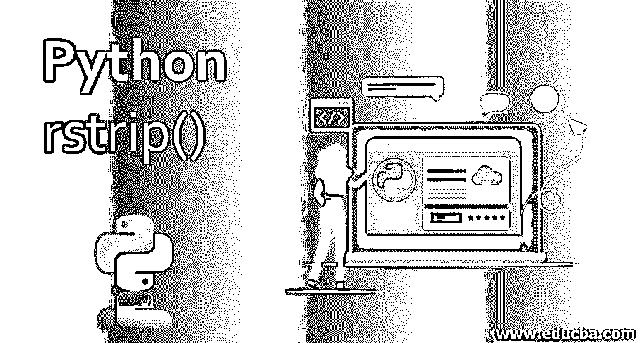
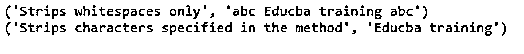
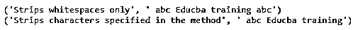
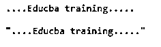
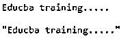

# Python rstrip()

> 原文：<https://www.educba.com/python-rstrip/>




## Python rstrip()简介

Python 中没有其他编程语言中的数据类型声明。因此 Python 没有任何字符的数据类型，字符序列或字符数组形成一个字符串，单个字符在 Python 中也被认为是一个字符串。在 Python 中，引入了很多字符串方法，都是内置函数。所以在本文中，我们讨论的是从给定字符串的开头和结尾删除部分字符串的 string 方法。

为此，Python 有一个名为 strip()的内置函数。此方法返回通过移除前导字符和尾随字符从原始字符串中去除的字符串部分。在这里，我们只关注 strip()，它只剥离原始字符串右侧的字符，以获得剥离的字符串。

<small>网页开发、编程语言、软件测试&其他</small>

### Python 中 strip()和 rstrip()的语法和示例

Python 有一个 string 方法，从给定的字符串中剥离字符，得到剥离的字符串。这是一个内置函数，同样有两个 strip()函数，它们是 rstrip()和 lstrip()。strip()方法从给定字符串的开头和结尾字符中删除字符集。

**语法:**

```
Str.strip()
```

**参数:**

*   您可以将 char 作为参数，这是可选的，用于通知要从原始字符串中删除多少个字符。
*   如果没有指定参数，那么默认情况下，它会从给定字符串的左右两边删除空格。

strip()函数的返回值总是以字符串的形式返回，该字符串包括所有字符或从给定字符串的开始和结束位置剥离的字符串。默认情况下，它会从给定的字符串中去掉空格，并在字符串中包含前导空格和尾随空格。

### Python rstrip()的示例

此代码给出了 strip()方法的示例:

**代码:**

```
str = " abc Educba training abc "
str_out = str.strip()
print("Strips whitespaces only", str_out)
str_out1 = str.strip(' abc ')
print("Strips characters specified in the method",str_out1)
```

**输出:**




上面的示例使用 strip()而不使用任何参数，因此给定的字符串“abc Educba training abc”将通过删除字符串开头和给定字符串结尾的空格得到“abc Educba training abc”。当我们使用带参数的 strip()函数时，在上面的示例中，我们将 strip()方法中的参数字符指定为“abc”，strip('abc ')，然后它删除字符串开头和结尾的字符“abc”，并将字符串作为“Educba training”输出。

### Python 中如何使用 rstrip()？

这也是 strip()方法的一部分 string 方法，rstrip()函数只移除原始字符串末尾右侧的字符串或移除原始字符串的尾部字符。

**语法:**

```
Str.rstrip()
```

**参数:**

*   这同样类似于 strip()方法，该方法将 char 作为可选参数；它仅在要删除指定字符时使用。
*   如果没有指定参数，那么默认情况下，它将从给定字符串的右边去掉空白。

rstrip()函数的返回值总是一个字符串。这将返回从给定字符串末尾剥离的剥离字符串。函数中指定的字符从给定字符串的右侧开始分隔。默认情况下，rstrip()函数从字符串中去除尾随空格。

#### 示例#1

让我们考虑一个例子，它在程序中使用 rstrip()方法去掉给定字符串的右边。

**代码:**

```
str = " abc Educba training abc "
str_out = str.rstrip()
print("Strips whitespaces only", str_out)
str_out1 = str.rstrip(' abc ')
print("Strips characters specified in the method",str_out1)
```

**输出:**




在上面的例子中，我们使用了带参数和不带参数的 rstrip()方法。在上面的示例中，rstrip()函数在作为“abc Educba training abc”应用于给定字符串时不带参数，然后此方法去除给定字符串右侧的空白，得到字符串“abc Educba training abc”。rstip()函数在给定字符串“abc Educba training abc”上应用参数“abc”时，会产生字符串“abc Educba training ”,该字符串再次从字符串右侧删除参数中指定的字符“abc”。

这些 strip()和 strip()函数可以用于格式化项目报告和文档，也可以在您想要出版一本书并想要删除额外的空白或换行符时使用；这些在这样的真实世界的例子中是有帮助的。strip()和 rstrip()函数也可以用来从给定的字符串中删除换行符。首先，让我们看看 strip()如何从给定的字符串中删除换行符。

#### 例#2

使用 strip()函数从给定的字符串中移除换行符。

**代码:**

```
str = "\n....Educba training.....\n"
print(str)
str_out = str.strip('\n')
print "\"" + str_out + "\""
```

**输出:**




#### 例#3

要删除字符串右侧的换行符:

**代码:**

```
str = "Educba training.....\n"
print(str)
str_out = str.strip('\n')
print "\"" + str_out + "\""
```

**输出:**




### 结论

在 Python 中，string 有 strip()、rstrip()和 lstrip()等非常重要的方法。strip()函数通常去除位于字符串开头和结尾的字符，这些字符在函数的参数中指定，如果没有指定参数，则默认去除空白。rstrip()和 lstrip()函数的工作方式也类似于 strip()函数，唯一的区别是 rstrip()从右侧去除字符，而 lstrip()从左侧去除字符。默认情况下，对于这两个函数，如果没有指定参数，它会删除空白。

### 推荐文章

这是 Python rstrip()的指南。在这里，我们讨论 Python rstrip()的语法和工作方式，以及示例和代码实现。您也可以浏览我们推荐的其他文章，了解更多信息——

1.  [Python 列表删除()](https://www.educba.com/python-list-remove/)
2.  [Python 正则表达式测试器](https://www.educba.com/python-regex-tester/)
3.  [Python 中的字符串数组](https://www.educba.com/string-array-in-python/)
4.  [蟒蛇卷曲](https://www.educba.com/python-curl/)


