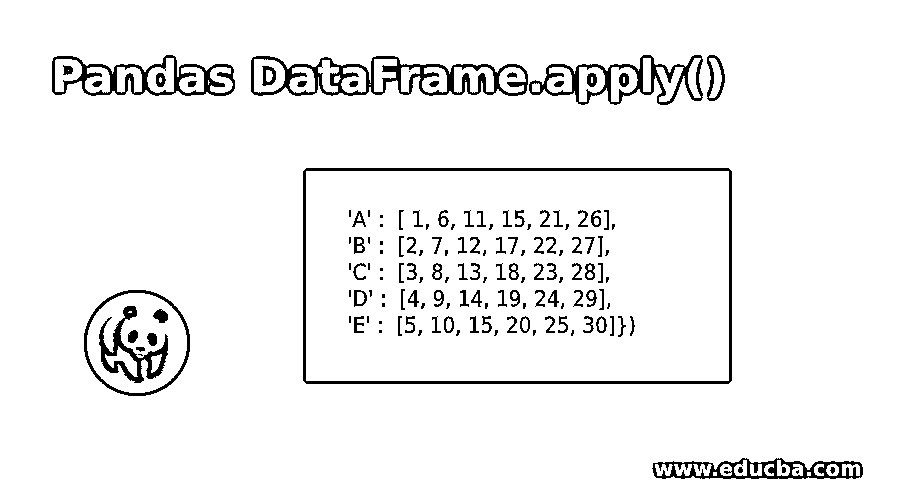
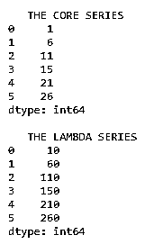
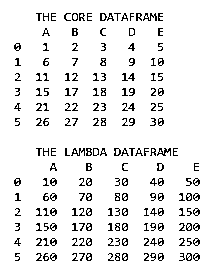
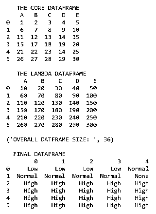

# Pandas DataFrame.apply()

> 原文：<https://www.educba.com/pandas-dataframe-dot-apply/>




## 熊猫简介 DataFrame.apply()

当 panda 数据结构的每个值都需要以某种特定的方式进行操作时，就可以使用 pandas.apply()函数。apply()方法用于对 panda 数据结构中的每个值应用一些特定的函数。如果函数是一个系列或数据框的列(轴=1)，则应用于该函数的对象从索引(轴=0)开始。默认情况下(result_type=None)，函数的返回作为最终的返回元素。在这个主题中，我们将学习熊猫 DataFrame.apply()。

### 句法

下面是提到的语法

<small>网页开发、编程语言、软件测试&其他</small>

```
DataFrame.apply(self, function, axis=0, raw=False, result_type=None, args=(), return)
```

| **参数** | **描述** |
| **功能** | 表示需要应用于熊猫数据结构的函数 |
| **轴** | Denotes the columns or rows for which the function needs to be applied. {0 or ‘index,’ 1 or ‘columns’}, default 0沿其应用函数的轴:0 或“index”:将函数应用于每一列。1 或“列”:将函数应用于每一行。 |
| **Raw** | Determines how the data is passed, whether it is a series or a ndarray.**假:**数据以一系列数据帧的形式传递**True:** 数据作为 ndarray 对象传递。值得注意的是，制作 Numpy 归约函数的过程实现了更好的性能。 |
| **结果 _ 类型** | The result_type applies when the value of the axis used is 1, which represents the columns:**1) 'expand':** Expand 允许列表值垂直转换成列**2) 'reduce':** 与 expand 完全相反，在 expand 中，列值将被缩减为列表类型的项目。**3)“广播”:**在这里，数据帧的实际形状将被视为输出。核心索引值将保留在这里。 |
| **参数** | 表示传递给函数的所有参数 |

### 熊猫的例子 DataFrame.apply()

下面提到了不同的例子:

#### 示例#1

**代码:**

```
import pandas as pd
Core_Series = pd.Series([ 1, 6, 11, 15, 21, 26])
print("   THE CORE SERIES ")
print(Core_Series)
Lambda_Series = Core_Series.apply(lambda Value : Value * 10)
print("")
print("   THE LAMBDA SERIES ")
print(Lambda_Series)
```

**输出:**




**说明:**这里是熊猫库的初始导入，导入的库用于创建系列。序列中的值以这样的方式表示，即它们是 1 到 n 的序列。apply()方法通过 lambda 函数放置在该序列上。lambda 函数负责从序列中取出每个值，并将其乘以 10。所以在这个过程的最后，这个系列中的每一个项目都要乘以 10。结果值被捕获到一个称为 lambda 系列的系列中，并打印到控制台上。我们可以清楚地注意到 lambda 系列保存了核心系列的所有值，其倍数为 10。

#### 示例 **#2**

**代码:**

```
import pandas as pd
Core_Dataframe = pd.DataFrame({'A' :  [ 1, 6, 11, 15, 21, 26],
'B' :  [2, 7, 12, 17, 22, 27],
'C' :  [3, 8, 13, 18, 23, 28],
'D' :  [4, 9, 14, 19, 24, 29],
'E' :  [5, 10, 15, 20, 25, 30]})
print("   THE CORE DATAFRAME ")
print(Core_Dataframe)
Lambda_Dataframe = Core_Dataframe.apply(lambda Value : Value * 10)
print("")
print("   THE LAMBDA DATAFRAME ")
print(Lambda_Dataframe)
```

**输出:**




**说明:**这里最初导入的是 pandas 库，导入的库用于创建 dataframe，是一个形状(6，6)。数据帧中的所有列都分配有标题，这些标题是按字母顺序排列的。数据帧中的值以这样的方式形成，即它们是 1 到 n 的序列。该数据帧在这里以编程方式命名为核心数据帧。apply()方法通过 lambda 函数放置在此数据帧上。lambda 函数负责从数据帧中取出每个值，并将其乘以 10。所以在这个过程的最后，数据帧中的每一项都要乘以 10。结果值被捕获到一个称为 lambda 数据帧的数据帧中，并打印到控制台上。我们可以清楚地注意到 lambda 数据帧保存了核心数据帧中的所有值，数据帧上有 10 的倍数。

#### 实施例 3

**代码:**

```
import pandas as pd
def Value_range_check(value):
    if value < 50: return "Low" elif value >= 50 and value < 100: return "Normal" elif value > 100:
        return "High"
final_dataframe = pd.DataFrame([])
Core_Dataframe = pd.DataFrame({'A' :  [ 1, 6, 11, 15, 21, 26],
'B' :  [2, 7, 12, 17, 22, 27],
'C' :  [3, 8, 13, 18, 23, 28],
'D' :  [4, 9, 14, 19, 24, 29],
'E' :  [5, 10, 15, 20, 25, 30]})
print("   THE CORE DATAFRAME ")
print(Core_Dataframe)
Lambda_Dataframe = Core_Dataframe.apply(lambda Value : Value * 10)
print("")
print("   THE LAMBDA DATAFRAME ")
print(Lambda_Dataframe)
Lambda_Dataframe_size = (Lambda_Dataframe.shape[0] * Lambda_Dataframe.shape[0])
print("")
print("OVERALL DATFRAME SIZE: ", Lambda_Dataframe_size)
for i in range(Lambda_Dataframe.shape[1]):
    Value_checked_dataframe = Lambda_Dataframe.iloc[:,i].apply(Value_range_check)
    final_dataframe.insert(i,i,Value_checked_dataframe)
    print("")
    print("  FINAL DATAFRAME ")
    print(final_dataframe)
```

**输出:**




**解释:**上面例子中的整个初始操作集合在这里再次重复；更具体地说，在这个示例中，apply()方法以两种方式使用，如上面在第一个实例中所讨论的，apply()方法被用在 lambda 函数上，但是在下一个实例中，它被应用在普通函数上。该函数应用于λ数据帧。这里，函数用于将 lambda 函数中获得的每个值分成三个不同的类别:低、正常和高。例如，如果一个值落在 50 以内，它被命名为低，那么落在 50 到 100 之间的值被命名为正常；最后，超过 100 的值称为高。为了将结果序列公式化为数据帧，通过使用 iloc 作为列引用，将 lambda 数据帧中的每一列传递给 apply 函数。因此返回的输出也将是一列值。为了将每一列插入到数据帧中，使用了 insert()方法。最终的数据帧被打印到控制台上。

### 结论

pandas 中的 apply()方法显示了以最灵活的方式对数据帧中的每个值应用操作的灵活性。它还描述了与此功能相关的一组分类功能。

### 推荐文章

这是熊猫 DataFrame.apply()的指南。这里我们讨论 Pandas DataFrame.apply()的语法和示例，以及代码、输出和解释。您也可以看看以下文章，了解更多信息–

1.  什么是熊猫？
2.  [Python 熊猫数据帧](https://www.educba.com/python-pandas-dataframe/)
3.  [熊猫。Dropna()](https://www.educba.com/pandas-dot-dropna/)
4.  [什么是 AOP？](https://www.educba.com/what-is-aop/)


