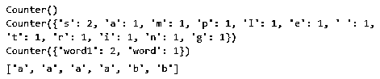
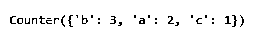
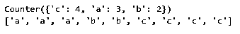
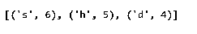
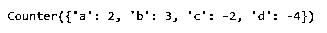
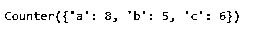
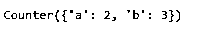

# Python 计数器

> 原文：<https://www.educba.com/python-counter/>


## Python 计数器简介

Python 提供了一个计数器类，它是集合模块的子类。它是一类特殊的对象数据集。我们还有容器数据类型，它们是集合模块的一部分。counter 子类通常用于对可散列对象进行计数。当计数器执行时，它创建可迭代项的哈希表。计数器对象总是为计数器对象中的每个元素返回一个 itertool。

counter 是一个字典子类，用于对可散列的对象进行计数。计数器中的元素存储为字典键，计数存储为字典值。计数可以是任何整数值。它还包括零值和负值。

<small>网页开发、编程语言、软件测试&其他</small>

**语法:**

`counter  = Counter()  # this will return into empty counter`

### Python 计数器的示例

以下是 Python 计数器的示例

#### 示例#1

**代码:**

```
from collections import Counter
c = Counter()
print(c)
c = Counter('sample string')
print(c)
c = Counter(['word', 'word1','word1'])
print(c)
c = Counter(a=4, b=2, c=0, d=-2)
sorted(c.elements()) 
```

**输出:**




**代码解释:**在上面的例子中，我们已经从 collections 模块中导入了 counter 子类。然后我们创建了空的计数器。然后，我们将两个单词的字符串传递给计数器函数“sample string ”,并打印计数器函数的输出。您可以看到 counter 函数给出了字符串中每个字符的计数以及该字符重复的次数。然后，我们将单词列表传递给计数器函数。该列表包含三个单词；现在，如果我们这次打印计数器函数的结果，我们将得到每个单词的计数。然后我们有了这个字符，并在计数器函数中给它分配了一个数字。现在我们尝试使用 sorted 函数打印 counter 函数的元素。sorted 函数将对列表元素进行排序。现在你可以看到计数器函数已经打印了字符，打印的次数和我们分配给它的次数一样多。计数器函数不会执行任何等于零或小于零的整数。

#### 实施例 2

**代码:**

```
from collections import Counter
lst = ['a', 'b', 'c', 'b', 'a', 'b'] c = Counter(lst)
print(c) 
```

**输出:**




**代码解释:**在上面的例子中，我们已经创建了一个重复字符的列表。现在我们将列表传递给计数器函数并打印结果。因此，counter 函数输出列表中每个字符的计数。

#### 实施例 3

**代码:**

```
from collections import Counter
counter = Counter(a=3, b=2, c=4)
print(counter)
print(list(counter.elements())) 
```

**输出:**




**代码解释:**在上面的例子中，我们在 counter 函数中有一些字符，并给它分配了一些数字，然后我们使用 elements 打印 counter 函数的结果，我们可以看到它打印的字符等于我们分配的值的数字。

#### 实施例 4

**代码:**

```
from collections import Counter
c = Counter('sssssshhhhhcccdddd')
c.most_common(3) 
```

**输出:**




**代码解释:**在上面的例子中，我们已经在 counter 函数内部传递了字符串，我们使用 most_common 方法打印了结果。该方法采用一个可选参数 integer，并将输出计数到最常见或唯一输出的元素数的结果。如您所见，我们已经在 most_common 方法中传递了 3，因此它将导致只有三个元素具有最大计数。如果我们不传递任何值，它将导致所有的元素。

#### 实施例 5

**代码:**

```
from collections import Counter
a = Counter(a=5, b=4, c=2, d=-3)
b = Counter(a=3, b=1, c=4, d=1)
a.subtract(b)
a 
```

**输出:**




**代码解释:**在上面的例子中，我们创建了两个计数器，a 和 b，两个计数器都由元素组成，并为其分配了一些数字。现在我们使用 subtract 方法从 a 中减去 b 的计数。现在 counter 函数将在减去每个元素的计数后得出元素的最终计数。这里，在这种情况下，两个输入都可以是零，也可以是负的。计数器上的元素数量可以不同。

**代码:**

```
from collections import Counter
a = Counter(a=5, b=4, c=2, d=-3)
b = Counter(a=3, b=1, c=4, d=1)
a+b 
```

**输出:**

如果我们这样做，它还会将两个计数器的元素和结果相加到它们的和中。




**代码:**

```
from collections import Counter
a = Counter(a=5, b=4, c=2, d=-3)
b = Counter(a=3, b=1, c=4, d=1)
a-b 
```

**输出:**

如果我们这样做，它将从计数器中减去 b 的计数，结果，它将只显示正的计数；不显示负数或零计数。




### 结论

计数器是一个 dict 类型的子类，用于对可散列对象进行计数。每当我们执行一个计数器方法时，它就创建字典键，计数被存储为字典值。计数器方法只输出正的计数；它将忽略零值和负值。我们还可以执行一些数学运算，如加、减、与、或、并。

### 推荐文章

这是一个 Python 计数器的指南。在这里，我们还将讨论 python 计数器的介绍和语法，以及不同的示例和代码实现。您也可以看看以下文章，了解更多信息–

1.  [Python eval()](https://www.educba.com/python-eval/)
2.  [Python 中的装饰器](https://www.educba.com/decorator-in-python/)
3.  [Python 并发](https://www.educba.com/python-concurrency/)
4.  [Python argparse](https://www.educba.com/python-argparse/)


